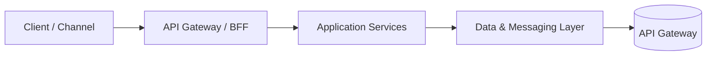

## 1. Executive Summary

Single entry point for clients — routing, auth, rate limiting, and protocol translation. Use this page to decide **when** the pattern earns its complexity — not just what it means on a diagram.
> **Deep dive:** For implementation patterns and code examples, see the companion post [/microservices/api-gateway-bff-pattern/](/microservices/api-gateway-bff-pattern/).

---

## 2. What Problem It Solves

| Business pain | Technical symptom |
| :--- | :--- |
| Slow time-to-market from tight coupling | One change ripples across teams and releases |
| Outages spread across domains | Shared runtime or database becomes a blast-radius multiplier |
| Hard to scale one hot capability | Monolithic scaling pays for idle components |
| Integration fragility | Point-to-point calls multiply with every new consumer |

**API Gateway** addresses a specific slice of these pains. Match the pattern to the pain — do not adopt it because a reference architecture diagram includes the box.

---

## 3. Where It Fits in Architecture

---

## 4. When to Choose

- Team and domain boundaries are clear enough to justify separate deploy units or integration style
- Non-functional requirements (scale, availability, compliance) explicitly need this pattern
- You have observability and ops maturity to run the added moving parts
- A phased migration path exists (especially for strangler and modular monolith approaches)

---

## 5. When Not to Choose

- Early product stage with unknown domain boundaries
- Team lacks distributed systems ops experience and no platform team support
- Problem is purely CRUD with low traffic — simpler topology wins
- You are solving an organizational problem with technology alone

---

## 6. Popular Tools / Products

| Layer | Examples |
| :--- | :--- |
| **Runtime** | Kubernetes, ECS, VM clusters |
| **Integration** | Kafka, RabbitMQ, REST/gRPC |
| **Resilience** | Resilience4j, Istio, Envoy, API gateway plugins |
| **Cloud managed** | AWS/Azure/GCP PaaS equivalents for your chosen building blocks |

---

## 7. Trade-offs


| Dimension | Benefit | Cost |
| :--- | :--- | :--- |
| **Complexity** | Solves a real architectural constraint | More components to deploy, monitor, and debug |
| **Delivery speed** | Parallel team ownership after boundaries settle | Slower initially due to contracts and platform work |
| **Operational load** | Better fault isolation when done well | Requires SRE/platform investment |
| **Consistency** | Fits enterprise integration standards | Harder end-to-end testing without good observability |


---

## 8. Real-World Example

**Global retail ERP modernization:** Order capture stays on legacy SAP while a **strangler** routes new mobile checkout to cloud microservices. **Event-driven** updates sync inventory to the warehouse system overnight. **Circuit breakers** on payment calls prevent cart meltdown when the PSP degrades.

**BFSI payments:** **Saga** orchestrates authorize → capture → settlement with compensating voids. **Outbox** publishes ledger events without dual-write bugs. **Bulkheads** isolate fraud scoring thread pools from authorization latency.

---

## 9. Failure Scenarios

| Failure mode | What breaks | Mitigation |
| :--- | :--- | :--- |
| Pattern adopted without boundaries | Distributed monolith — worst of both worlds | Domain discovery workshops first |
| Missing idempotency / ordering rules | Duplicate charges, inconsistent reads | Explicit contract tests and replay strategy |
| Observability gap | Mean time to innocence measured in hours | Trace IDs, golden signals, SLOs per dependency |
| Premature extraction | High coordination overhead, no deploy independence | Modular monolith or strangler first |

---

## 10. Best Practices

1. Write an **Architecture Decision Record (ADR)** with triggers and rollback criteria.
2. Prove the pattern on **one bounded context** before enterprise-wide mandate.
3. Invest in **contract testing** and **consumer-driven contracts** at integration edges.
4. Pair every async pattern with a **dead-letter, replay, and reconciliation** story.
5. Link operational runbooks to **SLOs** — not just architecture slides.

---

## 11. Interview Answer


**"API Gateway — when would you use it?"**

"I reach for API Gateway when the business needs single entry point for clients and the organization can operate the extra moving parts. I would not start there for a small team proving product-market fit — I'd prefer a modular monolith or well-structured monolith until deploy boundaries and traffic patterns are understood. In interviews I always pair the pattern with a failure mode — for example how we'd handle partial outages and idempotent retries."


---

## 12. Related Topics

- Browse [Module 1: Architecture Patterns](/technology-playbook/) for adjacent patterns
- [Technology Decision Matrix](/technology-playbook/how-to-choose-database/) for tooling choices
- [Microservices Playbook](/microservices/) for implementation-depth companion posts
