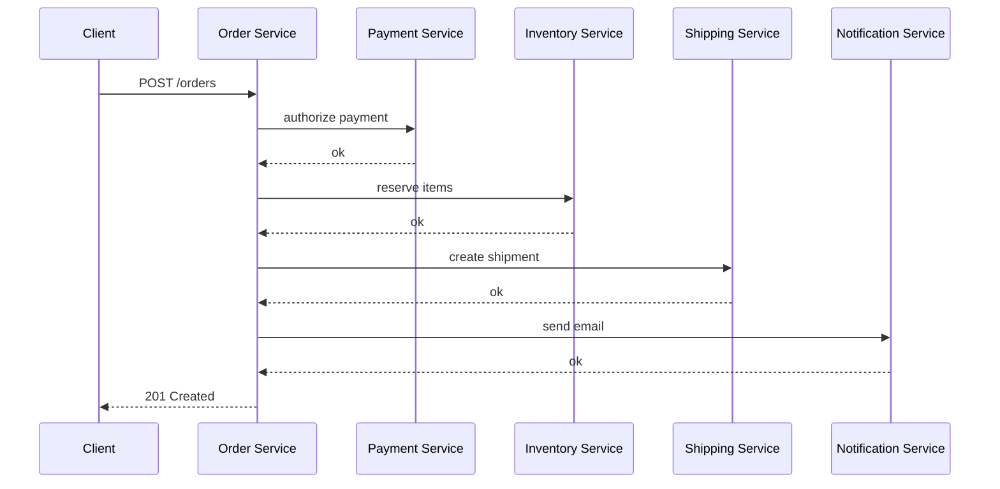
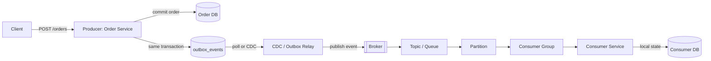
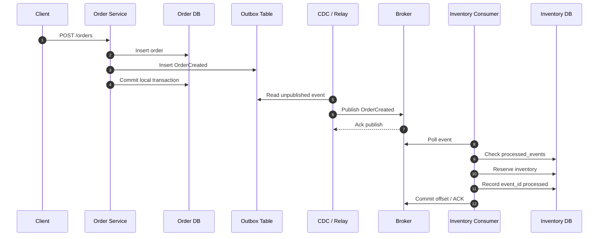
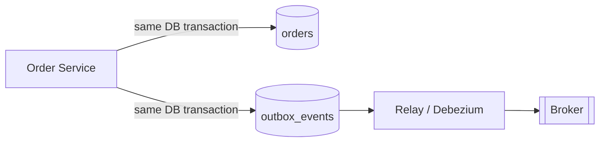
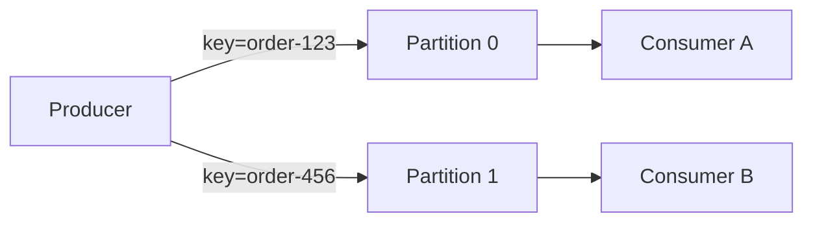

## 1. Why Event-Driven Architecture Exists

Event-Driven Architecture exists because real production workflows rarely end with the first database write.

When a user places an order, the system may need to reserve inventory, authorize payment, create a shipment, update analytics, send email, notify a warehouse, and refresh a read model. If the Order Service calls all of those services synchronously before returning, checkout becomes hostage to every downstream dependency.



That synchronous chain fails in predictable ways:

| Problem | Production effect |
| :--- | :--- |
| One slow dependency | Checkout latency grows even if the order write is healthy |
| One failed dependency | The whole user request may fail or require complex partial rollback |
| More consumers over time | Order Service becomes a coordinator for every downstream team |
| Traffic spikes | Every downstream service gets hit at the same time |
| Deploy coupling | Changing notification or analytics can risk order creation |

EDA changes the contract. Order Service completes the main transaction, records the fact that an order was created, and lets other services react later.

Examples:

- `OrderCreated` lets Payment Service start authorization.
- `PaymentCompleted` lets Inventory Service reserve stock or release a hold.
- `InventoryReserved` lets Shipping Service create a shipment.
- `ShipmentCreated` or `NotificationRequested` lets Notification Service send email/SMS/push.

The key idea is **temporal decoupling**. Producer and consumer do not need to be online, fast, or deployed together at the exact same moment. The broker acts as a durable buffer between them.

EDA is not "make everything async." It is "commit the important local state first, then publish facts so side effects can happen reliably after the main transaction."

---

## 2. Core Architecture



| Component | Why it exists |
| :--- | :--- |
| **Producer** | Owns the business decision. Order Service decides an order was accepted and emits `OrderCreated`. |
| **Local database** | Stores the producer's source of truth. The event should represent committed state, not a hopeful action. |
| **Outbox table** | Bridges the database transaction and broker publish without a distributed transaction. |
| **CDC / relay** | Moves outbox rows to the broker. It can retry when the broker is unavailable. |
| **Broker** | Provides durable buffering, fanout, retention, backpressure absorption, and replay capability depending on product. |
| **Topic / queue** | Names the stream of related messages, such as `order.events` or `notification.requests`. |
| **Partition** | Enables parallelism while preserving order inside a selected key boundary. |
| **Consumer group** | Lets multiple instances of one logical consumer share work without each processing every event. |
| **Consumer service** | Reacts to facts from the producer and owns its own business state. |
| **Consumer database** | Stores the consumer's local result, read model, processed-event guard, or workflow state. |

The important architectural boundary is ownership. Order Service does not update Payment DB directly. Payment Service consumes `OrderCreated` and updates its own database. That keeps service boundaries real instead of turning events into remote table writes.

---

## 3. End-to-End Event Flow



Step by step:

1. **Order Service receives request**: The user submits checkout. The service validates the command and decides whether the order can be created.
2. **Updates local DB**: It inserts or updates the order row, for example `status = PENDING_PAYMENT`.
3. **Writes event to outbox in same transaction**: It inserts `OrderCreated` into `outbox_events` before commit.
4. **CDC / outbox relay publishes event**: A separate relay reads committed outbox rows and publishes them to a broker topic.
5. **Broker stores event**: Kafka appends it to a partition; RabbitMQ stores it in a queue until acknowledged.
6. **Consumer pulls event**: Inventory Service receives `OrderCreated` from its assigned partition or queue.
7. **Consumer checks idempotency**: It checks whether `event_id` was already processed.
8. **Consumer updates local DB**: It reserves stock and may publish `InventoryReserved`.
9. **Consumer commits offset / acknowledges message**: Only after the local work is safely committed does it acknowledge progress.

This flow is designed for the uncomfortable reality of production: every arrow can fail, retry, duplicate, pause, or run slowly.

---

## 4. Transactional Outbox

The dangerous version of EDA is this:

```text
1. Insert order into Order DB
2. Publish OrderCreated to Kafka/RabbitMQ
```

That is a dual write. It crosses two systems without one atomic transaction.

| Failure | What happens |
| :--- | :--- |
| DB commit succeeds, broker publish fails | Order exists, but Payment, Inventory, Shipping, and Notification never hear about it. |
| Broker publish succeeds, DB commit fails | Consumers process `OrderCreated` for an order that does not exist. |
| App times out after publish | Producer may retry and publish duplicate events. |

Transactional outbox avoids this by making the application write only to its local database inside the request transaction.



Typical outbox columns:

| Column | Purpose |
| :--- | :--- |
| `event_id` | Globally unique event identity for deduplication, tracing, and replay. |
| `aggregate_id` | Business entity id such as `order-123`; often used as the partition key. |
| `event_type` | Name such as `OrderCreated`, `PaymentCompleted`, `InventoryReserved`. |
| `payload` | Serialized event body, usually JSON, Avro, or Protobuf. |
| `status` | Relay state such as `NEW`, `PUBLISHED`, `FAILED`, or omitted when CDC reads committed rows. |
| `created_at` | When the business transaction created the event. |
| `published_at` | When the relay successfully published the event. |

The outbox does not magically make publish exactly-once. The relay can still publish the same event twice. The win is narrower and important: if the order commit succeeds, the event is durably waiting to be published. If the order commit rolls back, there is no committed outbox row to publish.

---

## 5. Idempotent Consumer

Most practical brokers and consumer designs are **at-least-once**. That means the event will be delivered one or more times. "More than once" is not a rare edge case; it is the normal price of reliable delivery.

Duplicates happen when:

- The consumer processes an event but crashes before ACK or offset commit.
- The broker does not receive the ACK.
- A consumer group rebalance interrupts processing.
- The relay republishes an outbox event after a timeout.
- Operators replay old events to rebuild a read model.

The classic crash:

```text
1. Inventory consumer receives OrderCreated(event_id=evt-1)
2. It reserves inventory in Inventory DB
3. It crashes before committing Kafka offset / ACKing RabbitMQ
4. Broker redelivers evt-1 after restart
5. Without idempotency, inventory is reserved twice
```

The standard guard is a `processed_events` table with a unique `event_id`.

```sql
CREATE TABLE processed_events (
  event_id VARCHAR(100) PRIMARY KEY,
  event_type VARCHAR(100) NOT NULL,
  processed_at TIMESTAMP NOT NULL
);
```

Consumer flow:

```text
BEGIN;

INSERT INTO processed_events(event_id, event_type, processed_at)
VALUES (:event_id, :event_type, NOW());

-- If unique constraint fails, rollback and ACK/commit offset because the event was already handled.

UPDATE inventory
SET reserved = reserved + :quantity
WHERE sku = :sku;

COMMIT;

ACK message / commit offset;
```

For external side effects, use the same principle but choose the right idempotency key. A payment call should use `order_id` or a payment idempotency key so retrying `PaymentRequested` does not charge twice. A notification service may store `event_id` plus channel/template/customer if duplicate emails are unacceptable.

---

## 6. Ordering and Partitioning

Ordering only matters inside a boundary. For EDA, that boundary is usually an aggregate:

- All events for one order should use `order_id`.
- All balance events for one account should use `account_id`.
- All profile events for one user should use `user_id`.

Kafka guarantees order **inside one partition**. It does not guarantee total order across all partitions.



Good partition key discipline:

| Events | Partition key | Why |
| :--- | :--- | :--- |
| `OrderCreated`, `PaymentCompleted`, `InventoryReserved`, `ShipmentCreated` | `order_id` | One order's lifecycle is processed in sequence. |
| `UserRegistered`, `UserEmailChanged`, `UserDeleted` | `user_id` | Profile changes do not overtake each other. |
| `AccountDebited`, `AccountCredited` | `account_id` | Balance-affecting events remain ordered. |

What goes wrong with the wrong key:

- Using random `event_id` scatters related order events across partitions.
- `InventoryReserved` might be processed before `OrderCreated`.
- A read model can show `SHIPPED` before it has ever seen `PAID`.
- Compensations can race with the original action.

Hot partitions are the other side of the tradeoff. If one key receives huge traffic, one partition becomes overloaded while others sit idle. Examples: one celebrity `user_id`, one flash-sale `sku`, or one enterprise tenant sending most traffic. Fixes include choosing a better key, splitting by sub-aggregate, adding partitions with a migration plan, or designing the workflow so one hot aggregate does not serialize unrelated work.

---

## 7. Retry, DLQ and Poison Messages

Failures are not all the same.

| Error type | Example | Handling |
| :--- | :--- | :--- |
| Retryable | Payment API timeout, DB deadlock, temporary network issue | Retry with backoff and jitter. |
| Non-retryable | Invalid schema, unknown enum, impossible business state | Do not retry forever; route to DLQ or quarantine. |
| Poison pill | One event always crashes the consumer | Skip to DLQ after a bounded number of attempts so the partition can move. |

A retry policy should protect both the downstream system and the partition:

```text
Attempt 1: immediate retry for tiny transient failure
Attempt 2: retry after 5 seconds
Attempt 3: retry after 30 seconds
Attempt 4: retry after 5 minutes
After limit: publish to DLQ with error metadata and alert
```

DLQ is not a trash can. It is a production queue of business work that failed. Each DLQ record should keep the original event, error reason, consumer name, stack or validation error, retry count, timestamps, correlation id, and replay instructions.

Manual replay is controlled reprocessing. An operator or support workflow fixes the root cause, selects DLQ events, and replays them to the original topic or a replay topic. Replay must still be safe because consumers will see duplicates.

Alerting matters more than the existence of a DLQ. A silent DLQ means customers are stuck while dashboards look green.

---

## 8. Consumer Lag and Backpressure

Consumer lag is the distance between what the broker has stored and what a consumer group has processed.

In Kafka terms:

```text
lag = latest partition offset - committed consumer group offset
```

If `order.events` has 10 million records and Inventory Service has committed only through 9.6 million, Inventory has 400,000 events of lag.

Lag means:

- Read models are stale.
- Workflows are delayed.
- Customer-visible state may remain `PENDING` too long.
- Broker retention may expire events before slow consumers read them.

CPU-based autoscaling is not enough. A consumer can have low CPU while blocked on database locks, downstream rate limits, partition assignment, or poison events. Scale and alert on lag, processing rate, oldest unprocessed event age, error rate, and DLQ growth.

Backpressure is the signal that consumers cannot keep up. The response might be:

- Add consumer instances if partitions allow parallelism.
- Add partitions for future throughput, with ordering implications understood.
- Optimize consumer database writes.
- Pause non-critical producers.
- Shed optional events such as analytics before core events.
- Increase broker retention to preserve recovery time.

Retention risk is practical. If Kafka keeps events for 3 days and a consumer is down for 4 days, replay from the broker may be impossible. Then you need a database backfill, object-store archive, or manual reconciliation.

---

## 9. Production Failure Scenarios

| Scenario | What actually happens | Production-grade response |
| :--- | :--- | :--- |
| **Producer crashes after DB commit** | Order row and outbox row are committed, but app dies before publishing. | Relay later publishes from outbox. No event is lost. |
| **Relay publishes same event twice** | Broker contains duplicate `OrderCreated` with same `event_id`. | Consumers use idempotency guard and skip duplicates. |
| **Broker unavailable** | Relay cannot publish new outbox rows. | Outbox backlog grows; alert on unpublished age/count; relay retries with backoff. |
| **Consumer crashes after DB update before ACK** | Local state changed, but broker redelivers event. | `processed_events` unique key or idempotent upsert prevents duplicate side effect. |
| **Poison event blocks partition** | Same bad message fails repeatedly and prevents later messages in that partition. | Bound retries, route to DLQ, alert, continue partition progress. |
| **Consumer lag grows** | Read models become stale; orders remain pending; retention clock starts hurting. | Alert on lag age, scale consumers, inspect DB/downstream bottlenecks. |
| **Wrong partition key breaks ordering** | `PaymentCompleted` and `OrderCreated` process out of order for the same order. | Key by aggregate such as `order_id`; add contract tests for routing. |
| **Event schema change breaks consumers** | New payload field or enum crashes old consumer. | Use schema registry/versioning, backward-compatible changes, staged rollout. |
| **DLQ grows silently** | Failed business actions disappear from normal dashboards. | DLQ count/age alerts, ownership, replay runbook, reconciliation report. |

The senior engineer answer is not "Kafka will handle it." Kafka stores and delivers records. Your application still owns transactional boundaries, idempotency, schema compatibility, partition keys, and operational recovery.

---

## 10. EDA vs Pub/Sub vs Streaming

These terms overlap in conversation, but they imply different operational behavior.

| Model | How it behaves | Replay | Best fit |
| :--- | :--- | :--- | :--- |
| **RabbitMQ-style command/message queue** | Messages are routed to queues and removed after ACK. Competing consumers share work. | Usually limited to unacked messages and DLQ, not long historical replay. | Async commands such as `SendNotification`, background jobs, work queues. |
| **Kafka-style event log** | Events are appended to partitioned logs. Consumers track offsets. Broker retains records by time/size. | Native replay from earlier offsets while retained. | Event history, CDC pipelines, read model rebuilds, analytics fanout. |
| **Pub/Sub fanout** | One published message fans out to multiple subscribers or queues. | Depends on product; often subscription retention is bounded. | Many independent reactions to `OrderCreated` or `PaymentCompleted`. |

Use RabbitMQ-style queues when the message is more like a task: "send this email" or "resize this image." Use Kafka-style logs when the message is a durable business fact: `OrderCreated`, `PaymentCompleted`, `InventoryReserved`. Use pub/sub fanout when multiple independent consumers need the same event without the producer knowing them.

The replay difference is often decisive. If you need to rebuild a projection, onboard a new consumer from historical events, or reprocess a month of `PaymentCompleted`, a log broker is usually a better fit than a classic task queue.

---

## 11. When NOT to Use EDA

EDA is dangerous when the business requirement is actually synchronous.

Do not use EDA as the primary path when:

- The user needs an immediate answer before continuing, such as payment authorization result at checkout.
- Strong consistency is required across all updated state before response.
- The system is simple CRUD with one caller and one callee.
- The team cannot operate broker health, consumer lag, DLQs, replay, and schema compatibility.
- Debugging complexity is not acceptable for the product or organization.
- The event would expose unstable internal implementation details instead of stable business facts.
- The workflow needs human-readable, step-by-step orchestration visibility and compensation; a saga/workflow engine may be clearer.

Good architecture sometimes means choosing REST plus a transaction, not adding a broker.

---

## 12. Best Practices

1. Use **transactional outbox** for business events emitted from database transactions.
2. Make every consumer **idempotent** before production traffic or replay.
3. Put `event_id`, `event_type`, `aggregate_id`, `occurred_at`, `schema_version`, `correlation_id`, and `traceparent` in event metadata.
4. Use a **schema registry** or explicit versioning process for Avro, Protobuf, or JSON schemas.
5. Treat event contracts as public APIs; keep changes backward compatible.
6. Choose partition keys deliberately, usually `order_id`, `user_id`, `account_id`, or another aggregate id.
7. Alert on DLQ count, DLQ age, and DLQ growth rate.
8. Build replay tooling before the first incident, not during it.
9. Alert on consumer lag, oldest unprocessed event age, processing rate, and broker retention headroom.
10. Track outbox backlog and oldest unpublished event age.
11. Store enough error metadata to debug failed events without guessing.
12. Make external side effects idempotent using business idempotency keys.
13. Document ownership: every topic, consumer group, DLQ, and replay job needs an owning team.
14. Test consumer crash scenarios: after DB write, before ACK, during rebalance, and during replay.
15. Keep events as business facts, not commands disguised as facts. Prefer `OrderCreated` over `DoPaymentNow` unless you intentionally use a command queue.

---

## 13. Top Interview Questions


**1. Why use Event-Driven Architecture?**  
Use EDA when a committed business fact has multiple downstream reactions that can happen asynchronously. It reduces synchronous coupling, absorbs bursts through a broker, and lets services own independent state. The tradeoff is eventual consistency and more operational work.

**2. What is transactional outbox?**  
It is a pattern where the service writes the business change and an outbox event in the same local database transaction. A relay or CDC process publishes the event later. It prevents the dual-write failure where the DB commit and broker publish disagree.

**3. Why do consumers need to be idempotent?**  
Because at-least-once delivery can redeliver the same event after crashes, timeouts, rebalances, relay retries, or replay. An idempotent consumer can safely receive `OrderCreated(event_id=evt-1)` more than once without duplicating the business effect.

**4. What happens if a consumer crashes after DB update but before ACK?**  
The local DB update may be committed, but the broker thinks the message was not processed. After restart, the broker redelivers it. The consumer must check `processed_events` or use an idempotent write before applying the effect again.

**5. How does ordering work in Kafka?**  
Kafka preserves order only inside a partition. Events with the same key, such as `order_id`, go to the same partition and are consumed in sequence. There is no global ordering across partitions.

**6. Kafka vs RabbitMQ?**  
Kafka is a partitioned durable event log with offset-based consumption and replay while data is retained. RabbitMQ is commonly used as a message/command queue where messages are removed after ACK. Kafka fits event streams and rebuildable projections; RabbitMQ fits task queues and async commands.

**7. What is consumer lag?**  
Consumer lag is how far a consumer group is behind the broker's latest records. It means the consumer is not keeping up. In business terms, read models and workflows are stale.

**8. What is a DLQ?**  
A dead-letter queue stores events that a consumer could not process after bounded retries. It should include error metadata and trigger alerts. A DLQ without ownership and replay tooling is just hidden data loss.

**9. How does replay work?**  
Replay means processing old events again, either by resetting offsets, reading from a retained log, or re-publishing selected DLQ events. Replay is useful for rebuilding read models or recovering from bugs, but it requires idempotent consumers.

**10. How do you handle schema evolution?**  
Use schema registry or versioned schemas, make additive backward-compatible changes, avoid removing or renaming fields without a migration, and roll out producers after consumers can tolerate the new shape.

**11. How do you avoid duplicate side effects?**  
Use `event_id` in a `processed_events` table for database effects and business idempotency keys for external effects. For payments, the idempotency key should map to the payment attempt, not to a random retry.

**12. How should `event_id` be designed?**  
It should be globally unique, stable across retries, and created when the event is created in the outbox. Do not generate a new `event_id` every time the relay retries publishing the same business event.

**13. What is eventual consistency?**  
It means services do not all observe the new state immediately after the producer commits. After `OrderCreated`, Inventory and Payment may update seconds later. The system must expose states like `PENDING`, `RESERVED`, `FAILED`, or `RETRYING` honestly.

**14. When should you not use EDA?**  
Avoid EDA when the user needs an immediate answer, strong consistency is mandatory, the domain is simple CRUD, or the team cannot operate lag, DLQ, replay, broker retention, and schema compatibility.

**15. How do you trace async events?**  
Propagate `correlation_id` and W3C `traceparent` in event headers or metadata. The producer span should link to relay publish and consumer processing spans so one order can be followed across asynchronous boundaries.

**16. What can go wrong with the wrong partition key?**  
Related events can land in different partitions and process out of order. For example, a read model may see `PaymentCompleted` before `OrderCreated`. Key by the aggregate that owns the ordering requirement, such as `order_id`.

**17. What is a poison message?**  
A poison message is an event that always fails one consumer, often due to bad schema, invalid data, or an unhandled code path. Without bounded retries and DLQ routing, it can block a partition forever.

**18. Why is CPU autoscaling insufficient for consumers?**  
A consumer can be behind because of DB locks, downstream rate limits, partition skew, or poison events while CPU remains low. Scale and alert using consumer lag, oldest message age, throughput, and error rate.


---

## 14. Related Topics

- [Outbox Pattern](/technology-playbook/outbox-pattern/) for reliable event publishing from a local transaction
- [Saga Pattern](/technology-playbook/saga-pattern/) for multi-step workflows and compensating actions
- [How to Choose Message Broker](/technology-playbook/how-to-choose-message-broker/) for broker selection tradeoffs
- [Microservices Playbook](/microservices/) for implementation-depth companion posts
