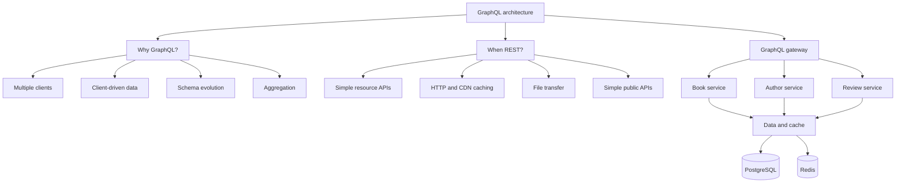

## The decision in one view

GraphQL is most useful at an experience boundary where multiple clients need different views of data spread across several domains. It gives clients control over the response shape, but moves query cost, authorization, and downstream fan-out into the server's operating model.

The gateway owns the GraphQL contract and resolves a client query through downstream services. It should not expose service or database topology directly; domain ownership and authorization boundaries still apply.

## GraphQL vs REST

Legend: **● strong fit** · **◐ possible, with trade-offs**

| Decision factor | REST | GraphQL |
| :--- | :---: | :---: |
| Client-specific data shape | ◐ | ● |
| Schema evolution | ◐ | ● |
| HTTP caching | ● | ◐ |
| Simple CRUD | ● | ● |
| Complex domain graph | ◐ | ● |
| File transfer | ● | ◐ |
| Simple query governance | ● | ◐ |

Choose GraphQL when client flexibility and aggregation solve a measured problem. Prefer REST when resources are simple, standard HTTP caching matters, or the API should remain easy for broad public consumption.

## Production guardrails

- Authenticate at the edge and authorize every protected object and field.
- Limit query depth, aliases, breadth, and calculated complexity.
- Require bounded pagination for collections.
- Apply rate limits and, where useful, persisted or allowlisted queries.
- Use DataLoader or equivalent batching to prevent N+1 downstream calls.
- Cache only where identity, freshness, and invalidation rules are explicit.
- Set resolver and downstream timeouts; use circuit breakers around remote dependencies.
- Trace the request from operation and resolver to downstream service.
- Evolve the schema additively, mark fields deprecated, and remove them only after usage falls to zero.


Do not treat GraphQL as a database proxy. An unrestricted graph can turn one small-looking client request into hundreds of calls or an expensive database query.


## Key takeaway

> **GraphQL optimizes client–server data interaction; scalability still depends on batching, caching, pagination, authorization, and efficient downstream access.**

## GraphQL FAQ

### 1. Why GraphQL instead of REST?

GraphQL is preferable when multiple clients have different data requirements, the domain has a complex object graph, and we want client-driven response shapes with schema evolution. REST is preferable for simple resource APIs, strong HTTP caching, file transfer, and straightforward public APIs.

### 2. When would you reject GraphQL?

For simple CRUD APIs, highly cacheable public resources, file-heavy APIs, webhook-style APIs, or environments where operational simplicity is more valuable than flexible querying. GraphQL also introduces query-complexity and resolver-performance concerns.

### 3. How does GraphQL scale?

GraphQL itself is not the scalability mechanism. We scale the underlying architecture using horizontal scaling, caching, batching/DataLoader, pagination, query-cost limits, connection pooling, rate limiting, and efficient downstream access.

### 4. How do you solve N+1?

Avoid per-object database or downstream calls. Use batching such as `DataLoader` or Spring `@BatchMapping`, appropriate SQL joins, or optimized repository queries. The correct choice depends on the data-access pattern.

### 5. DataLoader vs `JOIN FETCH`?

`JOIN FETCH` is a persistence-level optimization and is useful when related data should be loaded together. DataLoader is GraphQL-oriented batching and is useful when nested fields are requested dynamically. For GraphQL, DataLoader provides better alignment with client-selected fields.

### 6. How do you prevent expensive GraphQL queries?

Enforce maximum query depth, query complexity or cost, pagination, maximum page size, timeouts, rate limits, and potentially persisted or allowlisted queries. Do not allow arbitrary unbounded graph traversal.

### 7. How do you implement authorization?

Authenticate the caller first, then enforce authorization at the appropriate resolver, service, or domain boundary. Use RBAC, ABAC, and object-level authorization where required. Never rely on hiding fields in the schema as the security boundary.

### 8. How do you evolve GraphQL without versioning?

Prefer additive schema changes. Add new fields, deprecate old fields, monitor consumer usage, migrate clients, and then remove deprecated fields. Breaking changes should be treated as controlled contract changes.

### 9. How do you monitor GraphQL when everything is `POST /graphql`?

Instrument by `operationName`, resolver, field, latency, error rate, query complexity, downstream calls, and database activity. Distributed tracing should propagate from GraphQL through services to databases and other downstream systems.

### 10. How do you cache GraphQL?

Use caching at appropriate layers: CDN or HTTP where applicable, persisted-query or result caching, application or Redis caching, and DataLoader request-level caching. Cache keys must include the relevant query, variables, tenant or security context, and other correctness dimensions.

### 11. How would you introduce GraphQL into an existing REST and microservices platform?

Introduce GraphQL as a BFF or API gateway layer over existing services. Keep business logic in existing service and domain layers instead of duplicating it in GraphQL resolvers. Migrate clients incrementally and retain REST where it remains appropriate.

### 12. GraphQL Gateway vs BFF vs Federation?

A **BFF** is usually optimized for a particular client or channel. A **GraphQL Gateway** provides a unified graph across services. **Federation** distributes ownership of the graph across domains while presenting a unified schema. The choice depends on organizational boundaries, service ownership, and graph complexity.

### 13. What happens when one downstream service fails?

Define explicit timeout and deadline policies, circuit breakers, and bulkheads where appropriate. GraphQL can return partial data with errors for fields that fail, but whether partial results are acceptable depends on business semantics.

### 14. How do you handle partial failures?

Treat fields independently where possible. Return successful data plus structured GraphQL errors for failed fields. For critical dependencies, fail the complete operation instead. The policy should be explicit rather than accidental.

### 15. How do you handle 100K+ requests per second?

Horizontally scale stateless GraphQL nodes and use load balancing, caching, batching, efficient database access, connection pools, query-cost controls, rate limiting, and downstream protection. Measure bottlenecks before optimizing. GraphQL does not inherently prevent 100K+ requests per second.

### 16. How do you protect GraphQL from denial-of-service attacks?

Use authentication, rate limiting, query-depth limits, complexity analysis, maximum result sizes, pagination, timeouts, persisted queries, concurrency limits, and downstream circuit breakers. The main GraphQL-specific concern is computationally expensive queries.

### 17. How do you handle file upload and download?

Do not force large binary transfers through normal GraphQL operations. Use object storage with pre-signed URLs or dedicated REST or HTTP endpoints. GraphQL can coordinate the operation and return metadata and URLs.

### 18. How do you support subscriptions and realtime requirements?

GraphQL subscriptions can provide a unified API, typically over WebSocket or another supported realtime transport. At scale, plan for connection management, pub/sub infrastructure, backpressure, authorization, and horizontal scaling.

### 19. How do you handle multi-tenancy?

Tenant identity must come from trusted authentication context, not GraphQL arguments supplied by the client. Propagate tenant context through resolvers, services, and repositories; enforce tenant isolation at the data layer where possible; and include tenant context in cache keys.

### 20. What metrics would you monitor?

Monitor request rate, operation-level latency, error rate, query complexity, query depth, resolver latency, DataLoader batch size, database query count, cache-hit ratio, downstream latency and errors, timeouts, rejected queries, and resource utilization.

## Related decision

Use [How to Choose an API Protocol](/technology-playbook/how-to-choose-api-protocol/) when comparing GraphQL with REST, gRPC, WebSocket, SSE, and asynchronous messaging.
