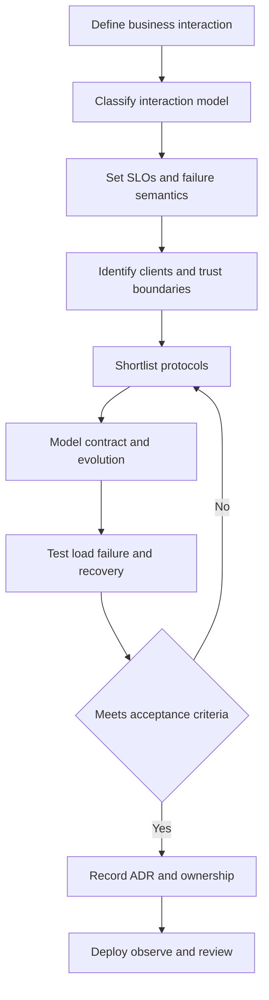
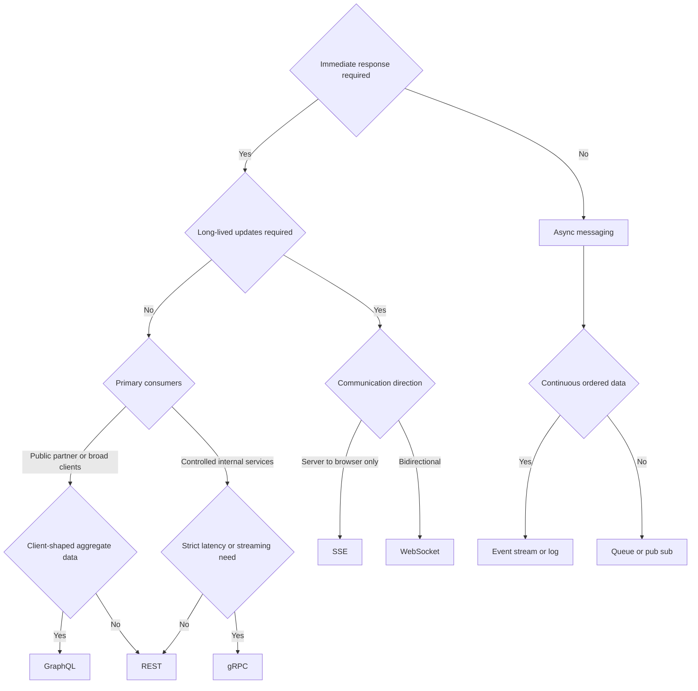
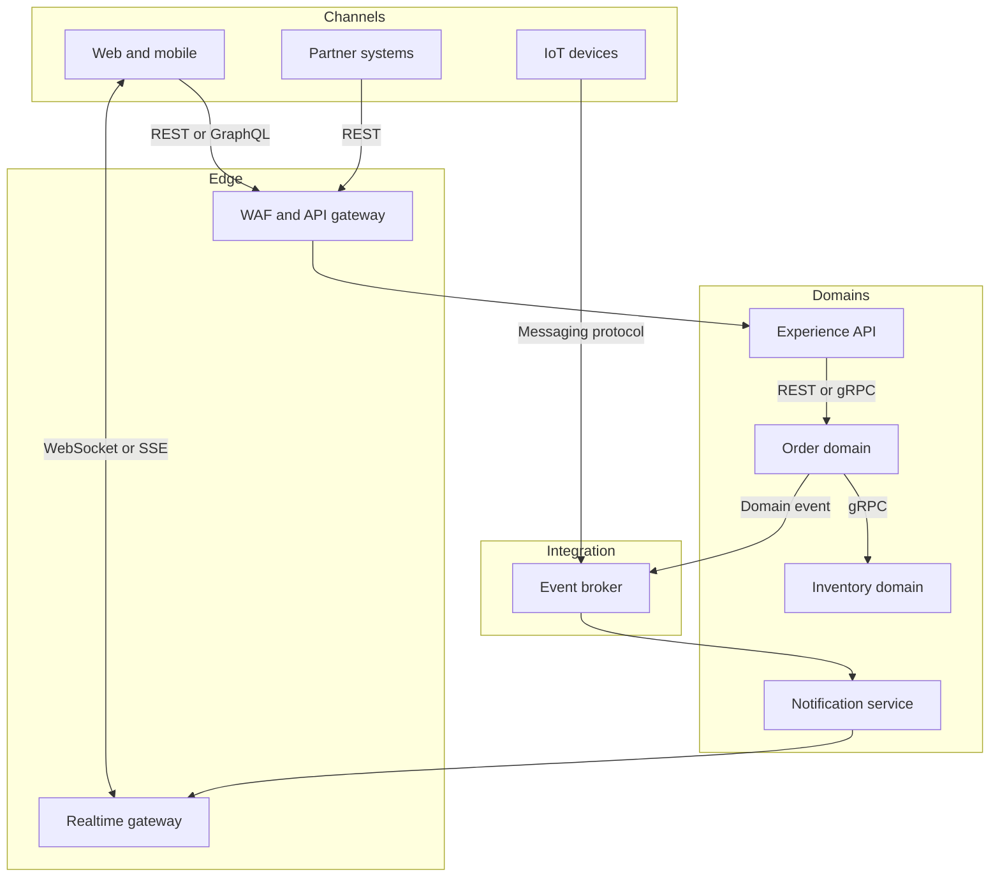

## 1. Executive Summary

An API protocol is a **coupling, failure, and operating-model decision**, not a serialization preference.

Start with the interaction model:

- Request/response
- Server push
- Bidirectional session
- Durable command or event delivery
- Continuous stream

Then evaluate client reach, latency and throughput, delivery semantics, ordering, schema evolution, security boundaries, observability, and the team's ability to operate it.

| Primary need | Default shortlist | Usually avoid |
| :--- | :--- | :--- |
| Public or partner resource API | **REST over HTTPS** | gRPC-only API for browser and third-party reach |
| Client-shaped data across several domains | **GraphQL** | GraphQL for simple CRUD or unconstrained expensive queries |
| Low-latency internal RPC or streaming | **gRPC** | Direct synchronous call chains across many services |
| Bidirectional, low-latency session | **WebSocket** | WebSocket for occasional one-way notifications |
| One-way browser updates | **SSE** | SSE for client-to-server streaming or binary frames |
| Durable decoupling and workload buffering | **Async messaging** | Messaging when the caller requires an immediate authoritative result |


**Architect recommendation:** Most enterprises need more than one protocol. A common, defensible baseline is REST or GraphQL at experience boundaries, gRPC selectively inside latency-sensitive trust zones, WebSocket or SSE for live delivery, and asynchronous messaging between bounded contexts.

Do not expose every internal protocol externally, and do not force one protocol across workloads with different failure semantics.


---

## 2. Business Problem

The business asks for:

- Responsive channels
- Reliable transactions
- Partner integration
- Near-real-time updates
- Independent delivery by teams

The protocol determines how those outcomes behave during overload, partial failure, version change, and regional disruption.

| Business concern | Architecture translation | Evidence required |
| :--- | :--- | :--- |
| Partner adoption | Open standards, stable contract, broad tooling | Consumer onboarding test and compatibility policy |
| Responsive digital journey | End-to-end p95/p99 latency, payload size, round trips | Production-shaped load test from client regions |
| Transaction certainty | Response semantics, idempotency, timeout ambiguity | Retry and duplicate-processing tests |
| Live experience | Update frequency, direction, connection duration | Concurrent-connection and reconnect test |
| Independent teams | Temporal and deployment coupling | Consumer-driven compatibility tests |
| Resilience to demand spikes | Buffering, backpressure, admission control | Burst, throttling, and recovery tests |
| Audit and regulation | Identity propagation, authorization, retention | Threat model and audit-evidence review |

> **Key takeaway:** A protocol cannot create a sound domain boundary. First define the capability owner and contract; then select the interaction style that exposes it with acceptable coupling.

---

## 3. Architecture Decision Flow

Use the flow in order.

A fast benchmark does not compensate for incompatible clients, ambiguous retry semantics, or an operating model the organization cannot support.

### Technology decision tree

> **Key takeaway:** The branches create a shortlist, not an automatic verdict. Security controls, existing gateways, client support, recovery requirements, and team maturity may eliminate the apparent first choice.

---

## 4. Where It Fits in Enterprise Architecture

Protocol decisions occur at four boundaries:

- Channel-to-enterprise
- Partner-to-enterprise
- Service-to-service
- Domain-to-domain

Each boundary can legitimately use a different protocol. Gateways, adapters, and event consumers prevent that choice from leaking everywhere.

| Boundary | Typical choice | Governance emphasis |
| :--- | :--- | :--- |
| Public and partner | REST; GraphQL when justified | Compatibility, quotas, documentation, threat protection |
| Experience API or BFF | REST or GraphQL | Consumer needs, aggregation, query-cost controls |
| Internal synchronous | REST or gRPC | Deadlines, retries, service identity, dependency depth |
| Browser live updates | SSE or WebSocket | Connection lifecycle, authorization refresh, fan-out |
| Domain integration | Async queue, pub/sub, or event stream | Ownership, schema evolution, idempotency, replay |

---

## 5. Decision Checklist


- Is the interaction request/response, server push, bidirectional, command, event, or stream?
- Must the caller receive an authoritative result before continuing?
- Who owns the contract, and can producers and consumers deploy independently?
- Are ordering, delivery, replay, cancellation, and idempotency semantics explicit?



- What are the p50, p95, and p99 end-to-end latency targets?
- What sustained throughput, burst rate, payload size, and concurrent connection count are expected?
- What availability, RTO, and RPO apply to the business journey?
- What happens during timeout, partial response, duplicate delivery, reconnect, and regional failure?



- Do browsers, mobile clients, partners, batch jobs, devices, or controlled services consume it?
- Can gateways, proxies, firewalls, and observability tooling handle the protocol end to end?
- How are authentication, per-operation authorization, rate limits, and tenant isolation enforced?
- Can the team load-test, debug, roll back, and recover the protocol in production?



**Before approval, require:**

- An ADR
- A versioning policy
- An error model
- An ownership model
- Failure tests
- Capacity assumptions
- Reassessment triggers


---

## 6. Architecture Decision Factors

| Factor | Questions experienced architects ask | Decision impact |
| :--- | :--- | :--- |
| Interaction shape | Is the exchange unary, server-streaming, client-streaming, bidirectional, or durable asynchronous? | Eliminates protocols that do not naturally model the exchange |
| Temporal coupling | Must both parties be healthy at the same time? | Favors messaging when buffering and independent recovery matter |
| Client reach | Are consumers browsers, partners, devices, or controlled services? | Favors HTTP/JSON for reach; binary RPC for controlled estates |
| Latency | What is the journey p99, including network, queues, serialization, and dependencies? | Favors fewer hops and compact protocols, but requires load evidence |
| Throughput | What messages, bytes, connections, and fan-out per second are expected? | Determines streaming, batching, compression, and partitioning strategy |
| Consistency | Does success mean accepted, committed, replicated, or fully processed? | Requires explicit response or event semantics; protocol alone does not guarantee consistency |
| Contract evolution | Can old and new clients coexist? Are fields additive? | Favors governed schemas and compatibility automation |
| Failure model | What does a timeout mean? Can work complete after the caller gives up? | Drives deadlines, idempotency keys, deduplication, and reconciliation |
| Backpressure | Can consumers slow producers safely? | Favors bounded queues, flow control, or explicit admission control |
| Security | Where are identity and authorization evaluated? Is message-level protection needed? | Drives TLS/mTLS, tokens, scopes, broker ACLs, and gateway policy |
| Observability | Can traces cross sync and async boundaries? Can payloads be inspected safely? | Requires correlation, semantic metrics, and controlled payload logging |
| Operability | Can the platform manage schemas, connections, brokers, gateways, and upgrades? | May outweigh theoretical protocol efficiency |
| Portability | Is a proprietary managed feature worth faster delivery or lower operations? | Record deliberate lock-in and an exit approach, not abstract portability goals |

### Request/response versus streaming

| Model | Best fit | Main risk |
| :--- | :--- | :--- |
| Unary request/response | Short bounded operation with immediate result | Cascading latency and ambiguous timeouts |
| Server streaming | Large result or progressive updates | Slow consumers and partial-result semantics |
| Bidirectional streaming | Interactive session or continuous control | Stateful connection ownership and recovery |
| Async command | Accepted now, processed later | Status visibility and duplicate execution |
| Event notification | Inform multiple consumers of a fact | Eventual consistency and contract misuse |
| Ordered event stream | Replayable history and independent projections | Partitioning, lag, retention, and governance |

---

## 7. Technology Categories


| Category | Use when | Do not use when | Core trade-off |
| :--- | :--- | :--- | :--- |
| **REST** | Resource-oriented public, partner, mobile, and general enterprise APIs need broad interoperability and cache-friendly HTTP semantics | Very high-frequency internal RPC, strongly client-shaped aggregation, or continuous bidirectional exchange dominates | Maximum reach and operational familiarity; payload and endpoint orchestration can be inefficient |
| **GraphQL** | Several UI clients need different projections over a governed domain graph and a BFF would otherwise proliferate endpoints | The API is simple CRUD, consumers are uncontrolled without query governance, or writes require opaque workflow semantics | Client flexibility and fewer round trips; server complexity, authorization depth, and unpredictable query cost |
| **gRPC** | Controlled internal consumers need typed contracts, low overhead, deadlines, or unary and streaming RPC | Browser/partner accessibility, human debuggability, generic intermediaries, or loose coupling is primary | Performance and generated contracts; tighter toolchain and runtime coupling |
| **WebSocket** | A session needs full-duplex, low-latency messaging such as collaborative control or multiplayer state | Updates are occasional and one-way, or durable offline delivery is required | Flexible real-time channel; connection state, fan-out, reconnect, and load-balancing complexity |
| **SSE** | Browsers need one-way notifications over standard HTTP with automatic reconnection | Client streaming, binary frames, or full-duplex communication is needed | Simple server push; one-way text stream and long-lived connection constraints |
| **Async queue/pub-sub** | Producers and consumers need time decoupling, retry, fan-out, or spike absorption | The caller needs an immediate committed result or the workflow cannot tolerate eventual completion | Resilience and decoupling; eventual consistency, duplicates, and operational state |
| **Event stream/log** | Ordered, replayable facts feed multiple consumers, analytics, or CDC projections | A transient task queue is sufficient or global ordering is required | Replay and scalable consumption; partitions, lag, retention, and schema governance |


REST, GraphQL, gRPC, WebSocket, and SSE are application-facing API styles or transports.

Async messaging is an interaction model commonly implemented through AMQP, Kafka protocol, MQTT, cloud pub/sub APIs, or webhooks.

> **Key takeaway:** Compare them at the architecture level, but do not treat them as interchangeable wire specifications.

---

## 8. Popular Products

Products should enter the process only after a protocol category survives the requirements filter.

| Category | Common open or self-hosted choices | Selection concern |
| :--- | :--- | :--- |
| REST gateways | Kong, Apache APISIX, Tyk, Envoy, NGINX | OpenAPI lifecycle, policy model, HA, plugins, and rate-limit consistency |
| GraphQL runtimes/gateways | Apollo Router/Server, GraphQL Java, Hasura | Federation ownership, query limits, resolver behavior, and subscription scale |
| gRPC infrastructure | Envoy, grpc-java, grpc-go, Buf tooling | Protobuf governance, proxy support, deadlines, streaming, and reflection policy |
| WebSocket/SSE edge | Envoy, NGINX, HAProxy, application frameworks | Connection limits, draining, affinity, fan-out, and authorization refresh |
| Queue/pub-sub | RabbitMQ, NATS, ActiveMQ Artemis | Routing, acknowledgment, redelivery, durability, and dead-letter handling |
| Event streaming | Apache Kafka, Apache Pulsar, Redpanda | Partition model, replay, retention, schema governance, and cross-region operation |


**Selection warning:** Avoid selecting a platform because it supports every protocol on a feature matrix. Evaluate the specific data path, limits, failure behavior, and operating responsibility you will use.


---

## 9. Trade-offs

| Choice | Advantages | Disadvantages | Accepted when |
| :--- | :--- | :--- | :--- |
| Synchronous | Simple caller flow, immediate validation, familiar tracing | Temporal coupling, tail-latency accumulation, retry storms | The response is required and dependency depth is bounded |
| Asynchronous | Buffering, independent scaling, fan-out, replay potential | Eventual consistency, duplicates, harder end-to-end diagnosis | Business process can expose pending state and reconcile |
| JSON/text | Human-readable, broad ecosystem, easy edge integration | Larger payloads and weaker schema enforcement by default | Interoperability matters more than wire efficiency |
| Binary/IDL | Compact, typed, code generation, efficient streaming | Tooling coupling, harder ad hoc inspection, compatibility discipline required | Consumers are controlled and performance benefit is measured |
| Long-lived connection | Low-latency push and reduced polling | Stateful capacity, reconnect storms, draining, regional routing | Update frequency and experience justify persistent sessions |
| Client-selected fields | Efficient UI composition | Query cost, data leakage, cache complexity | Strong schema, authorization, depth, and cost governance exist |

---

## 10. Anti-patterns

- **One protocol everywhere:** standardization becomes harmful when external reach, internal latency, realtime sessions, and durable integration are forced into one failure model.
- **Chatty synchronous mesh:** a user request traverses many REST or gRPC services, multiplying tail latency and failure probability.
- **GraphQL as an unbounded database proxy:** clients can traverse expensive relationships without depth, complexity, timeout, or field-level authorization controls.
- **WebSocket as a message broker:** disconnected clients lose work because sessions were mistaken for durable delivery.
- **SSE for two-way workflows:** commands are smuggled through a separate unmanaged channel without coherent correlation or security.
- **Async request/response by accident:** a broker is used, but the producer blocks for a reply, retaining temporal coupling with more infrastructure.
- **Exactly-once assumption:** business side effects are not idempotent because a platform delivery claim is treated as an end-to-end guarantee.
- **Retry without a budget:** gateways, clients, libraries, and brokers retry independently and amplify an incident.
- **Shared enterprise schema:** one canonical model couples unrelated domains and makes every evolution a coordination exercise.
- **Protocol translation everywhere:** repeated REST-to-gRPC-to-event transformations obscure ownership, errors, and observability.

---

## 11. Production Considerations

| Area | Production guidance | Signals to monitor |
| :--- | :--- | :--- |
| Scalability | Size by requests/messages per second, bytes per second, concurrent streams/connections, fan-out, and hot partitions. Test bursts and skew | Saturation, active connections, partition skew, queue depth, consumer lag |
| Availability | Bound synchronous dependency depth; use timeouts, circuit breakers, load shedding, and degraded modes. For async paths, make broker and consumer recovery explicit | Success rate by operation, timeout rate, redelivery, unavailable partitions |
| Latency | Define end-to-end percentiles. Propagate deadlines in RPC; separate queue wait from processing time in async paths | p50/p95/p99, deadline exceeded, queue age, resolver timing |
| Throughput | Apply batching and compression only after measuring CPU and latency effects. Enforce message and response-size limits | Payload distribution, compression ratio, CPU, throttling |
| Consistency | Define what acknowledgment means and surface pending or reconciled state to users | Duplicate rate, reconciliation backlog, stale-read indicators |
| Backpressure | Use bounded queues, stream flow control, consumer concurrency limits, and admission control; never permit unbounded memory growth | Rejections, buffer utilization, slow consumers, dropped updates |
| Observability | Standardize correlation IDs and trace context. Trace across brokers with produce/consume spans; avoid sensitive payload logging | RED metrics, consumer lag, reconnects, error codes, trace continuity |
| Security | Use TLS externally and mTLS or workload identity where justified. Authorize resources/fields/topics, validate payloads, and rate-limit by tenant | Auth failures, denied fields/topics, anomalous query cost, abuse rate |
| Deployment | Preserve backward compatibility during rolling releases. Drain long-lived connections and coordinate schema changes | Old-client share, connection drain time, incompatible-message count |
| Disaster recovery | Define whether endpoints fail over, connections reconnect, and brokers replicate or restore. Test DNS, credential, offset, and duplicate behavior | Demonstrated RTO/RPO, restore duration, replay volume |
| Capacity planning | Forecast normal, peak, failure, and replay capacity. Reserve headroom for reconnect storms and consumer catch-up | Headroom, cost per million operations, recovery throughput |

### Protocol-specific operational controls

| Protocol | Required controls |
| :--- | :--- |
| REST | Idempotency keys for retried writes, pagination, cache rules, consistent errors, OpenAPI compatibility checks |
| GraphQL | Persisted/allowlisted queries where appropriate, depth and complexity limits, resolver timeouts, DataLoader/batching, field authorization |
| gRPC | Deadlines, cancellation propagation, max message sizes, health checking, reflection policy, protobuf compatibility checks |
| WebSocket | Heartbeats, reconnect backoff and jitter, connection quotas, token renewal, draining, per-connection buffers |
| SSE | Event IDs, retry guidance, proxy buffering disabled, heartbeat comments, resume semantics, connection quotas |
| Messaging | Idempotent consumers, dead-letter policy, retry tiers, schema registry, poison-message handling, replay runbooks |

---

## 12. Failure Scenarios

| Failure | What happens | Architecture response |
| :--- | :--- | :--- |
| Response times out after server commit | Caller cannot know whether the write succeeded | Idempotency key, status lookup, safe retry, reconciliation |
| Slow downstream in sync chain | Threads/connections exhaust and failure cascades | Deadline budget, concurrency cap, circuit breaker, degraded response |
| GraphQL resolver fan-out | One query creates hundreds of backend calls | Query-cost limits, batching, caching, resolver budgets, persisted queries |
| WebSocket node or region fails | Thousands or millions of clients reconnect together | Jittered backoff, global routing, resumable session state, admission control |
| SSE intermediary buffers stream | Updates arrive late in bursts | Disable buffering, heartbeat, validate every proxy/CDN hop |
| Consumer stops or falls behind | Queue age/lag grows; retention may expire | Autoscale on lag and age, reserve catch-up capacity, alert on time-to-loss |
| Poison message repeats | Partition or consumer loop is blocked | Bounded retries, quarantine/DLQ, diagnostics, controlled replay |
| Schema changes incompatibly | Old client cannot decode or changes meaning | Additive evolution, compatibility gate, dual-read/write only with exit plan |
| Duplicate event causes side effect twice | Double charge, email, or inventory decrement | Business idempotency, inbox/dedup record, invariant check |
| Credentials expire on long-lived connection | Silent disconnect or unauthorized stale session | Reauthentication protocol, short-lived tokens, explicit close/reconnect |
| Regional failover reorders events | Projections diverge or stale state wins | Partition ownership, sequence/version checks, reconciliation, tested runbook |

---

## 13. Cloud Managed Services

Managed services reduce undifferentiated operations. They do not remove contract design, client retry behavior, quotas, cost controls, or recovery testing.

Capabilities and limits change, so verify the chosen tier and region during the ADR.


| Need | AWS | Azure | Google Cloud | Self-hosted |
| :--- | :--- | :--- | :--- | :--- |
| REST/HTTP API edge | API Gateway, Application Load Balancer | API Management, Application Gateway | API Gateway, Apigee, Cloud Load Balancing | Kong, APISIX, Tyk, Envoy, NGINX |
| GraphQL | AWS AppSync | API Management plus GraphQL runtime | Deploy runtime on Cloud Run/GKE; Apigee for API policy where suitable | Apollo, GraphQL Java, Hasura |
| gRPC | Application Load Balancer; service runtimes on ECS/EKS | API Management support varies by gateway/tier; runtimes on AKS/Container Apps | API Gateway gRPC, Cloud Run, GKE | Envoy plus language runtime |
| WebSocket | API Gateway WebSocket APIs, AppSync Events | Web PubSub, SignalR Service, API Management pass-through where supported | Deploy on Cloud Run/GKE; load balancer support subject to service limits | Envoy, NGINX, application gateway |
| SSE | Run behind supported HTTP services/load balancers; validate timeout limits | App Service, Container Apps, AKS; validate gateway buffering/timeouts | Cloud Run, GKE; validate duration and reconnect limits | NGINX/Envoy plus application runtime |
| Queue/pub-sub | SQS, SNS, EventBridge | Service Bus, Event Grid | Pub/Sub | RabbitMQ, NATS, ActiveMQ Artemis |
| Event streaming | Amazon MSK, Kinesis Data Streams | Event Hubs | Managed Service for Apache Kafka, Pub/Sub | Kafka, Pulsar, Redpanda |


### Cloud selection criteria

- Maximum request or message size
- Connection duration and idle timeout
- Delivery and ordering scope
- Retention and replay
- Private networking and identity integration
- Multi-region behavior
- Quotas and observability export
- Egress cost and protocol fidelity


A service bearing the protocol name may support only a subset or require a particular tier.


---

## 14. Real-world Examples

| Industry | Decision | Why it fits | Guardrail |
| :--- | :--- | :--- | :--- |
| Banking payments | REST for payment initiation; async events for ledger posting and downstream notification | Immediate validation plus durable, independently recoverable processing | Idempotency key, immutable event identity, reconciliation, audit trail |
| Retail commerce | GraphQL at mobile/web BFF; REST/gRPC within domains; events for order and inventory changes | Channel-specific views without exposing internal topology | Query-cost limits, domain-owned schemas, oversell reconciliation |
| Healthcare integration | REST/FHIR at organizational boundary; messaging for workflows and notifications | Standards-based interoperability plus resilient background exchange | Consent and field authorization, PHI-safe telemetry, delivery audit |
| Gaming | UDP or specialized game transport for fast state where applicable; WebSocket for lobby/chat; events for analytics | Different paths optimize moment-to-moment latency, sessions, and durable analysis | Never make ephemeral session transport authoritative for purchases or progression |
| AI inference | REST for broad inference APIs; gRPC/streaming for controlled low-latency token or media flows; async jobs for long-running generation | Matches response duration, client reach, and payload flow | Admission control, cancellation, token/compute quotas, output status endpoint |
| IoT | MQTT or managed pub/sub from devices; event stream for telemetry; REST for device administration | Intermittent connectivity and high-volume asynchronous telemetry | Device identity, topic ACLs, offline buffering, duplicate handling |

### Example decision

A retail checkout must:

- Tell the shopper whether an order was accepted within two seconds
- Survive promotion spikes
- Update inventory, fulfillment, loyalty, and analytics independently

The resulting decision is:

1. Use REST for the client command because the immediate response matters.
2. Commit the order and an outbox record atomically.
3. Publish an `OrderAccepted` event.
4. Process downstream events idempotently.

> **Architect recommendation:** Do not hold the shopper request open while every downstream system completes.

---

## 15. Best Practices

1. **Interaction model:** Choose it before the product or serialization format.
2. **Dependency depth:** Keep synchronous chains shallow and give each hop a deadline budget.
3. **Safe retries:** Use idempotency keys and explicit operation status for writes.
4. **Event ownership:** Treat events as domain facts owned by the producing domain, not remote procedure calls in disguise.
5. **Contract evolution:** Use additive changes and automate compatibility checks in CI.
6. **Backpressure:** Design overload behavior before the first load test.
7. **Cross-protocol standards:** Standardize identity, error semantics, correlation, tracing, and SLOs.
8. **Failure testing:** Test partial failures, duplicates, slow consumers, reconnect storms, replay, and regional recovery.
9. **State ownership:** Separate authoritative state from caches, projections, sessions, and transport buffers.
10. **Review triggers:** Record accepted trade-offs and triggers such as new client types, 3x traffic, regulatory change, or repeated SLO breach.

---

## 16. Interview Questions

1. How do you choose between REST, GraphQL, and gRPC?
2. When is asynchronous messaging preferable to synchronous request/response?
3. WebSocket versus SSE: what changes operationally?
4. How do you prevent retry storms and duplicate business side effects?
5. What does a timeout mean in a distributed write operation?
6. How do you evolve protobuf, JSON, GraphQL, and event schemas safely?
7. How do you control GraphQL query cost and field-level authorization?
8. What metrics distinguish broker health from consumer health?
9. How would you design multi-region recovery for long-lived connections and event consumers?
10. When would you reject a faster protocol in favor of REST?

---

## 17. Interview Answer


"I do not choose an API protocol from a feature comparison.

I begin with the business interaction and the cost of failure: whether the caller needs an immediate authoritative result, whether parties may recover independently, whether communication is unary, one-way streaming, bidirectional, or replayable, and who owns the contract.

I then quantify client reach, p99 latency, throughput, payload size, concurrency, availability, ordering, delivery, security, recovery, and team operability.

REST is my broad-interoperability default for public and partner request/response APIs.

I use GraphQL when diverse experience clients genuinely need client-shaped aggregation and the organization can govern query cost and authorization. I use gRPC for controlled internal RPC or streaming where typed contracts and measured efficiency justify tighter coupling.

I use SSE for simple server-to-browser updates and WebSocket for true bidirectional sessions. I choose queues, pub/sub, or event streams when buffering, fan-out, replay, or temporal decoupling matters, while designing explicitly for duplicates and eventual consistency.

I validate the shortlist with production-shaped load and failure tests, including ambiguous timeouts, slow consumers, reconnect storms, schema compatibility, and regional recovery.

The ADR records why the protocol fits this boundary, the trade-offs we accept, operational ownership, and the conditions that would make us revisit the decision."


---

## 18. Related Topics

- [Technology Playbook index](/technology-playbook/)
- [Technology Decision Matrix](/technology-playbook/module-technology-decision-matrix/)
- [How to Choose a Message Broker](/technology-playbook/how-to-choose-message-broker/)
- [API Gateway](/technology-playbook/api-gateway/)
- [Backend for Frontend](/technology-playbook/bff-pattern/)
- [Event-Driven Architecture](/technology-playbook/event-driven-architecture/)
- [Service Mesh](/technology-playbook/service-mesh/)
- [Circuit Breaker Pattern](/technology-playbook/circuit-breaker-pattern/)
