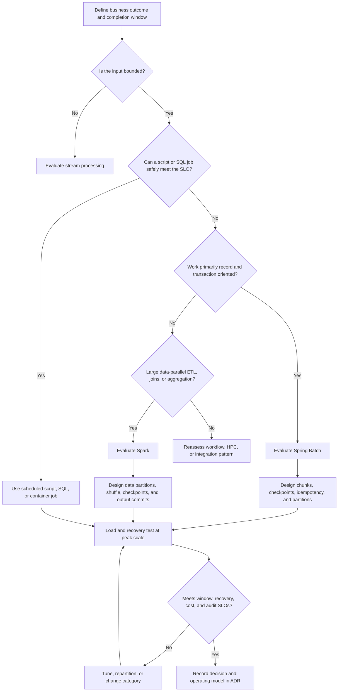
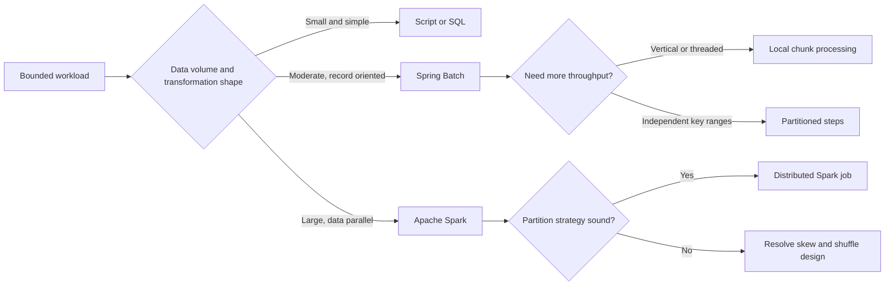
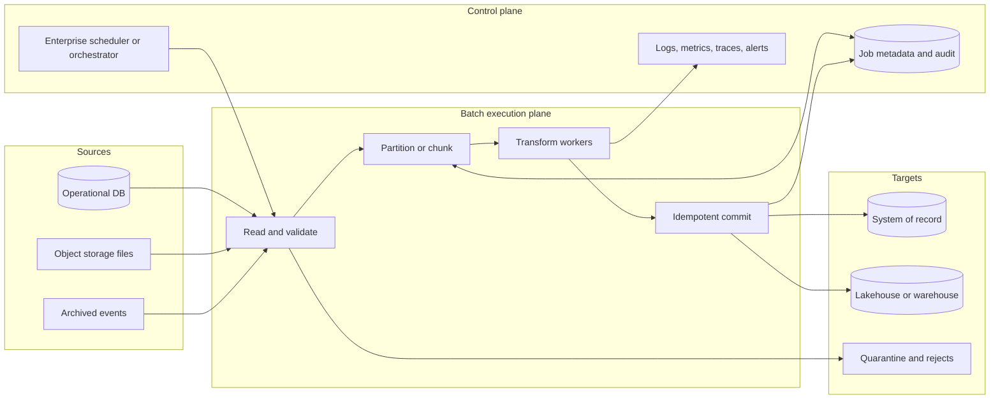

## 1. Executive Summary

A batch engine executes **bounded work**: a known dataset is read, transformed, and written on a schedule or in response to an event.

The architectural choice is usually not “Spring Batch or Spark?” in isolation. It is whether the workload is:

- **Transaction-oriented**
- **Data-parallel**
- Simple enough to need **no specialized engine**

| Workload | Default direction | Why |
| :--- | :--- | :--- |
| Millions of business records, database reads/writes, per-item validation, transactional commits | **Spring Batch** | Chunk transactions, job metadata, skip/retry, checkpointing, and restartability fit application-centric jobs |
| Hundreds of GB to PB, joins and aggregations across files or lake tables, elastic parallelism | **Apache Spark** | Distributed execution, partitioned datasets, shuffle, SQL, and broad data-source support |
| Small deterministic job, short runtime, safe full rerun | **Script, SQL procedure, or container job** | Lower operational and cognitive cost |
| Continuous events requiring seconds or sub-seconds | **Stream processor** | A bounded batch engine creates avoidable latency |
| Dependencies across many jobs and systems | **Orchestrator plus an execution engine** | Scheduling and dependency control are different from record processing |


Choose the **simplest restartable execution model** that completes the peak dataset inside the business window, protects source and target systems, and can prove what was processed exactly once at the business level.


---

## 2. Business Problem

Enterprises use batch processing when work does not need to complete in the request path and benefits from consolidation.

Common workloads include:

- End-of-day settlement and payroll
- Claims adjudication and inventory reconciliation
- Regulatory extracts
- Feature generation
- Lakehouse ETL

The business requirement is rarely just “process a file.” It normally includes:

- Complete before a **business deadline**, such as market open or warehouse dispatch.
- Process a defined cutoff consistently even while operational data changes.
- Recover after failure **without duplicating financial or clinical effects**.
- Reconcile input, accepted, rejected, and output counts for audit.
- Scale for month-end, campaign, enrollment, or telemetry peaks.
- Limit load on OLTP databases and downstream APIs.
- Retain evidence showing which code, parameters, and source snapshot produced an output.

Batch is a good fit when bounded inputs, throughput, and recoverability matter more than immediate response. It is not a substitute for real-time integration, workflow orchestration, or an event stream.

---

## 3. Architecture Decision Flow

### Technology decision tree


**Architect recommendation:** Do not use a successful happy-path run as the proof point. Use a peak-volume test that includes worker loss, partial writes, restart, reconciliation, and downstream throttling.


---

## 4. Where It Fits in Enterprise Architecture

A batch engine belongs in the **execution plane**.

- An enterprise scheduler or workflow orchestrator **triggers execution** and manages cross-system dependencies.
- The batch engine owns **reading, transforming, checkpointing, and writing** its bounded dataset.

| Concern | Primary owner |
| :--- | :--- |
| Calendar, dependency graph, manual approval, cross-system SLA | Scheduler or orchestrator |
| Read-process-write lifecycle, chunk transaction, skip/retry, step restart | Batch engine |
| Distributed SQL, shuffle, caching, data partitions | Data-processing engine such as Spark |
| Durable input and replay boundary | Database snapshot, object storage, table format, or log |
| Business deduplication and reconciliation | Application and data design—not the scheduler |
| Runtime placement, isolation, autoscaling | Container, Kubernetes, or managed cloud platform |

> **Key takeaway:** Keep orchestration and execution responsibilities explicit. The scheduler controls *when* work runs; the batch engine controls *how* bounded records are processed and recovered.

---

## 5. Decision Checklist


1. Is the input **bounded**, and how is its cutoff or snapshot defined?
2. What are average, peak, and three-year volumes in records and bytes?
3. What completion window, recovery-time objective, and recovery-point objective apply?
4. Is processing record-oriented, set-oriented, graph-like, ML-oriented, or dominated by joins?
5. Must a rerun reproduce the same result from the same inputs and code version?



1. What is the unit of commit: item, chunk, file, partition, or whole job?
2. Where is the checkpoint stored, and is it consistent with target commits?
3. Are writers idempotent by business key or protected by a unique constraint?
4. Can completed work be skipped safely after a crash?
5. How are rejected records quarantined, corrected, and replayed?
6. How are input, processed, skipped, duplicate, and output counts reconciled?



1. Can sources and sinks sustain planned concurrency without harming online traffic?
2. Is data locality more important than transaction integration?
3. Does the team operate JVM batch applications, distributed Spark, or a managed service more reliably?
4. Are encryption, private networking, lineage, retention, and data-residency controls available?
5. Does the cost model include idle clusters, shuffle, storage requests, retries, and cross-zone or cross-region transfer?


### Fast decision matrix


| Factor | Script / SQL | Spring Batch | Spark |
| :--- | :--- | :--- | :--- |
| Typical shape | Simple sequential or set-based task | Record-oriented business processing | Data-parallel ETL and analytics |
| Scale | Small to moderate | Moderate to large with partitioning | Large to very large |
| Transaction model | Custom or database transaction | Chunk-oriented transactions | Partition/task output commits; not OLTP transactions |
| Restart metadata | Custom | First-class job and step repository | Recompute failed tasks; application-level job recovery |
| Best data location | Local file or database | Databases, files, services | Object storage, lakehouse, distributed storage |
| Operational cost | Low initially | Moderate | Moderate to high; lower with managed/serverless options |
| Choose when | Full rerun is cheap and safe | Audit, skip/retry, and business commits dominate | Parallel scans, joins, aggregation, or ML dominate |
| Avoid when | Failure handling is becoming a framework | PB-scale shuffle-heavy ETL | Per-record side effects or strict cross-resource transactions dominate |


---

## 6. Architecture Decision Factors

### Processing semantics

#### Chunk processing

**Chunk processing** reads a bounded number of items, transforms them, writes them, and then commits.

| Chunk choice | Benefit | Cost |
| :--- | :--- | :--- |
| **Smaller chunks** | Reduce replay after failure and shorten transaction duration | Increase commit overhead |
| **Larger chunks** | Improve throughput | Consume more memory, hold locks longer, and enlarge the replay unit |

Measure chunk size against:

- Target latency
- Database log pressure
- Lock duration
- Failure cost

#### Checkpointing

**Checkpointing** records safe progress. A useful checkpoint represents committed work—not merely the last item read.

| Checkpoint timing | Failure consequence |
| :--- | :--- |
| Advances **before** the target commit | Data can be lost |
| Advances **after** the target commit without idempotency | A crash can cause duplicates |

#### Restartability

**Restartability** means a failed job instance can continue from a known state using:

- Immutable job parameters
- Execution metadata
- Replay-safe writers

Restartability is not the same as retry:

| Mechanism | Purpose |
| :--- | :--- |
| **Retry** | Repeats a transiently failed operation |
| **Restart** | Reconstructs job state after the process or infrastructure has ended |

### Data and transaction boundary

| Question | Architectural implication |
| :--- | :--- |
| Must source and target update atomically in one database? | Spring Batch with a local transaction is often simpler |
| Are source and target different systems? | Assume no distributed transaction; use idempotency, staging, manifests, or outbox patterns |
| Is input immutable in object storage? | Spark gains data locality and safe replay advantages |
| Are per-record API calls required? | Bound concurrency, handle rate limits, and prefer bulk APIs; Spark executors can amplify calls dangerously |
| Does processing require wide joins or aggregations? | Spark is usually more natural; model shuffle and skew explicitly |
| Must bad records be tolerated? | Define skip policy, quarantine contract, threshold, and reconciliation—not silent dropping |

### Partitioning

Partitioning improves elapsed time only when partitions are **independent and balanced**.

| Partition-key quality | Examples or consequences |
| :--- | :--- |
| **Good keys** | Immutable date ranges, tenant IDs, account ranges, source-file manifests |
| **Poor keys** | Skew, overlap, missed records, contention |

Choose partition count from:

- Measured work per partition
- Available compute
- Connection-pool capacity
- Target write throughput
- Recovery granularity


**Trade-off:** More partitions are not automatically faster. Coordination, file creation, database contention, and shuffle overhead eventually dominate.


### Latency, throughput, and consistency

- **Latency:** Batch optimizes total completion time, not per-event response. Use streaming when freshness is an SLO rather than a reporting preference.
- **Throughput:** Measure end-to-end committed records per second, not transformation speed alone.
- **Consistency:** Freeze an input snapshot or cutoff and publish outputs atomically where possible. Readers should never see half of a business-period result.
- **Availability:** Most batch systems tolerate temporary unavailability if restart meets the business deadline. Do not pay for active-active execution unless the business impact justifies it.

---

## 7. Technology Categories

| Category | Best fit | Strengths | Limits |
| :--- | :--- | :--- | :--- |
| **Application batch framework** | Business records, validation, enrichment, database writes | Chunk transactions, job metadata, skip/retry, restart | Scaling requires careful partition and resource design |
| **Distributed data engine** | Large ETL, lakehouse transforms, aggregation, ML preparation | Parallelism, SQL, joins, ecosystem | Shuffle cost, skew, memory tuning, weak fit for per-record side effects |
| **ELT / warehouse-native SQL** | Transform data already in a cloud warehouse | Minimal data movement, governed SQL, elastic compute | Vendor coupling and poor fit for complex procedural logic |
| **Managed ETL service** | Connector-heavy integration with limited platform staff | Provisioning, catalog, monitoring, scaling | Service constraints, cost opacity, portability trade-offs |
| **Container or serverless job** | Small isolated executable with simple recovery | Low platform overhead, language freedom | Checkpointing, metadata, and reconciliation remain application concerns |
| **HPC array / grid job** | CPU-intensive simulation, rendering, scientific workloads | Massive compute parallelism | Not an ETL or transactional batch model |
| **Stream processor** | Unbounded input and continuous freshness | Low latency, stateful event-time processing | More complex state and delivery semantics; not the default for bounded jobs |

### Spring Batch versus Spark


| Dimension | Spring Batch | Apache Spark |
| :--- | :--- | :--- |
| Primary abstraction | Job, step, item reader, processor, writer | DataFrame or dataset transformed across executors |
| Natural workload | Transactional and record-oriented | Data-parallel and analytical |
| Checkpoint/restart | Durable job repository and execution context | Stage/task recomputation; checkpoints for some APIs; job-level publishing must be designed |
| Commit scope | Configurable chunk transaction | Partition/file/table commit protocol |
| Horizontal scale | Multi-threaded steps, local/remote chunking, partitioned steps | Native distributed partitions and executors |
| Data skew | Partition design issue | Partition and shuffle issue; often a primary performance risk |
| Side effects | Controlled item/chunk writers | Must be idempotent; executor retry can repeat side effects |
| Team fit | Java/Spring application teams | Data engineering teams using SQL, Python, Scala, or Java |
| Operational footprint | Application runtime plus metadata database | Driver, executors, cluster/serverless runtime, logs, shuffle storage |


---

## 8. Popular Products

| Product or approach | Category | Use it when | Do not choose it merely because |
| :--- | :--- | :--- | :--- |
| **Spring Batch** | Application batch framework | Business-domain processing needs chunk commits, job metadata, skip/retry, and deterministic restart | The organization already uses Spring Boot |
| **Apache Spark** | Distributed data engine | Large scans, joins, aggregation, feature engineering, or lakehouse ETL need cluster parallelism | The input has “big data” in its name but fits on one node |
| **Apache Beam** | Portable batch/stream programming model | One logical model across supported runners has strategic value | Portability is assumed to be cost-free |
| **Flink batch/runtime modes** | Distributed data processing | The estate already uses Flink and bounded plus unbounded processing need a shared model | A bounded nightly job requires streaming complexity |
| **dbt / warehouse SQL** | ELT | Transformations are primarily SQL and data already resides in the analytical platform | It can replace operational transaction processing |
| **Cloud ETL services** | Managed ETL | Managed connectors, catalog integration, and reduced infrastructure work outweigh lock-in | “Serverless” eliminates data design and cost governance |
| **Kubernetes Job / cloud container job** | Generic job runtime | A simple containerized task needs retries and isolation | Platform retries provide business-level exactly-once behavior |

An orchestrator such as Airflow, Prefect, Control-M, or a cloud workflow service can trigger these products, but it does not replace their execution and recovery semantics.

---

## 9. Trade-offs


| Decision | Advantage | Disadvantage | Architectural guardrail |
| :--- | :--- | :--- | :--- |
| Chunk commits | Bounded memory and replay; shorter transactions | Partial job output exists during execution | Stage results or expose only a completed generation |
| Large chunks | Higher throughput and fewer commits | Longer locks, more replay, larger memory use | Tune with realistic failures and DB log metrics |
| Fine-grained partitions | Parallelism and smaller recovery units | Coordination, small files, metadata growth | Set minimum partition size and compact outputs |
| Distributed Spark | Elastic parallel scans and transforms | Shuffle, skew, startup time, cluster expertise | Measure bytes shuffled, spill, skew, and cost per successful run |
| Managed service | Less provisioning and patching | Constraints, lock-in, variable spend | Keep portable data formats and benchmark total run cost |
| Self-hosted engine | Runtime control and predictable reserved capacity | Upgrade, HA, security, and on-call ownership | Establish platform SLOs and automated lifecycle management |
| At-least-once retry | Better availability under transient failure | Duplicate side effects | Idempotency key, unique constraint, or transactional outbox |
| Full rerun | Simple mental model | Expensive and potentially duplicative | Use only with immutable inputs and replaceable outputs |


> **Key takeaway:** The central trade-off is **recovery certainty versus parallel throughput**. Increasing concurrency can shorten the happy path while making checkpoint coordination, source load, target contention, and incident recovery harder.

---

## 10. Anti-patterns

- **Using Spark for every file:** cluster startup, shuffle, and operating cost outweigh benefits for small jobs.
- **Building a framework around a script:** once custom code tracks checkpoints, retries, dependencies, and audit history, it has recreated a weaker batch engine.
- **Treating the scheduler as the engine:** a scheduler can rerun a failed command but cannot infer which business records committed.
- **Offset equals correctness:** saving a read offset without coordinating target commits creates gaps or duplicates.
- **Blind retry of non-idempotent writes:** repeated payments, notifications, or inventory movements are business incidents, not technical duplicates.
- **Parallelizing before measuring:** extra threads or executors can saturate the database, API, network, or object-store request rate.
- **Partitioning mutable data by offset:** inserts and deletes can shift pages between workers; use stable keys or snapshots.
- **One giant transaction:** long locks, log growth, expensive rollback, and fragile recovery.
- **One record per transaction:** safe-looking but usually destroys throughput and increases log overhead.
- **Silent skip policy:** completing “successfully” after discarding records breaks audit and trust.
- **In-place publication:** consumers observe partial results while partitions are still committing.
- **Assuming exactly-once from the engine:** external side effects still require business idempotency and reconciliation.
- **Running unbounded history every night:** use watermarks or manifests, while retaining a controlled backfill path.

---

## 11. Production Considerations

### Scalability and capacity planning

Start with a budget:

`required throughput = peak input records / available processing seconds`

Then include:

- Validation failures and retries
- Skew and startup time
- Checkpoint writes and compaction
- A recovery reserve

Capacity tests should use representative record sizes and cardinality—not synthetic identical rows.

- Measure source read capacity and target commit capacity before adding workers.
- Set connection pools and API concurrency below downstream safety limits.
- For Spark, capture input bytes, shuffle read/write, spill, executor loss, skewed task duration, and output file count.
- For Spring Batch, capture read/process/write rates, commit duration, rollback count, skip/retry count, pool saturation, and JobRepository latency.
- Test at expected peak, at three times expected peak, and with one constrained dependency.

### Availability, restartability, and disaster recovery

- Store job metadata in a durable, backed-up database when restart depends on it.
- Make input snapshots, manifests, code artifacts, schemas, and job parameters recoverable for the audit period.
- Define whether disaster recovery restarts in the primary region, fails over to a second region, or waits for restoration.
- Prevent two regions or schedulers from executing the same business job concurrently; use a durable job-instance identity and fencing.
- Test restoration of metadata and replay from immutable input. A backup that has never produced a successful restart is not a recovery design.

For many nightly jobs, warm standby plus replay is economically better than active-active. Let the business deadline and maximum tolerable data loss drive the topology.

> **Architect recommendation:** Choose the recovery topology from the business deadline and maximum tolerable data loss. Do not default to active-active execution for a restartable nightly workload.

### Monitoring and observability

| Signal | Why it matters | Example alert |
| :--- | :--- | :--- |
| Job start delay and duration | Protects the completion window | Forecasted completion exceeds business deadline |
| Records read, written, skipped, retried | Exposes loss, duplication, and quality issues | Reconciliation delta is non-zero |
| Last successful checkpoint | Shows recovery exposure | No progress for a defined interval |
| Partition duration distribution | Reveals skew or stuck workers | Slowest partition exceeds percentile threshold |
| Source and sink latency/throttling | Identifies external bottleneck | Sustained rate limiting or pool saturation |
| Resource and cost per run | Supports capacity and FinOps | Cost per million records deviates from baseline |
| Reject reason distribution | Detects upstream schema/data drift | New reason code or threshold breach |

Correlate every log, metric, and trace with `job_instance_id`, `execution_id`, step, partition, input generation, and code version. Retain a concise run manifest even if detailed logs have shorter retention.

### Security

- Use workload identities and least-privilege access; do not embed long-lived credentials in job parameters.
- Encrypt source, checkpoint, temporary shuffle, reject, and output data in transit and at rest.
- Treat reject files and debug samples as production data; they often contain the most sensitive raw fields.
- Isolate network paths to databases and object stores, and control data exfiltration from worker nodes.
- Mask secrets and regulated fields in logs. Audit manual restart, skip, backfill, and override actions.
- Patch base images and dependencies, sign artifacts, and scan connectors because batch jobs often have broad data access.

### Deployment and change management

- Version job definitions, schemas, transforms, and restart state together.
- Decide whether an in-flight execution restarts on the old artifact or migrates to a new one; never leave this implicit.
- Use canary input partitions or shadow comparison for high-impact calculation changes.
- Make database migrations backward-compatible with the currently running job version.
- Separate a routine restart from a backfill; backfills need explicit scope, resource limits, reconciliation, and approval.

---

## 12. Failure Scenarios

| Failure | Risk | Recovery design |
| :--- | :--- | :--- |
| Worker dies after target commit but before checkpoint | Duplicate write on restart | Idempotent upsert or unique business key; reconcile checkpoint with target |
| Checkpoint advances before target commit | Missing records | Commit checkpoint only with or after durable output; replay from earlier safe point |
| One partition is much larger | Completion window missed | Detect skew, split heavy keys, salt aggregates, or allocate adaptive capacity |
| Source changes during scan | Inconsistent result or missed rows | Snapshot isolation, immutable extract, cutoff timestamp, or manifest |
| Schema changes mid-run | Corruption or mass rejects | Contract validation before execution; pin schema version; quarantine safely |
| Downstream database slows | Locking, timeouts, online impact | Backpressure, bounded concurrency, adaptive chunk size, circuit breaking, reschedule |
| Spark executor repeats a task | Duplicate external side effects | Avoid side effects in transformations; use transactional table/file commit and idempotent sinks |
| Driver or coordinator fails | Lost orchestration state | Durable metadata, restartable submission, immutable parameters and artifacts |
| Partial output becomes visible | Consumers read inconsistent generation | Write to staging and atomically publish a manifest, table version, or pointer |
| Poison record repeatedly fails | Infinite retry and blocked completion | Retry only transient errors; quarantine permanent errors with threshold and owner |
| Metadata store is lost | Completed work cannot be distinguished | Backup, point-in-time recovery, run manifests, and tested restore procedure |
| Duplicate trigger | Same business period processed twice | Unique job-instance key, launch lock, fencing, and idempotent outputs |


“Exactly once” must be stated at a boundary. An engine may execute a task once according to its metadata while an external API observes the same business request twice. Define correctness in terms of durable business effects and reconciliation.


---

## 13. Cloud Managed Services

Cloud services map to different categories; they are not interchangeable merely because each can run on a schedule.


| Need | AWS | Azure | Google Cloud | Self-hosted |
| :--- | :--- | :--- | :--- | :--- |
| Managed Spark ETL | AWS Glue, Amazon EMR, EMR Serverless | Azure Databricks, Azure Synapse Spark | Dataproc, Serverless for Apache Spark | Spark on Kubernetes or YARN |
| Connector-led pipeline and orchestration | AWS Glue Workflows, Step Functions, Managed Workflows for Apache Airflow | Azure Data Factory, Microsoft Fabric Data Factory | Cloud Data Fusion, Cloud Composer, Workflows | Airflow, Prefect, Dagster |
| Generic container or task batch | AWS Batch, ECS tasks, EKS Jobs | Azure Batch, Container Apps Jobs, AKS Jobs | Batch, Cloud Run jobs, GKE Jobs | Kubernetes Jobs, Nomad |
| Warehouse-native ELT | Redshift SQL and dbt | Fabric or Synapse SQL and dbt | BigQuery SQL and Dataform or dbt | dbt with chosen warehouse |
| Spring Batch runtime | ECS, EKS, EC2, or container job with managed database | AKS, App Service/container runtime, VM, or container job with managed database | GKE, Cloud Run jobs, Compute Engine, or container runtime with managed database | Kubernetes, VM, or application platform plus durable JobRepository |


Selection guidance:

- Use **managed Spark** when large data-parallel processing is the fit and reducing cluster lifecycle work is worth service constraints.
- Use **managed ETL** when connector coverage, catalog integration, and platform standardization matter more than engine portability.
- Use a **generic batch runtime** for containerized executables or HPC-style task arrays; add application-level checkpoint and reconciliation where required.
- Hosting Spring Batch on a cloud runtime does not make job metadata optional. Keep its JobRepository durable, highly available enough for the SLO, and protected from concurrent duplicate launches.
- Prefer open table and file formats, externalized SQL or transformation logic where practical, and explicit egress estimates to preserve an exit path.


**Cloud decision:** Verify current service behavior during procurement and ADR approval. Managed service boundaries, runtime support, and pricing can change.


### Official service references

- [AWS Glue serverless Spark ETL](https://docs.aws.amazon.com/glue/latest/dg/how-it-works.html)
- [Amazon EMR Serverless Spark jobs](https://docs.aws.amazon.com/emr/latest/EMR-Serverless-UserGuide/jobs-spark.html)
- [Azure Data Factory with Azure Batch](https://learn.microsoft.com/azure/batch/tutorial-run-python-batch-azure-data-factory)
- [Google Cloud Serverless for Apache Spark](https://docs.cloud.google.com/dataproc-serverless/docs/overview)

---

## 14. Real-world Examples

### Banking — end-of-day settlement

- **Input:** Freeze a business-date input manifest.
- **Processing:** Validate transactions, partition by account range, calculate balances and fees, and post idempotently using a settlement ID.
- **Engine fit:** Spring Batch fits when business rules and transactional database writes dominate. Spark fits upstream reconciliation across very large payment and ledger datasets.
- **Publication:** Publish only after control totals match.

### Retail — inventory and sales ETL

- **Input:** Stores upload immutable daily files to object storage.
- **ETL:** Spark joins sales, returns, product, and promotion data and writes partitioned lakehouse tables.
- **Posting:** A smaller application batch posts approved inventory adjustments to the ERP.
- **Decision:** Separate analytical ETL from transactional posting to prevent Spark task retries from duplicating business movements.

### Healthcare — claims adjudication

- **Processing:** A Spring Batch job reads claims, validates eligibility and coding rules, enriches reference data, and commits bounded chunks.
- **Reject handling:** Invalid claims enter an access-controlled quarantine queue.
- **Audit:** Job metadata, rule versions, and input manifests support audit and deterministic reprocessing.
- **Security:** Logs exclude protected health information.

### ERP — month-end close

- **Orchestration:** An enterprise scheduler coordinates extracts, currency revaluation, consolidation, and reports.
- **Recovery:** Each engine owns its own restart boundary.
- **Partitioning:** Stable legal-entity partitions allow parallelism; final consolidation waits for all entity control totals.
- **Fencing:** A duplicate launch is fenced by company and accounting-period identity.

### AI — offline feature generation

- **Processing:** Spark computes training and batch-inference features from immutable lake snapshots.
- **Metadata:** Outputs include the source snapshot, feature definition version, model version where relevant, and quality metrics.
- **Boundary:** Online feature serving is a separate architecture; the batch job optimizes throughput and reproducibility rather than request latency.

### IoT — telemetry compaction

- **Processing:** Archived device events are processed hourly or daily to deduplicate, aggregate, and compact small files.
- **Engine fit:** Spark suits high-volume partitioned telemetry, provided hot devices do not create skew.
- **Boundary:** If operational decisions need second-level freshness, a streaming path runs separately; batch remains the reconciliation and backfill path.

---

## 15. Best Practices

1. Define the **business job instance** using stable parameters such as tenant, business date, source generation, and calculation version.
2. Preserve immutable input or a reproducible database snapshot for every auditable run.
3. Make every writer idempotent at the business boundary; do not rely solely on framework execution status.
4. Align checkpoint advancement with durable commits and document the replay unit.
5. Start single-process, then add threads or partitions only after measuring the bottleneck.
6. Partition by stable, non-overlapping keys and continuously measure skew.
7. Protect OLTP systems with read replicas, extracts, rate limits, bounded pools, and off-peak windows where appropriate.
8. Stage multi-partition output and publish it atomically through a manifest, table snapshot, or version pointer.
9. Separate transient retry, job restart, reject replay, and historical backfill as distinct operating procedures.
10. Reconcile counts and financial or domain totals before declaring success.
11. Test process death immediately before and after a commit, duplicate triggers, schema drift, and dependency throttling.
12. Alert on projected deadline breach, stalled checkpoints, reconciliation mismatch, and abnormal cost—not only on process failure.
13. Record rejected alternatives, benchmark evidence, recovery behavior, and exit strategy in the ADR.
14. Revisit the decision when the freshness SLO, data location, volume, team operating model, or regulatory boundary changes.

---

## 16. Interview Questions

1. How do you decide between Spring Batch and Spark?
2. What is chunk-oriented processing, and how do you choose a chunk size?
3. What is the difference between retry, checkpointing, and restartability?
4. How do you prevent duplicate side effects when a job restarts?
5. How would you partition a batch job without missing or duplicating records?
6. Why can increasing Spark partitions or Spring Batch workers reduce throughput?
7. How do you publish output atomically when many workers write in parallel?
8. What metrics predict that a job will miss its completion window?
9. When is a scheduled script better than a batch framework?
10. When should batch be replaced or complemented by streaming?
11. How would you design disaster recovery for a month-end financial job?
12. What does exactly-once mean when the target is an external API?

---

## 17. Interview Answer


“I start with the business boundary: what bounded dataset represents a complete run, what deadline applies, and what evidence proves success. I then classify the processing shape. For record-oriented business processing with validation, database transactions, skip and retry policies, and explicit restart metadata, Spring Batch is usually the stronger fit. For large scans, joins, aggregations, and lakehouse ETL where data can be partitioned, Spark is usually the better execution model. If a script or warehouse SQL safely meets the SLO, I avoid introducing either.

I treat restartability as a design property, not a product checkbox. The input must be reproducible, checkpoints must align with durable commits, and writers must be idempotent by business key because worker or task retries can repeat external effects. I choose chunk and partition sizes from the completion window, source and sink capacity, skew, transaction duration, and recovery granularity—not CPU count alone.

Before approving the decision, I run peak-volume and failure tests, including crashes around commit boundaries, duplicate triggers, slow dependencies, and disaster recovery. I require reconciliation, atomic publication, security controls, observability, a three-year cost model, and a clear operating owner. Managed cloud services may reduce infrastructure work, but they do not remove correctness, data governance, or exit-strategy decisions.”


---

## 18. Related Topics

- [Technology Playbook index](/technology-playbook/)
- [Apache Spark](/technology-playbook/apache-spark/)
- [How to Choose a Workflow Engine](/technology-playbook/how-to-choose-workflow-engine/)
- [How to Choose a Scheduler](/technology-playbook/how-to-choose-scheduler/)
- [Apache Flink](/technology-playbook/apache-flink/)
- [Apache Beam](/technology-playbook/apache-beam/)
- [Airflow](/technology-playbook/airflow/)
- [Prefect](/technology-playbook/prefect/)

### Spring Batch framework references

- [Chunk-oriented processing](https://docs.spring.io/spring-batch/reference/step/chunk-oriented-processing.html)
- [Restart configuration](https://docs.spring.io/spring-batch/reference/step/chunk-oriented-processing/restart.html)
- [Partitioning and parallel processing](https://docs.spring.io/spring-batch/reference/scalability.html)
