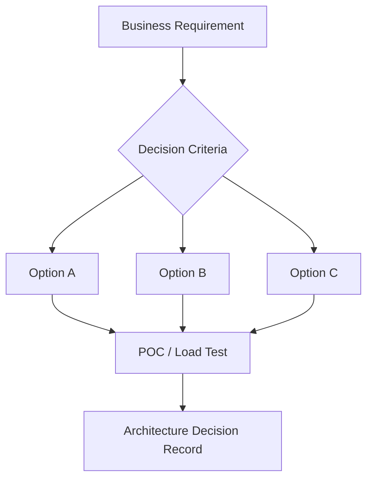

## 1. Executive Summary

In-memory vs distributed cache — consistency, TTL, eviction, and session vs object caching. This decision guide turns vague "which tool?" meetings into **repeatable criteria** architects can defend in ADRs and interviews.

---

## 2. What Problem It Solves

| Without a framework | With a framework |
| :--- | :--- |
| Brand-driven choices | Requirement-driven shortlist |
| Late performance surprises | POC criteria defined upfront |
| Ops mismatch | Team skill and SRE capacity factored in |

---

## 3. Where It Fits in Architecture

---

## 4. When to Choose — Decision Checklist


1. What are the **access patterns** (read/write ratio, latency, consistency)?
2. What is the **scale trajectory** in 12–24 months?
3. **Managed vs self-hosted** — can we operate HA ourselves?
4. What **compliance** constraints apply (region, encryption, audit)?
5. What does the team **already know** — learning curve budget?


---

## 5. When Not to Choose — Anti-patterns

- Picking the tool the team used last job without workload fit
- Skipping **load test** because POC "felt fast"
- Ignoring **exit strategy** and vendor lock-in
- Choosing distributed tech when a single-node solution meets SLOs for years

---

## 6. Popular Tools / Products

Browse the relevant playbook module for product-specific pages and cloud equivalents.

---

## 7. Trade-offs


| Criterion | Favor managed cloud | Favor self-hosted / OSS |
| :--- | :--- | :--- |
| **Time to prod** | Faster | Slower — need platform team |
| **Control** | Limited knobs | Full tuning |
| **Cost at scale** | OpEx predictable early | CapEx/engineering may win later |
| **Compliance** | Shared responsibility | You own patching and audit |


---

## 8. Real-World Example

**ERP inventory service:** PostgreSQL for transactional stock; Redis for hot SKU cache; Kafka for stock-change events to warehouse and ecommerce; Elasticsearch for store-facing search.

---

## 9. Failure Scenarios

- **Wrong store for access pattern** — e.g. graph traversal in relational without modeling
- **Operational underestimation** — Kafka without monitoring consumer lag
- **Cost shock** — serverless + egress at high volume

---

## 10. Best Practices

1. Shortlist **two options** and run the same POC scenario on both.
2. Write an **ADR** with rejected alternatives.
3. Include **run cost** estimate at 3× expected scale.

---

## 11. Interview Answer


"I don't pick technologies by popularity. For **Choose Cache**, I walk through access patterns, consistency, ops model, compliance, and team skills — then map to a shortlist. I always mention what I'd choose for a startup MVP vs a regulated bank production path."


---

## 12. Related Topics

- [Technology Playbook index](/technology-playbook/)
- Product-specific pages in modules 3–6
