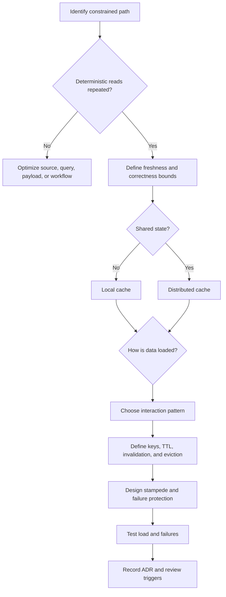
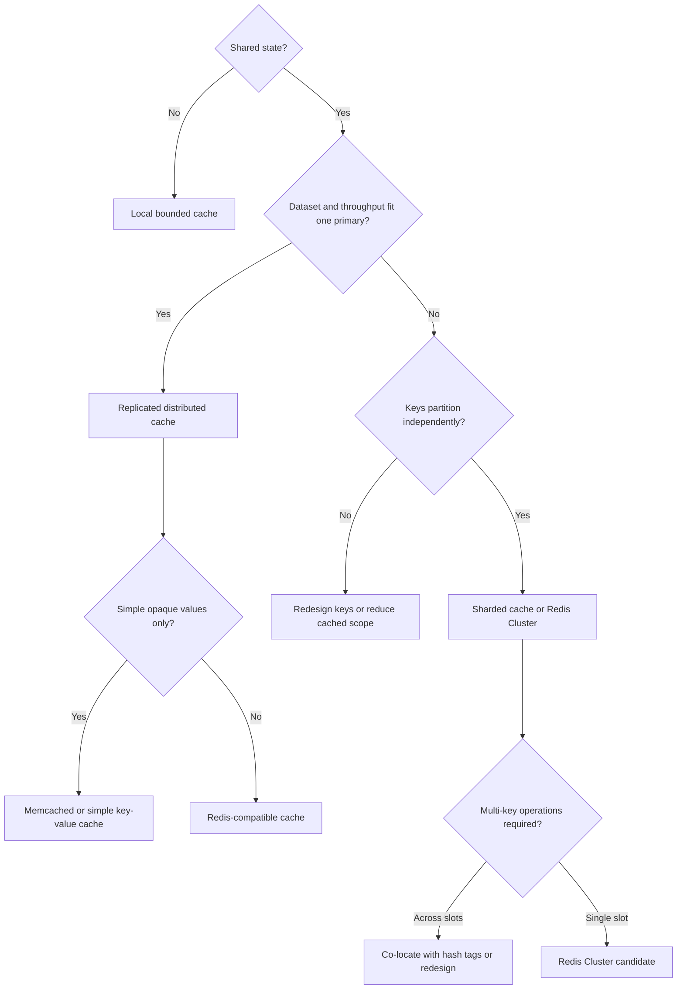
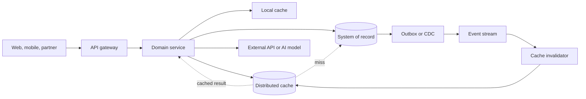

## 1. Executive Summary

A cache is a **derived, disposable copy of data** placed closer to demand. It can reduce latency, absorb read load, protect constrained dependencies, or reuse expensive computation.

It is not automatically the right answer to a slow system. First address:

- poor queries;
- missing indexes;
- excessive payloads;
- avoidable network calls.

Add caching only when measured reuse justifies another stateful subsystem.

Use a cache when:

- requests repeatedly access the same data;
- the source is slower or more expensive than the target SLO permits;
- the business can define acceptable staleness.

Do not cache highly volatile or security-sensitive data without an explicit invalidation model. Never make a cache the accidental system of record.

The central decision is not simply **Redis or no Redis**. An architect decides:

- what is cached and why;
- whether caching is local or distributed;
- whether the application or cache owns loading and writes;
- how TTL and eviction interact with correctness;
- how stale data, cache loss, failover, and stampedes are handled;
- whether Redis Cluster complexity is justified by dataset size or throughput.

The default enterprise starting point is usually **cache-aside**, bounded TTLs, explicit invalidation for important updates, protection against cache stampede, and a source of truth sized to survive a cold cache. Move to write-through, write-behind, or Redis Cluster only when their benefits outweigh their consistency and operational costs.


**Architect Recommendation:** Start with cache-aside and bounded TTLs. Adopt coupled write patterns or Redis Cluster only when workload evidence demonstrates that the added consistency and operational complexity is justified.


---

## 2. Business Problem

Caching addresses a business constraint, not a technology preference.

| Business pressure | Cache contribution | Decision caveat |
| :--- | :--- | :--- |
| Customer journey exceeds latency SLO | Serves hot data without repeated source calls | Validate p95/p99, not only average latency |
| Database or API is near capacity | Removes repeatable reads and smooths bursts | A cold cache must not collapse the source |
| External API or AI inference is expensive | Reuses stable results | Key must include every input that changes the result |
| Flash sale or game event creates spikes | Absorbs hot-key traffic | Hot keys and stampedes can overload the cache itself |
| Global users are far from the source | Places data nearer to consumers | Replication increases staleness and conflict risk |
| Backend is temporarily unavailable | May serve bounded-stale data | This is graceful degradation, not a substitute for resilience |

Caching is a poor fit when:

- every request is unique;
- data changes faster than it is reused;
- the source already meets its SLO economically;
- stale data can cause an unsafe or irreversible decision.

A cache should have a measurable objective, such as **reducing catalog-read p99 from 180 ms to 40 ms** or **removing 70% of repeated reads from the pricing database**.

---

## 3. Architecture Decision Flow

The decision sequence is:

1. Prove where latency, cost, or load occurs with production evidence.
2. Identify cacheable units and expected hit ratio from access distribution.
3. Define maximum acceptable staleness per data class.
4. Select topology and interaction pattern.
5. Specify keys, TTL, invalidation, eviction, ownership, and failure behavior.
6. Test steady state, cold start, hot keys, node loss, and cache unavailability.
7. Record what would cause the cache to be resized, repartitioned, or removed.

### Technology decision tree

---

## 4. Where It Fits in Enterprise Architecture

A cache sits between a consuming workload and an authoritative source. It belongs in the serving path, not in the ownership model for master data.

| Architecture layer | Suitable cache use | Boundary to preserve |
| :--- | :--- | :--- |
| Client/CDN | Static assets and public responses | Do not leak tenant or personalized data |
| API gateway | Safe response caching, rate-limit state | Respect method, identity, headers, and authorization |
| Application process | Small immutable reference data | Each instance can observe different state |
| Distributed platform | Sessions, hot objects, counters, derived views | Network dependency and shared blast radius |
| Data access | Query or entity results | Invalidation follows transactional changes |
| Computation layer | AI inference, rules, rendering, aggregation | Model/rule/version belongs in the key |

Use one authoritative owner for each fact. Events or CDC may invalidate or refresh derived cache entries, but the event broker and cache do not jointly create transactionality unless the design explicitly handles duplicates, ordering, and missed events.

---

## 5. Decision Checklist


- Is the bottleneck measured, and will caching affect it?
- Which exact data or computation is reused, at what frequency and skew?
- What hit ratio is required for the business case?
- What is the maximum safe staleness for each entry type?
- Is the source of truth able to survive cache loss and repopulation?
- Is local inconsistency acceptable, or must instances share cached state?
- Who owns loading, invalidation, schema/version changes, and incidents?
- Which data must never be cached because of privacy, authorization, or correctness risk?
- Are TTL, negative caching, key cardinality, value size, and eviction policy defined?
- Are hot keys, stampedes, failover, retry amplification, and connection limits tested?
- Is capacity based on bytes, overhead, fragmentation, replicas, and growth rather than key count alone?
- Does the ADR state accepted trade-offs and reassessment triggers?


### Quick decision matrix

| Requirement | Preferred direction | Avoid when |
| :--- | :--- | :--- |
| Per-instance, immutable reference data | Local cache | Values must change synchronously everywhere |
| Shared sessions or hot domain views | Distributed cache | Session can be stateless or client-held safely |
| Simple application-owned loading | Cache-aside | Multiple applications need uniform loading semantics |
| Transparent repository integration | Read-through | Provider abstraction hides critical behavior |
| Reads must see a write immediately through cache | Write-through | Cache outage must not block authoritative writes |
| Write bursts may be deferred and loss is tolerable/mitigated | Write-behind | Financial, inventory, or safety writes require durable commit |
| Dataset or throughput exceeds one shard | Redis Cluster | Cross-key operations and hot-key concentration dominate |

---

## 6. Architecture Decision Factors

| Factor | Questions an architect asks | Design consequence |
| :--- | :--- | :--- |
| **Correctness** | What harm can stale, missing, or duplicated data cause? | Determines whether data is cacheable and the invalidation model |
| **Latency** | What are end-to-end p95 and p99 targets? | Determines locality, connection model, and value size |
| **Throughput** | What are peak operations/sec and bandwidth? | Drives sharding, pipelining, and network capacity |
| **Hit ratio** | What fraction of requests can realistically reuse data? | Low reuse may add cost without protecting the source |
| **Working set** | How many hot keys and bytes exist under peak load? | Drives memory, eviction, and fragmentation headroom |
| **Access skew** | Are a few keys disproportionately popular? | Requires hot-key replication, request coalescing, or local L1 cache |
| **Consistency** | Is bounded staleness acceptable? Are read-your-writes semantics required? | Drives TTL, invalidation, and bypass rules |
| **Availability** | Should requests fail open, fail closed, or fall back to source? | Must be decided per use case, not globally |
| **Durability** | Can all cache state be reconstructed? | If not, it is a data store and needs a different decision process |
| **Security** | Does data contain credentials, PHI, PCI, tenant, or authorization context? | Drives exclusion, isolation, encryption, and access policy |
| **Operability** | Can the team run clusters, upgrades, resharding, and incident recovery? | Often favors managed service or simpler topology |
| **Cost** | Does saved source cost exceed memory, network, and operations cost? | Validate at current, peak, and 3x growth scenarios |

### TTL and invalidation

TTL is a **freshness bound and resource-control mechanism**, not a complete consistency strategy. A five-minute TTL means data may remain wrong for nearly five minutes.

Choose TTL from:

- business tolerance;
- update frequency;
- source load;
- recovery behavior.

Add random jitter so many keys do not expire together. Use explicit invalidation or versioned keys when important changes must propagate sooner.

Avoid “cache forever” unless values are immutable and keys contain a version. Negative caching can protect a source from repeated misses, but use a short TTL so newly created records become visible.

### Eviction

Eviction answers what the cache sacrifices under memory pressure.

| Policy | Favors or protects |
| :--- | :--- |
| **LRU approximation** | Recently accessed data |
| **LFU** | Frequently used data |
| **TTL-oriented** | Expiring keys |
| **No eviction** | Existing data by rejecting new writes |

The correct policy follows business value and workload distribution. **Eviction protects capacity; invalidation protects freshness.**

### Cache stampede

A stampede occurs when many requests miss or expire simultaneously and all regenerate the same value.

Common controls include:

- per-key request coalescing;
- distributed locks with short leases;
- stale-while-revalidate;
- refresh-ahead;
- TTL jitter;
- concurrency limits;
- source-side backpressure.

Locks require timeouts and fencing awareness. Never let a failed refresher block a key indefinitely.

---

## 7. Technology Categories

### Interaction patterns


| Pattern | Read path | Write path | Strengths | Main risk | Use when |
| :--- | :--- | :--- | :--- | :--- | :--- |
| **Cache-aside** | App checks cache, loads source on miss, then stores | App updates source and invalidates or updates cache | Simple, selective, portable | Miss path and invalidation live in application code | Default for read-heavy domain data |
| **Read-through** | Cache/provider loads source on miss | Usually separate | Consistent loading abstraction | Provider coupling and hidden failure behavior | A mature data-access layer can own loaders |
| **Write-through** | Reads use populated cache | Write commits through cache to source synchronously | Cache is warm; read-after-write is easier | Added write latency; cache may become availability dependency | Reads strongly benefit and synchronous source commit is acceptable |
| **Write-behind** | Reads use cache | Cache queues asynchronous source write | Absorbs bursts and lowers write latency | Loss, reordering, duplicates, and complex recovery | Derived, reconstructable, or explicitly loss-tolerant data |



**Production Warning:** Write-behind is normally inappropriate for authoritative banking balances, medication orders, and inventory reservations. Acknowledgement before durable authoritative commit changes the business guarantee, even if persistence is enabled on the cache.


### Deployment categories

| Category | Characteristics | Best fit | Key limitation |
| :--- | :--- | :--- | :--- |
| **Local in-process** | Fastest; no network; one copy per instance | Small read-only reference data, parsing results | Inconsistent copies and multiplied memory |
| **Distributed cache** | Shared network service with replication | Sessions, shared hot objects, counters | Network latency and shared failure domain |
| **Two-level L1/L2** | Local L1 plus distributed L2 | Extremely hot reads at high scale | More invalidation and observability complexity |
| **Sharded cluster** | Keyspace partitioned across nodes | Dataset or throughput beyond one primary | Resharding, multi-key limits, hot shards |
| **Edge/CDN cache** | Geographic HTTP/object caching | Public or safely partitioned content | HTTP semantics, invalidation delay, personalization risk |

### Redis Cluster

Redis Cluster partitions keys into hash slots and provides horizontal scale. Use it when measured memory or throughput exceeds a single-primary topology and keys can be independently partitioned. It is not a default high-availability switch: a primary-replica topology may provide HA with much less application complexity.

Before selecting Redis Cluster, verify that:

- clients understand topology changes and redirects;
- multi-key operations are limited to one slot or deliberately co-located with hash tags;
- Lua/scripts and transactions fit cluster constraints;
- replica and failover behavior meets the SLO;
- resharding is exercised under load.

Clustering does not solve a single hot key because one key still maps to one slot.

---

## 8. Popular Products

| Product/category | Architecture fit | Prefer when | Avoid when |
| :--- | :--- | :--- | :--- |
| **Redis / Valkey** | Rich key-value structures, TTLs, atomic operations, replication, clustering | Need counters, sets, sorted sets, streams, locks, or shared cache patterns | Only opaque values are needed and operational simplicity matters more |
| **Memcached** | Simple distributed volatile object cache | Need straightforward scale-out caching with disposable values | Need replication, persistence, rich structures, or advanced atomic workflows |
| **Caffeine / Guava / in-process libraries** | Bounded local application cache | Nanosecond/microsecond local access and per-instance state is acceptable | Need shared state or coordinated invalidation |
| **Hazelcast / Apache Ignite** | Distributed data grid and compute-adjacent state | JVM-centric enterprise workloads need data-grid capabilities | A simpler cache meets the requirement |
| **CDN/edge cache** | HTTP responses and static objects near users | Content is cacheable using HTTP semantics | Data is private, highly personalized, or mutation-heavy |

Product selection follows pattern and topology selection. Compare protocol compatibility, supported commands, failover semantics, maintenance behavior, quotas, observability, security controls, regional availability, and total operating cost with a representative proof of concept.

---

## 9. Trade-offs

| Decision | Advantages | Disadvantages |
| :--- | :--- | :--- |
| Add a cache | Lower latency, higher effective throughput, lower source cost | Staleness, invalidation, another failure mode |
| Local cache | Lowest latency, no network dependency | Per-instance inconsistency and memory duplication |
| Distributed cache | Shared view and independent scaling | Network hops, cluster operations, larger blast radius |
| Long TTL | Higher hit ratio and source protection | Longer stale-data window |
| Short TTL | Better freshness | More misses, regeneration, and stampede risk |
| Explicit invalidation | Freshness after known changes | Missed/late events create stale entries |
| Write-through | Warm cache and clearer write ordering | Higher write latency and coupled availability |
| Write-behind | Fast writes and burst absorption | Data-loss and reconciliation complexity |
| Redis Cluster | Horizontal memory and throughput | Client, key-design, resharding, and multi-key complexity |
| Managed service | Reduced patching, failover, and platform toil | Service constraints, cost, and provider coupling |

Architects accept these trade-offs explicitly. “Eventual consistency” is incomplete unless the ADR states the maximum stale interval, affected journeys, correction path, and business owner accepting it.

---

## 10. Anti-patterns

- **Caching before measuring:** hides inefficient queries or chatty service boundaries.
- **Cache as accidental database:** business data exists only in a nominally disposable tier.
- **TTL-only correctness:** important updates remain stale until expiration.
- **Delete-before-commit:** invalidation races with a failed transaction or concurrent read.
- **Unbounded keys or values:** user-controlled cardinality exhausts memory.
- **One global cache for every domain:** creates noisy neighbors and organization-wide blast radius.
- **Caching authorization decisions too broadly:** revoked access remains effective or tenant context leaks.
- **Synchronized expiry:** identical TTLs create a periodic stampede.
- **Retry storm:** clients retry cache and source without budgets, backoff, or concurrency limits.
- **Distributed locks without leases:** abandoned locks stop progress; expired owners may still act.
- **Redis Cluster by default:** adds partitioning constraints before scale requires them.
- **Assuming replication is backup:** replicas reproduce bad deletes, corruption, and poisoned values.
- **Caching null forever:** newly created data remains invisible.
- **Ignoring serialization evolution:** deployments cannot read values written by an older version.

---

## 11. Production Considerations

### Scalability and capacity planning

Estimate memory from:

- serialized key and value sizes;
- metadata overhead;
- allocator fragmentation;
- replication;
- persistence buffers;
- resharding headroom.

Model the hot working set separately from total data. Keep enough spare capacity to tolerate a node loss without immediate eviction or saturation.

Measure operations/sec and network bytes/sec. A few large values can exhaust bandwidth before CPU.

Scale vertically while it remains reliable and economical. Shard only when capacity or throughput requires it and the key model distributes load. Track per-shard utilization and hot keys, not only cluster averages.

### Availability, consistency, and disaster recovery

Define behavior for each cache use case:

| Cache unavailable | Appropriate behavior |
| :--- | :--- |
| Product description | Fall back to source with rate limiting; optionally serve bounded stale data |
| Authentication session | Fail closed or use a designed alternate validation path |
| Rate limiter | Choose fail-open or fail-closed from abuse and availability risk |
| Recommendation | Return a default result; do not block checkout |
| Derived AI response | Recompute within a strict concurrency and cost budget |

Use multi-zone replication when cache availability matters, but expect:

- a failover window;
- possible loss of recently replicated cache entries.

Multi-region cache replication is justified only by latency or continuity needs. Otherwise, rebuild from the source in the recovery region.

Document RTO for cache service restoration and for warming critical keys. Test the source under cold-cache recovery load.

### Monitoring and observability

Monitor business effect and cache mechanics together:

- hit, miss, and stale-serve rates by cache/use case;
- p50, p95, and p99 operation latency, timeouts, and errors;
- memory used, fragmentation, evictions, expirations, and rejected writes;
- CPU, network, connection count, queue depth, and per-shard imbalance;
- hot keys, large keys, command latency, replication lag, and failovers;
- source load caused by misses and refreshes;
- invalidation delay and refresh failures;
- cost per million useful hits, not merely instance utilization.

Use trace attributes for cache name, operation, outcome, and hashed key class; never expose sensitive raw keys or values. Alert on symptoms tied to SLOs rather than a single generic hit-ratio target.

### Security

Apply the following controls:

- use private networking and TLS;
- use workload identity or short-lived credentials;
- enforce least-privilege access and secret rotation;
- separate environments and high-risk tenants where blast-radius or compliance requirements demand it;
- encrypt persistence and backups when enabled;
- protect management endpoints and audit configuration changes.

Do not place passwords, tokens, full payment data, or unnecessary PHI in cache values. Include tenant, authorization scope, locale, and representation version in keys when they affect the result.

### Deployment and operations

Use versioned key prefixes so application releases can change serialization safely. Roll out schema changes with dual-read or backward-compatible decoders, then expire the old namespace.

Configure clients with:

- timeouts shorter than the request budget;
- bounded retries with jitter;
- connection pooling;
- circuit breakers.

In a non-production environment with representative load, rehearse:

- node replacement and failover;
- scale-out;
- certificate rotation;
- engine upgrade;
- full cache flush.

---

## 12. Failure Scenarios

| Failure | Observable impact | Prevention/mitigation |
| :--- | :--- | :--- |
| Cache node or cluster unavailable | Latency spike and source overload | Timeout quickly, circuit break, shed load, fall back within budget |
| Cold cache after deploy/failover | Miss storm | Warm critical keys, stagger traffic, limit regeneration concurrency |
| Popular key expires | Source or compute stampede | Single-flight, stale-while-revalidate, TTL jitter |
| Missed invalidation event | Stale business data | Transactional outbox/CDC, bounded TTL, reconciliation metrics |
| Invalidation races with concurrent fill | Old value overwrites fresh state | Version values, compare source version, delete after commit |
| Memory exhaustion | Evictions, write rejection, latency | Capacity headroom, bounded values, correct eviction, cardinality limits |
| Hot key or hot shard | Uneven CPU/network and tail latency | L1 cache, key replication, request coalescing, workload redesign |
| Replica promotion | Brief outage; recent cache writes may disappear | Retry idempotently, treat cache as reconstructable, test failover |
| Network partition | Timeouts or divergent local behavior | Explicit fail mode, strict deadlines, source protection |
| Poisoned or incompatible value | Repeated application errors | Versioned serialization, validation, kill switch, namespace rotation |
| Redis Cluster resharding issue | Redirects, timeouts, partial degradation | Cluster-aware clients, headroom, staged/tested resharding |
| Cache penetration on nonexistent keys | Repeated source hits | Short negative caching, input validation, optional probabilistic filter |


**Key Takeaway:** The cache must never turn a recoverable performance degradation into a total service outage. Failure tests must demonstrate both cache behavior and the secondary load imposed on databases, APIs, and AI services.


---

## 13. Cloud Managed Services

Service capabilities and names change. During the ADR, validate:

- engine and version compatibility;
- command support and topology;
- maintenance, quotas, and regional availability;
- networking, encryption, and identity;
- persistence and failover;
- pricing.

| Platform | Managed options | Architecture fit | Watch points |
| :--- | :--- | :--- | :--- |
| **AWS** | [Amazon ElastiCache](https://docs.aws.amazon.com/AmazonElastiCache/latest/dg/WhatIs.html) for Valkey, Redis OSS, and Memcached; Amazon MemoryDB where durable Redis-compatible data is intentional | Distributed caches, sessions, counters, leaderboards; cluster mode for sharded workloads | Cluster slots, supported commands/modules, failover semantics, cross-AZ cost, and whether the workload is truly cache or durable data |
| **Azure** | [Azure Managed Redis](https://learn.microsoft.com/en-us/azure/redis/overview) | Managed Redis-compatible caching, shared state, and data structures with Azure networking and identity integration | Tier/region availability, clustering policy, migration from Azure Cache for Redis, persistence and geo-replication behavior |
| **Google Cloud** | [Memorystore](https://cloud.google.com/memorystore/docs) for Valkey, Redis Cluster, and Redis | Managed distributed cache near Google Cloud workloads; clustered options for scale-out | Product/engine differences, cluster mode, command compatibility, maintenance, and application client discovery |
| **Self-hosted** | Redis/Valkey Cluster, Redis Sentinel, Memcached, Hazelcast, Apache Ignite | Required engine control, on-premises placement, specialized modules, or established platform capability | 24x7 ownership of patching, HA, backups, resharding, upgrades, security, and recovery |

Managed service is usually the enterprise default when caching is supporting infrastructure rather than a differentiating capability.

Self-host only when one or more of the following justify the operational burden:

- control;
- locality;
- compliance;
- economics at proven scale;
- unsupported features.

API compatibility does not guarantee identical persistence, failover, module, or performance behavior.

---

## 14. Real-world Examples

### Banking: reference and entitlement-aware data

A payments portal caches currency metadata and branch reference data with cache-aside and versioned keys. Account balances and transaction authorization remain authoritative in the ledger and are not served from a general-purpose stale cache. Entitlement results use short TTLs and event-driven invalidation because revocation risk is higher than database-load savings.

### Retail: product catalog and flash sale

Product descriptions and category trees use a distributed cache with explicit invalidation from catalog events and a bounded TTL. A small L1 cache absorbs extreme hot-key traffic. Price and available-to-promise inventory have shorter freshness bounds and may bypass the cache during checkout. TTL jitter, request coalescing, and source rate limits prevent a flash-sale stampede.

### Healthcare: clinical reference data

A clinical application caches stable drug codes and care-path reference data. Patient-specific clinical facts remain in the governed source unless a documented freshness and PHI control model permits caching. Cache keys and telemetry exclude patient identifiers, and access is isolated through private networking and workload identity.

### Gaming: sessions and leaderboards

A regional Redis-compatible cluster stores short-lived sessions, presence, counters, and sorted-set leaderboards. Durable match outcomes are written to an authoritative store or event log. The design accepts temporary leaderboard staleness but not loss of purchased assets. Hot-player keys and regional failover are load-tested before major events.

### AI: inference and semantic result caching

An AI gateway caches deterministic or sufficiently stable model results using a key that includes tenant, normalized prompt or input hash, model/version, parameters, policy version, and relevant retrieval corpus version. Sensitive prompts are excluded or encrypted with short retention. Similarity-based semantic caching is used only where approximate reuse is acceptable and evaluated for incorrect cross-context matches.

### IoT: device metadata and latest derived state

An ingestion platform caches device configuration and recent derived state to avoid a database read per message. Configuration changes publish invalidations. Telemetry history remains in the durable time-series platform. Capacity planning accounts for device-key cardinality, reconnect storms, and regional cache warming.

---

## 15. Best Practices

1. Start with a measurable latency, load, or cost objective.
2. Treat every entry as reconstructable unless making a deliberate database decision.
3. Make the authoritative source and cache owner explicit.
4. Prefer cache-aside for general domain reads; justify more coupled write patterns.
5. Derive TTL from business freshness tolerance and add randomized jitter.
6. Combine bounded TTL with reliable invalidation for important mutable data.
7. Include tenant, authorization scope, representation, and schema version in keys where relevant.
8. Prevent stampedes with request coalescing, refresh-ahead, and source backpressure.
9. Keep values small, bound cardinality, and choose eviction from workload evidence.
10. Size the source to survive planned cache bypass and controlled cold starts.
11. Use multi-zone managed caching where availability warrants it; avoid premature clustering.
12. Test hot keys, failover, network delay, resharding, eviction, and full cache loss.
13. Monitor hit ratio alongside source load, tail latency, staleness, and business SLOs.
14. Review cache necessity periodically; remove caches that no longer provide measurable value.

---

## 16. Interview Questions

1. How do you decide whether a system needs a cache?
2. Compare cache-aside, read-through, write-through, and write-behind.
3. How do you choose TTL and invalidation strategy?
4. What causes a cache stampede, and how do you prevent it?
5. When would you use a local cache instead of a distributed cache?
6. How do eviction policies affect correctness and performance?
7. When is Redis Cluster justified, and what constraints does it introduce?
8. How should an application behave when the cache is unavailable?
9. How do you prevent stale authorization or tenant data from leaking?
10. What metrics prove that a cache is delivering business value?
11. How do you capacity-plan a distributed cache?
12. Why is write-behind dangerous for financial or inventory transactions?

---

## 17. Interview Answer


“I begin with the business journey and production evidence, not a cache product. I identify the constrained dependency, quantify the p99 latency or load target, estimate reuse and key skew, and define the maximum safe staleness for each data class. If the source can be optimized to meet the SLO, I prefer that simpler design.

When caching is justified, I make the authoritative source explicit. Cache-aside is my default because it keeps ownership clear and is portable, with bounded TTL, explicit invalidation for important changes, jitter, and stampede protection. I choose a local cache for small per-instance data and a distributed cache when state must be shared. Write-through is appropriate when warming the cache justifies synchronous coupling; I use write-behind only when loss, duplication, ordering, and recovery semantics are explicitly acceptable.

I do not choose Redis Cluster merely for high availability. I use it when measured memory or throughput requires sharding and the key model tolerates slot-based partitioning and limited cross-key operations. In production, I test cold-cache recovery, hot keys, failover, eviction, resharding, and source protection. I monitor tail latency, hit ratio, evictions, memory, replication, hot shards, and source load. The ADR records consistency, security, cost, operational ownership, accepted failure modes, and the threshold for revisiting or removing the cache.”


---

## 18. Related Topics

- [Technology Playbook index](/technology-playbook/)
- [Databases module](/technology-playbook/module-databases/) — product-specific pages
- [How to Choose a Database](/technology-playbook/how-to-choose-database/)
- [Redis Cheat Sheet](/redis-cheatsheet/)
- [Database Internals](/database-handbook/) — indexing, transactions, and data ownership
