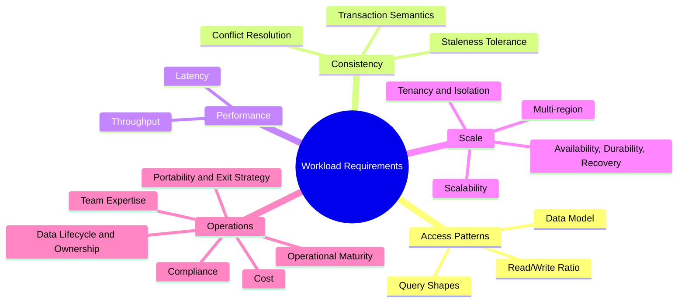
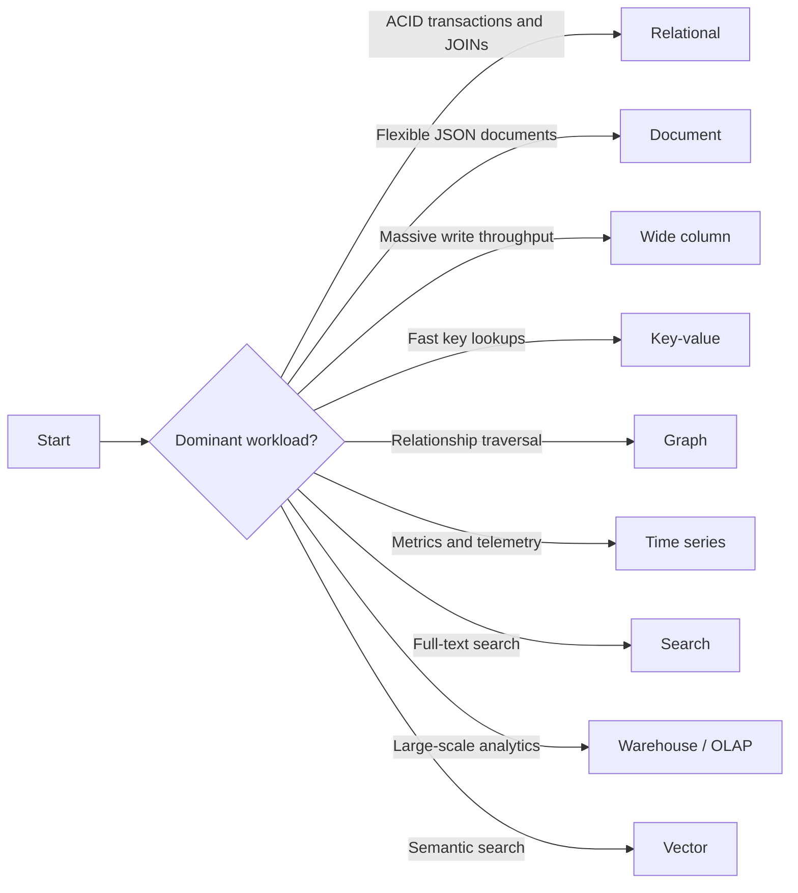
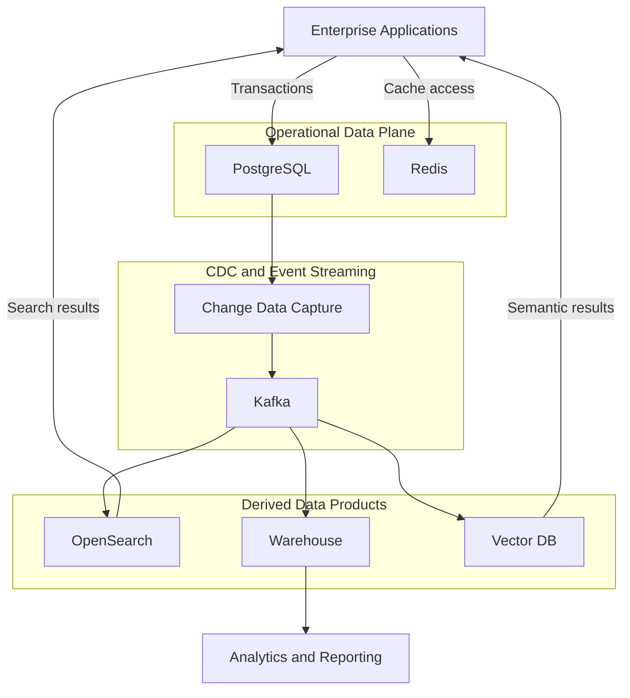

## 1. Executive Summary

Database selection is an **architecture decision**, not a product comparison or a debate about "PostgreSQL vs MongoDB on Twitter."

The decision starts with the business capabilities the system must protect. It then translates them into:

- **Access patterns**
- **Consistency requirements**
- **Latency and throughput targets**
- **Scale trajectory**
- **Operational constraints**

Only after those requirements are understood should the team evaluate database classes and products.

The outcome should be a defensible Architecture Decision Record (ADR) that captures:

- What the workload requires
- Which options were considered
- Why one option best fits
- Which trade-offs were accepted
- What evidence would trigger future reassessment

This framework supports that process for relational, document, wide-column, key-value, graph, time-series, search, analytics, and vector stores.

---

## 2. Frame the Decision

The business problem is rarely "we need a database." It is a capability the system must protect: accepting payments, serving a product catalog, detecting fraud, searching customer records, or producing regulatory reports.

Before discussing products, write down:

| Decision Context | What to Establish |
| --- | --- |
| **Capability** | Business goal, stakeholders, critical journeys, and delivery boundaries |
| **Data ownership** | Authoritative source, writers, readers, and downstream consumers |
| **Failure impact** | Consequences of lost, stale, duplicated, unavailable, or slow data |
| **Constraints** | Regulatory obligations, delivery horizon, budget, and organizational limits |

This context determines which requirements are mandatory and which trade-offs the business can accept.

---

## 3. Understand the Workload Requirements

Use the five requirements as a shared vocabulary for discovery, product comparison, proof-of-concept design, and ADR review.

For each branch, document the current requirement, expected growth, hard constraint, preferred target, and acceptable compromise. Requirements should be measurable: query shapes and rates, consistency semantics, latency percentiles, throughput, capacity, availability, RPO/RTO, residency, operational ownership, and total cost.

---

## 4. Evaluate Database Classes

Classification narrows the decision space; it does not select a product. Start with the class that fits the dominant data model and access patterns, then apply the decision factors and validate individual candidates.


The decision tree is a **shortlisting heuristic for one bounded workload**, not a claim that an enterprise system needs only one store.

Repeat the analysis for each materially different access pattern. A transactional system of record may legitimately feed a search index, analytical warehouse, cache, or vector index, provided ownership and consistency are explicit.

Prefer an existing, well-operated platform when it remains a natural fit. Introduce a specialized store only for a demonstrated constraint; give each business fact one authoritative owner and make every cache, index, warehouse table, or vector projection traceable and reproducible through CDC, a transactional outbox, replay, and reconciliation.


| Class | Architectural fit | Illustrative products | Illustrative managed options |
| :--- | :--- | :--- | :--- |
| **Relational** | ACID transactions, enforced relationships, JOINs, structured OLTP | [PostgreSQL](/database-handbook/postgresql/), [MySQL](/database-handbook/mysql/), [Oracle](/database-handbook/oracle/), [SQL Server](/database-handbook/sql-server/) | RDS, Aurora, Azure SQL, Cloud SQL |
| **Document** | Aggregate-oriented data, nested documents, evolving product schemas | [MongoDB](/database-handbook/mongodb/), [Couchbase](/database-handbook/couchbase/), [Cosmos DB](/database-handbook/cosmos-db/) | Atlas, Cosmos DB |
| **Wide column** | High write volume, partition-key access, horizontally distributed datasets | [Cassandra](/database-handbook/cassandra/), [ScyllaDB](/database-handbook/scylladb/) | Keyspaces, self-hosted operators |
| **Key-value** | Direct key lookup, sessions, counters, caches, simple state | [Redis](/database-handbook/redis/), [DynamoDB](/database-handbook/dynamodb/) | ElastiCache, DynamoDB |
| **Graph** | Relationship traversal, path finding, connected-data analysis | [Neo4j](/database-handbook/neo4j/), [Neptune](/database-handbook/amazon-neptune/) | Neptune, Aura |
| **Time series** | Time-ordered metrics, telemetry, retention, and window aggregation | InfluxDB, TimescaleDB | Managed time-series services |
| **Search** | Full-text relevance, fuzzy matching, facets, and search-oriented read models | [Elasticsearch](/database-handbook/elasticsearch/), [OpenSearch](/database-handbook/opensearch/) | OpenSearch Service |
| **Analytics** | Large scans, columnar aggregation, BI, and analytical concurrency | [Snowflake](/database-handbook/snowflake/), [BigQuery](/database-handbook/bigquery/), [ClickHouse](/database-handbook/clickhouse/) | Native cloud warehouses |
| **Vector** | Similarity search over embeddings with metadata filtering | [pgvector](/ai-for-engineers/pgvector/), [Milvus](/ai-for-engineers/milvus/), [Pinecone](/ai-for-engineers/pinecone/) | Managed vector services |

---

## 5. Compare Options and Trade-offs

### Eliminate poor fits

| Anti-pattern | Why it fails |
| :--- | :--- |
| One database for everything | A forced fit creates performance cliffs, integrity gaps, and operational pain |
| Database-per-feature enthusiasm | Every specialized store adds data movement, consistency, security, and support costs |
| MongoDB for heavy multi-table reporting | JOINs and aggregations become application code |
| Cassandra for low-volume CRUD | Ops overhead without scale benefit |
| Elasticsearch as system of record | Not a transactional primary store |
| Vector DB without hybrid strategy | Relational metadata + vectors often belong together (pgvector) |
| Product-first evaluation | Feature comparisons hide whether the data model and access patterns fit |
| Benchmark-driven selection | Generic benchmark results rarely represent real queries, data skew, concurrency, or failure modes |
| Premature polyglot persistence | More stores are introduced before one store has demonstrated a real architectural constraint |

### Make trade-offs explicit


| If you need… | Prefer | Avoid as primary |
| :--- | :--- | :--- |
| ACID ledger & JOINs | Relational | Document without schema discipline |
| Flexible catalog schema | Document | Wide column for small datasets |
| Global write scale | Wide column | Single-node relational |
| Session / hot cache | Redis / key-value | Relational row per session at scale |
| Full-text product search | OpenSearch / Elasticsearch | LIKE queries on OLTP |
| Executive dashboards | Warehouse / OLAP | OLTP replicas without guardrails |
| RAG similarity search | Vector + metadata store | Brute-force embedding scan in app memory |


The decision is usually between competing qualities, not between a good and bad product:

| Tension | Architectural Consequence |
| --- | --- |
| **Consistency vs. availability and geographic latency** | Stronger coordination protects invariants but can reduce write availability or increase latency during partitions. |
| **Flexible schema vs. enforced integrity** | Rapid model evolution reduces initial friction but can move validation, migration, and compatibility work into applications. |
| **Read optimization vs. write cost** | Indexes, replicas, and projections accelerate reads while adding write amplification, storage, and synchronization complexity. |
| **Specialized fit vs. operational simplicity** | A purpose-built store may serve one access pattern well but expands the platform, skills, and data-consistency surface. |
| **Scale headroom vs. present cost** | Designing for realistic growth is prudent; designing for unvalidated extreme scale can impose complexity before it produces value. |
| **Portability vs. native capability** | Common abstractions ease future change; deeper product capabilities can improve the current solution but increase migration effort. |


**Architect recommendation:** An ADR should state which side of each relevant trade-off is preferred, why the business accepts it, and how the risk will be monitored.


---

## 6. Validate and Record the Decision

Compare at least two viable candidates against the same acceptance criteria. Vendor benchmarks can inform the test design, but they cannot replace evidence from the actual workload.

### Validation checklist

| Evidence | What to Validate |
| --- | --- |
| **Workload** | Production-scale data volume, query mix, key distribution, result sizes, concurrency, bursts, background work, and expected growth |
| **Quality attributes** | Pass/fail thresholds for consistency, p95/p99 latency, throughput, availability, RPO/RTO, security, compliance, and cost |
| **Failure behaviour** | Node loss, network delay, replica lag, throttling, dependency failure, ambiguous writes, and recovery under load |
| **Operations** | Backup, restore, failover, upgrade, observability, access revocation, capacity expansion, and data export |
| **Architecture boundaries** | System of record, derived read models, caches, indexes, ownership, synchronization, replay, and reconciliation |

Use realistic data at **2× expected peak throughput** where practical. Include skewed keys and degraded conditions; a synthetic happy path does not prove production fitness.

### ADR checklist

The ADR is the final decision artifact:

| ADR Section | What to Record |
| --- | --- |
| **Context** | Business capability, workload requirements, constraints, and data ownership |
| **Options** | Viable candidates, rejected alternatives, and the same evidence for each |
| **Decision** | Selected database, its role, and why it best fits the ranked requirements |
| **Trade-offs** | Accepted compromises, risks, mitigations, and operational consequences |
| **Adoption** | Migration and rollback approach, owners, and production-readiness conditions |
| **Reassessment** | Evidence that triggers review: changed access patterns, scale, regulation, cost, or organizational capability |

---

## 7. Real-world Examples

These examples use database **classes**, not preferred products.

Equivalent products can be evaluated against:

- The architecture decision factors
- The operating model
- Commercial constraints


**Key takeaway:** In every example, one store owns each business fact. Caches, search indexes, vector indexes, and analytical stores are derived projections rather than competing sources of truth.


### Banking

**Business problem:** A banking platform must post transfers exactly once, preserve an auditable ledger, show customers current balances, detect suspicious behaviour, support customer-service searches, and produce regulatory and management reports. Financial correctness takes priority over convenience or schema flexibility.

| Data responsibility | Database choice | Why it is used |
| :--- | :--- | :--- |
| Accounts, ledger entries, holds, and posting state | Relational database | ACID transactions, constraints, deterministic posting, and auditable history |
| Idempotency keys, rate limits, and short-lived session state | Distributed key-value cache | Atomic counters, TTLs, and low-latency key access |
| Customer and transaction discovery | Search index | Full-text, fuzzy matching, filters, and faceted investigation |
| Fraud relationships | Graph database | Efficient traversal across customers, devices, merchants, accounts, and beneficiaries |
| Regulatory and management reporting | Columnar warehouse | Isolated large scans, historical aggregation, and governed reporting models |

- **Data flow:** A payment API validates the request and commits the ledger mutation and an outbox record in one relational transaction. CDC publishes the committed event. Independent consumers update notification, fraud, search, and analytical projections. Balance reads remain authoritative in the ledger or a consistency-safe projection.
- **Integration pattern:** Transactional outbox, idempotent consumers, saga coordination for multi-service journeys, and reconciliation between ledger entries and external settlement files. Synchronous calls are limited to decisions required before authorization.
- **Event streaming:** Immutable domain events such as `TransferPosted`, `PaymentDeclined`, and `AccountFrozen` decouple downstream processing. Partitioning by account or transaction preserves the ordering required by posting and fraud rules.
- **Search:** The search index contains masked customer and transaction projections for authorized support and investigation use. It never approves a payment or supplies an authoritative balance.
- **Analytics:** CDC events and periodic reconciled snapshots populate governed warehouse models for liquidity, risk, regulatory returns, and customer analytics.
- **Cache:** Cache only derived or short-lived data such as reference rates, entitlements, idempotency tokens, and rate limits. Do not cache a mutable balance unless its staleness and invalidation semantics are explicit.
- **Operational considerations:** Enforce strong access segregation, immutable audit evidence, encryption and key governance, PITR, tested restore, ledger reconciliation, controlled schema changes, and clearly measured RPO/RTO. Ambiguous transaction outcomes must be safe to retry.

### ERP

**Business problem:** An enterprise resource planning platform coordinates products, suppliers, procurement, inventory, orders, invoices, and financial postings across business units. It must preserve cross-module integrity while supporting search, planning, and analytical workloads that would overwhelm transactional processing.

| Data responsibility | Database choice | Why it is used |
| :--- | :--- | :--- |
| Orders, purchase orders, invoices, inventory movements, and master data | Relational database | Referential integrity, multi-entity transactions, structured reporting, and mature concurrency control |
| Product descriptions and configurable attributes | Document database or relational JSON model | Aggregate-oriented product data and controlled schema variation |
| Availability and reference-data projections | Distributed key-value cache | Fast reads for stores, warehouses, and high-volume order entry |
| Product, supplier, invoice, and purchase-order discovery | Search index | Cross-entity text search, filters, and relevance ranking |
| Finance, supply-chain, and planning models | Columnar warehouse | Historical aggregation across modules without loading the OLTP system |

- **Data flow:** Module APIs commit business transactions to the relational system of record. Outbox events distribute inventory, procurement, invoice, and master-data changes. Consumers build cache, search, planning, and warehouse projections.
- **Integration pattern:** API-based commands for immediate business validation, events for state propagation, canonical business identifiers, and anti-corruption layers around legacy modules and external supplier systems.
- **Event streaming:** Events such as `InventoryAdjusted`, `PurchaseOrderApproved`, and `InvoicePosted` enable near-real-time planning and integration. Consumers are idempotent because enterprise messages are commonly replayed or duplicated.
- **Search:** A permission-filtered index supports users who know a description, supplier reference, or partial document number rather than the exact primary key.
- **Analytics:** CDC and batch snapshots produce conformed dimensions for finance, procurement, inventory turns, demand planning, and profitability. Month-end results are reconciled to the transactional books.
- **Cache:** Cache stable reference data and availability projections with explicit version or invalidation events. The inventory movement journal remains authoritative when projections disagree.
- **Operational considerations:** Plan for long-running business transactions, period close, batch peaks, tenant or business-unit isolation, audit retention, data-quality controls, and zero-downtime migrations across mixed application versions.

### E-Commerce

**Business problem:** A commerce platform must serve a flexible catalog, deliver relevant search, maintain accurate prices and inventory, accept orders without overselling, personalize experiences, and analyze customer journeys under highly variable traffic.

| Data responsibility | Database choice | Why it is used |
| :--- | :--- | :--- |
| Orders, payments, reservations, and refunds | Relational database | Transactional invariants, idempotency, and auditable lifecycle state |
| Product catalog and merchandising content | Document database | Nested variants, category-specific attributes, and rapid schema evolution |
| Sessions, carts, rate limits, and hot product data | Distributed key-value cache | Low-latency access, TTLs, atomic counters, and burst absorption |
| Product discovery | Search index | Full-text relevance, autocomplete, facets, synonyms, and filtering |
| Clickstream, conversion, and merchandising analysis | Columnar warehouse | Large-scale behavioural analytics separated from order processing |
| Recommendations and semantic discovery | Vector database | Similarity retrieval over product and behavioural embeddings |

- **Data flow:** Catalog changes publish events that refresh the search, cache, and vector projections. Checkout synchronously validates price, availability, and payment, then commits the order and outbox event. Fulfilment and customer communication proceed asynchronously.
- **Integration pattern:** CQRS for catalog discovery versus transactional ordering, saga orchestration for checkout and fulfilment, outbox for reliable publication, and idempotency keys at payment and order boundaries.
- **Event streaming:** Catalog, price, inventory, cart, order, and clickstream events support independent consumers. Partition keys preserve per-product or per-order ordering without imposing global ordering.
- **Search:** Search is a denormalized read model. If it lags, product discovery may be stale, but checkout revalidates authoritative price, eligibility, and inventory before commitment.
- **Analytics:** Event streams populate funnel, campaign, cohort, inventory, and revenue models. Personally identifiable data is minimized or tokenized before broad analytical use.
- **Cache:** Use cache-aside for catalog reads and short-lived carts where the recovery contract is understood. Apply request coalescing, jittered TTLs, and admission controls to prevent a cache stampede.
- **Operational considerations:** Design for seasonal peaks, hot products, bot traffic, payment retries, search reindexing, regional latency, data privacy, and graceful degradation. Load tests must include skew, not only evenly distributed traffic.

### Healthcare

**Business problem:** A healthcare platform must preserve longitudinal patient records, coordinate appointments and clinical workflows, retrieve documents quickly, support cohort analytics, and enforce strict privacy, consent, retention, and audit requirements.

| Data responsibility | Database choice | Why it is used |
| :--- | :--- | :--- |
| Patient identity, encounters, orders, appointments, and billing | Relational database | Integrity, transactions, controlled updates, and traceable clinical workflows |
| Clinical resources and evolving structured records | Document database | Nested domain resources, versioned schemas, and aggregate retrieval |
| Clinical notes and document discovery | Search index | Full-text retrieval, terminology-aware queries, and filters |
| Short-lived sessions and authorization context | Distributed key-value cache | Low-latency access with bounded TTLs and centralized revocation support |
| Population health and operational reporting | Governed warehouse | De-identified cohort analysis and isolated analytical processing |
| Clinical knowledge retrieval | Vector database | Semantic retrieval across approved guidelines and clinical knowledge content |

- **Data flow:** Clinical applications write through governed APIs to authoritative stores. Outbox or CDC events update search and analytical projections only after committed changes. Consent and access-policy context accompanies downstream processing.
- **Integration pattern:** Versioned healthcare APIs, event notification, master-patient identity resolution, and anti-corruption layers for laboratories, imaging, pharmacy, and legacy clinical systems.
- **Event streaming:** Encounter, order, result, appointment, and consent events enable workflow coordination. Sensitive payloads are minimized, encrypted, access-controlled, and retained only as long as necessary.
- **Search:** The index supports clinicians within the patient's authorized context. Security trimming must be enforced at query time and verified when consent or record sensitivity changes.
- **Analytics:** Curated and de-identified datasets support capacity, quality, outcomes, and research use. Re-identification paths are isolated and governed rather than embedded in general BI access.
- **Cache:** Cache terminology, configuration, and short-lived authorization decisions. Avoid caching sensitive clinical content unless encryption, eviction, audit, and residency requirements are equivalent to the source.
- **Operational considerations:** Prioritize patient safety, data lineage, consent enforcement, break-glass auditing, residency, immutable access logs, restore testing, and downtime procedures. Schema evolution must preserve old clinical resource versions and provenance.

### IoT

**Business problem:** An industrial IoT platform ingests high-volume telemetry from intermittently connected devices, tracks current device state, detects anomalies, supports time-window queries, and retains aggregated history economically.

| Data responsibility | Database choice | Why it is used |
| :--- | :--- | :--- |
| Telemetry measurements | Time-series or wide-column database | High write throughput, time-window queries, retention policies, and partitioned scale |
| Device registry, ownership, and configuration | Relational database | Integrity, lifecycle management, and controlled configuration changes |
| Current device state and command status | Key-value database | Direct device-key access, high update rate, and bounded state representation |
| Fleet and alarm discovery | Search index | Attribute filtering, full-text metadata search, and operational investigation |
| Historical trends and predictive models | Columnar warehouse or lakehouse | Long-term aggregation across large telemetry volumes |

- **Data flow:** Gateways authenticate devices and publish telemetry to the event stream. Stream processors validate, deduplicate, enrich, and route readings to time-series storage, current-state projections, alarms, and analytical storage. Commands flow through a separate acknowledged channel.
- **Integration pattern:** Event-driven ingestion, store-and-forward at the edge, digital-twin or current-state projection, idempotent processing, and dead-letter handling for invalid or late data.
- **Event streaming:** Partition by device or stable device group to preserve local ordering. Define policies for duplicates, clock drift, out-of-order events, late arrival, backpressure, and replay.
- **Search:** Index device metadata, sites, firmware versions, alarms, and maintenance records. Do not send raw high-frequency telemetry into the search engine by default.
- **Analytics:** Downsampled and raw data feed reliability, energy, predictive-maintenance, and fleet models with explicit hot, warm, and archive retention tiers.
- **Cache:** Cache device credentials, configuration versions, routing metadata, and recent state. Version checks prevent stale cached configuration from issuing unsafe commands.
- **Operational considerations:** Plan for burst ingestion after network recovery, hot partitions, device identity rotation, firmware campaigns, timestamp quality, retention cost, regional ingestion failure, and replay without duplicate alarms.

### Gaming

**Business problem:** An online gaming platform needs low-latency sessions, matchmaking, player progression, inventories, leaderboards, social relationships, fraud detection, and behavioural analytics at unpredictable global scale.

| Data responsibility | Database choice | Why it is used |
| :--- | :--- | :--- |
| Accounts, purchases, entitlements, and durable inventory | Relational database | Transactional integrity, anti-duplication constraints, and auditable commerce |
| Session state, matchmaking queues, and leaderboards | Distributed key-value database or cache | Very low latency, atomic operations, sorted sets, and TTL-based presence |
| Player profiles and game-specific state | Document database | Aggregate retrieval and evolving content-dependent schemas |
| Friends, guilds, and social relationships | Graph database or adjacency model | Relationship traversal and community discovery |
| Telemetry and behavioural analysis | Columnar warehouse | High-volume event analysis, balancing, retention, and fraud modelling |

- **Data flow:** Gameplay services keep ephemeral match state close to the game session, while durable outcomes are validated and committed to authoritative stores. End-of-match and commerce events update progression, leaderboards, social feeds, and analytics.
- **Integration pattern:** Authoritative-server commands, event-carried state transfer, idempotent reward processing, and saga workflows for purchases and entitlement delivery.
- **Event streaming:** Match, economy, progression, social, and anti-cheat events are partitioned by player or match. Priority lanes keep security and commerce events from being delayed by bulk telemetry.
- **Search:** Search indexes support player, guild, and user-generated-content discovery with safety, moderation, and privacy filters.
- **Analytics:** Telemetry feeds balancing, engagement, churn, matchmaking quality, economy health, and fraud models. Analytical consumers must not block the gameplay path.
- **Cache:** Cache session routing, presence, leaderboards, matchmaking candidates, and read-heavy configuration. Durable rewards and purchases must survive cache loss.
- **Operational considerations:** Address hot celebrities and tournaments, regional latency, reconnect storms, cheating, replay attacks, cache loss, event duplication, data deletion requests, and disaster recovery for commerce independently from ephemeral match state.

### AI / RAG platform

**Business problem:** An enterprise retrieval-augmented generation platform must ingest governed content, preserve document provenance and permissions, retrieve relevant passages, support conversational workflows, evaluate quality, and provide auditable evidence for generated answers.

| Data responsibility | Database choice | Why it is used |
| :--- | :--- | :--- |
| Sources, documents, versions, permissions, jobs, and evaluation records | Relational or document database | Authoritative metadata, workflow state, lineage, and access-control relationships |
| Embeddings and similarity index | Vector database | Approximate nearest-neighbour retrieval with metadata filtering |
| Keyword and hybrid retrieval | Search index | Full-text relevance, filters, facets, highlighting, and lexical recall |
| Conversations, rate limits, and semantic cache | Key-value cache | TTL-based transient state and low-latency reuse where policy permits |
| Usage, quality, cost, and evaluation analysis | Columnar warehouse | Large-scale offline analysis without loading retrieval services |
| Original approved content | Durable object repository | Versioned source preservation and reprocessing from authoritative artifacts |

- **Data flow:** Connectors ingest approved content into the durable repository and metadata store. Parsing and chunking events trigger embedding and lexical indexing. A query passes authorization, retrieves lexical and vector candidates, reranks them, sends grounded context to the model, and records citations, model version, policy decisions, and evaluation signals.
- **Integration pattern:** Event-driven ingestion pipeline, idempotent jobs, content-addressed artifacts, lineage from source to chunk to embedding, and separate online retrieval and offline evaluation paths.
- **Event streaming:** Document-created, permission-changed, embedding-generated, index-published, and deletion events coordinate derived stores. Deletion and permission events receive priority because stale authorization is a security defect.
- **Search:** Hybrid retrieval combines lexical and vector results with metadata and access-control filters. A search or vector index is disposable and must be reproducible from governed source content and metadata.
- **Analytics:** Warehouse models track retrieval recall, groundedness, answer quality, feedback, latency, token consumption, model drift, and cost by tenant and use case.
- **Cache:** Cache embeddings, safe retrieval results, and non-sensitive responses only when the key includes model, prompt, corpus, permission, and policy versions. Never let a shared cache bypass document authorization.
- **Operational considerations:** Version embedding models and indexes, measure recall before promotion, support blue-green index rebuilds, prevent cross-tenant leakage, propagate deletions, protect prompts and outputs, monitor model and retrieval drift, and retain enough lineage to reproduce an answer.

---

## 8. Failure Scenarios

Production failures test the assumptions behind the architecture decision.

For each scenario, define:

- The observable signal
- The containment action
- The recovery procedure
- The reconciliation required after service returns

| Failure scenario | Architectural impact | Detection and response |
| :--- | :--- | :--- |
| **Connection storm during deployment or recovery** | New instances exhaust database connections, healthy traffic queues, and retries amplify the outage | Enforce a global connection budget, bounded pools, acquisition timeouts, exponential backoff, readiness gates, and controlled rollout concurrency. Alert on pool wait time and database connection saturation |
| **Replica lag** | Users or services observe stale balances, inventory, permissions, or workflow state | Measure replay lag in time and bytes, classify which reads tolerate staleness, route consistency-sensitive reads to the writer, and degrade explicitly when the safe path is unavailable |
| **Missing or regressed index** | Tail latency rises, CPU and I/O saturate, and one query shape degrades unrelated workloads | Monitor normalized query fingerprints and execution plans, impose query timeouts, test plans with production-scale statistics, and use controlled online index creation where supported |
| **Dual-write divergence** | The database commits while the search, cache, event, or analytical write fails, creating contradictory views | Commit an outbox record with the source transaction, publish asynchronously, make consumers idempotent, monitor projection lag, and provide replay and reconciliation tooling |
| **Hot partition or shard** | A small key range consumes disproportionate capacity and defeats horizontal scale | Monitor per-partition traffic and throttling, model skew before launch, isolate hot tenants where necessary, and use a planned key-salting or repartitioning strategy |
| **Unbounded schema flexibility** | Incompatible document shapes make queries, validation, indexing, and migrations unpredictable | Enforce versioned schemas at service boundaries, observe field cardinality and document size, and migrate old representations deliberately rather than indefinitely supporting accidental variants |
| **Cross-store authority confusion** | Cache, search, vector, or warehouse data is treated as the authoritative business state | Declare ownership in data contracts, expose freshness and version metadata, ensure commands validate against the system of record, and make every projection reproducible |
| **Retry storm and ambiguous commit** | Clients do not know whether a timed-out write committed and create duplicates or overload recovery | Use idempotency keys, bounded retries with jitter, operation-status lookup, circuit breaking, and reconciliation for externally visible side effects |
| **Backup or transaction-log gap** | Recovery cannot meet the stated RPO even though dashboards previously appeared healthy | Alert on backup age and log archival continuity, preserve independent copies, perform scheduled point-in-time restores, and measure actual recoverable windows |
| **Failover without fencing** | Two writers accept conflicting state, producing split brain and integrity violations | Require quorum-based leadership, fence the former primary, use monotonic epochs where appropriate, and test failover and failback under network partition |
| **Storage exhaustion or runaway growth** | Writes fail, replicas fall behind, and maintenance cannot complete | Forecast data, index, log, temporary-space, and replica growth; alert on time-to-exhaustion; enforce retention; and preserve emergency headroom for recovery operations |
| **Schema migration lock or backfill overload** | A release blocks critical tables, saturates I/O, or breaks mixed-version applications | Use expand-and-contract changes, online DDL where supported, throttled checkpointed backfills, lock timeouts, canaries, and a tested roll-forward or rollback plan |
| **Capacity assumption fails** | Growth, peak traffic, skew, or batch concurrency exceeds the evidence used in the ADR | Maintain capacity models, repeat representative load and fault tests, define scaling lead time, and trigger ADR review before thresholds become incidents |

See [Transactional Outbox](/database-handbook/transactional-outbox-pattern/) for reliable sync patterns.

---

## 9. Production Considerations

Selecting the right database class is only the beginning.

Enterprise readiness depends on whether the platform can:

- Protect data
- Recover within agreed objectives
- Absorb growth
- Apply change safely
- Produce evidence for operators, auditors, and service owners

### Service ownership and SLOs

**Why it matters:** Operational excellence begins with accountable ownership and service-level objectives tied to business journeys. Database health is useful only when it explains whether the application can complete critical reads and writes correctly and on time.

**Common mistakes:** Operating a shared database with no named owner, using provider availability as the application SLO, measuring infrastructure uptime without correctness or latency, or alerting teams that lack authority and runbooks.

**Recommended practices:** Assign platform and application ownership through a clear responsibility model. Define SLIs for availability, correctness, tail latency, durability, freshness, and recovery; set error budgets; connect alerts to user impact; and maintain escalation paths and tested runbooks.

### Backup strategy

**Why it matters:** Backups protect against corruption, accidental deletion, operator error, ransomware, and failures that replication may copy to every replica. The strategy must satisfy the workload's recovery point objective (RPO), retention obligations, and data-classification controls.

**Common mistakes:** Treating replicas as backups, keeping backups in the same failure domain as the primary database, relying on an undocumented default retention period, or backing up data without encryption and integrity verification.

**Recommended practices:** Define full, incremental, snapshot, and transaction-log coverage from the RPO and retention policy. Keep immutable or logically isolated copies in an independent failure domain, encrypt them, restrict restore permissions, monitor backup completion and age, and document ownership and expiration.

### Restore testing

**Why it matters:** A successful backup job proves that files were created; it does not prove that the service can recover usable data within its recovery time objective (RTO). Restore testing validates the complete people, process, security, and technology path.

**Common mistakes:** Testing only that a snapshot can be mounted, never validating application-level consistency, performing the first restore during an incident, or omitting large-dataset restore duration from the RTO.

**Recommended practices:** Run scheduled restore exercises into an isolated environment, validate checksums and critical business records, measure end-to-end recovery time, test access to encryption keys and credentials, record evidence, and track remediation actions. Include application owners in periodic recovery simulations, and test at least quarterly in regulated domains.

### PITR

**Why it matters:** Point-in-time recovery (PITR) restores the database to a moment immediately before a logical error, destructive deployment, or accidental change. It closes the recovery gap between periodic backups.

**Common mistakes:** Enabling transaction-log retention without monitoring gaps, assuming any timestamp is recoverable, choosing a recovery point without understanding transaction boundaries, or failing to protect the logs and keys needed for recovery.

**Recommended practices:** Continuously archive transaction logs, monitor archival lag and recoverable windows, align retention with the RPO, and test recovery to specific timestamps and transaction identifiers. Define how operators identify the safe recovery point and reconcile events accepted after it.

### Replication

**Why it matters:** Replication improves availability, read scale, and failure recovery by maintaining additional copies of data. Its guarantees determine how much data may be stale or lost during faults.

**Common mistakes:** Assuming replication is synchronous or lossless by default, ignoring replica lag, placing all replicas in one failure domain, or sending workloads to replicas without defining acceptable consistency.

**Recommended practices:** Choose synchronous or asynchronous replication from business RPO and latency requirements, distribute replicas across independent failure domains, monitor lag and replication health, and document which reads may use replicas. Test behaviour during network partitions, primary loss, and replica rebuilds.

### Sharding

**Why it matters:** Sharding distributes data and write load when a single database instance or replication group cannot meet capacity requirements. It establishes long-lived data-placement and routing boundaries.

**Common mistakes:** Sharding before evidence shows it is necessary, choosing a low-cardinality or monotonically increasing shard key, allowing hot tenants to dominate a shard, or ignoring cross-shard transactions and queries.

**Recommended practices:** Exhaust simpler scaling options first, select a stable high-cardinality key aligned with access patterns, model skew and tenant growth, and define routing, rebalancing, and shard-split procedures. Minimize cross-shard coordination and make shard identity observable during incidents.

### Partitioning

**Why it matters:** Partitioning improves manageability and may improve query performance by limiting scanned data, isolating lifecycle operations, and enabling efficient archival or deletion. It does not automatically make every query faster.

**Common mistakes:** Partitioning on a column that queries do not filter, creating excessive small partitions, omitting indexes within partitions, or allowing old partitions to grow without retention management.

**Recommended practices:** Align the partition key and interval with dominant filters, data volume, retention, and maintenance tasks. Validate partition pruning with real query plans, automate future partition creation and retirement, monitor partition size and skew, and benchmark both targeted and cross-partition queries.

### Connection pooling

**Why it matters:** Database connections consume memory, processes, locks, and scheduling capacity. Pooling protects the database from connection storms and amortizes connection setup cost.

**Common mistakes:** Giving every application instance a large pool, sizing pools independently of database capacity, leaking connections, using long-lived transactions, or retrying immediately when the pool is exhausted.

**Recommended practices:** Establish an end-to-end connection budget, size pools from measured concurrency rather than thread count, enforce acquisition and query timeouts, and monitor active, idle, waiting, and rejected connections. Apply bounded retries with backoff and test rolling deployments at maximum application replica count.

### Read replicas

**Why it matters:** Read replicas isolate analytical or read-heavy traffic and provide horizontal read capacity without adding work to the primary query path. Their usefulness depends on acceptable staleness and workload routing.

**Common mistakes:** Routing read-after-write journeys to an asynchronous replica, running unbounded reporting queries, overlooking replication lag under heavy writes, or assuming a read replica is automatically suitable for failover.

**Recommended practices:** Classify queries by consistency requirement, route only stale-tolerant reads to replicas, set query and resource guardrails, monitor replay lag, and provide a fallback policy. Separate operational reporting from transactional traffic when replica isolation is insufficient.

### Failover

**Why it matters:** Failover restores write availability after primary failure. The design must coordinate database leadership, client routing, transaction outcomes, and protection against split-brain behaviour.

**Common mistakes:** Automating promotion without reliable quorum, leaving applications pinned to the failed endpoint, assuming in-flight transactions committed or rolled back, or never testing failback after recovery.

**Recommended practices:** Use quorum-based health and fencing before promotion, provide stable service discovery, bound client connection and retry timeouts, and make write operations idempotent where outcomes may be ambiguous. Exercise failover and failback, measure recovery time, and verify data-loss boundaries.

### Multi-region

**Why it matters:** Multi-region deployment may reduce user latency, meet residency requirements, or protect against regional failure, but it introduces network latency, partitions, conflict resolution, and greater operational complexity.

**Common mistakes:** Adopting active-active writes without a conflict model, confusing a regional replica with regional resilience, allowing regulated data to replicate across prohibited boundaries, or setting consistency expectations that cannot survive inter-region latency.

**Recommended practices:** Begin with the business requirement: regional reads, regional writes, residency, or disaster recovery. Select the topology and consistency model explicitly, assign write ownership, define conflict semantics, measure inter-region lag, and test isolation and reintegration. Keep the simplest topology that meets the requirement.

### Disaster recovery

**Why it matters:** Disaster recovery restores the business service after a site, region, control-plane, security, or large-scale data event. It covers far more than database promotion.

**Common mistakes:** Writing a database-only runbook, using undefined RPO and RTO targets, depending on staff or credentials unavailable during the disaster, or maintaining a recovery environment that drifts from production.

**Recommended practices:** Define tiered RPO and RTO targets with business owners, map dependencies and recovery order, and maintain tested infrastructure, configuration, credentials, keys, network paths, and data copies. Conduct tabletop and technical exercises, measure actual objectives, record evidence, and update runbooks after every test and incident.

### Encryption

**Why it matters:** Encryption limits data exposure when storage media, backups, network traffic, or credentials are compromised. Enterprise controls often require evidence of encryption and key governance.

**Common mistakes:** Enabling storage encryption while leaving backups or replication traffic unprotected, sharing keys across environments, granting broad key access, or rotating keys without testing application and recovery impact.

**Recommended practices:** Encrypt data in transit and at rest, including backups, replicas, logs, and exports. Use centrally governed keys with least-privilege access, separation of duties, rotation policies, and audit trails. Identify fields requiring application-level encryption or tokenization and test key-loss and rotation procedures.

### Secrets

**Why it matters:** Database credentials and certificates provide direct access to critical data. Their lifecycle must support least privilege, rotation, auditability, and rapid revocation.

**Common mistakes:** Embedding credentials in source code or images, sharing accounts across services, using long-lived administrator passwords, exposing secrets in logs, or rotating credentials without connection-pool coordination.

**Recommended practices:** Store secrets in an approved secret-management system, issue distinct identities per workload and environment, prefer short-lived credentials where supported, and automate rotation. Restrict administrative access, audit retrieval and use, prevent logging of secret values, and test rotation with live pooled connections.

### Monitoring

**Why it matters:** Monitoring provides early evidence of saturation, degradation, data risk, and failure. It must connect database behaviour to user journeys and service-level objectives rather than report infrastructure metrics alone.

**Common mistakes:** Alerting on every metric without actionable thresholds, monitoring averages instead of tail latency, ignoring replication and backup health, or collecting logs and query details that expose sensitive data.

**Recommended practices:** Monitor availability, p95 and p99 latency, throughput, errors, saturation, connections, locks, slow queries, storage growth, replication lag, backup age, and recovery signals. Build service-level dashboards, define actionable alerts with owners and runbooks, correlate database telemetry with application traces, and control sensitive diagnostic data.

### Data integrity and reconciliation

**Why it matters:** Replication, CDC, retries, migrations, and polyglot persistence can create silent divergence even when every component is available. Reconciliation proves that authoritative records and derived projections remain complete, ordered enough, and explainable.

**Common mistakes:** Validating only record counts, assuming exactly-once delivery removes application duplication, running reconciliation without a repair process, or allowing a derived store to overwrite authoritative state.

**Recommended practices:** Define business-level invariants, checksums, control totals, version markers, and freshness thresholds. Reconcile source records, event streams, and critical projections continuously or on a risk-based schedule; quarantine unexplained differences; make repair idempotent; and retain evidence of detection and correction.

### Capacity planning

**Why it matters:** Capacity planning ensures sufficient compute, memory, storage, I/O, connections, and operational headroom for growth, peaks, maintenance, and degraded operation.

**Common mistakes:** Extrapolating from average traffic, tracking storage without I/O or working-set growth, ignoring index and replica amplification, or scaling only after thresholds are breached.

**Recommended practices:** Maintain a workload model covering baseline, peak, growth, data retention, query mix, skew, indexes, replicas, and batch activity. Trend leading indicators, define scaling thresholds and lead time, reserve failure and maintenance headroom, and rerun representative load tests before major launches or architecture changes.

### Schema migration

**Why it matters:** Schema changes can lock tables, rewrite large datasets, invalidate applications, or create incompatible data during rolling deployments. They are production changes and require the same discipline as code releases.

**Common mistakes:** Combining destructive schema and application changes in one release, running unbounded backfills, assuming transactional DDL removes performance risk, or deploying migrations from every application instance.

**Recommended practices:** Use version-controlled, reviewed, forward-compatible migrations with a single controlled executor. Apply the expand-and-contract pattern, separate schema change from data backfill and cleanup, throttle and checkpoint large migrations, validate lock and storage impact, and maintain a tested rollback or roll-forward plan.

### Zero downtime deployment

**Why it matters:** Enterprise systems must often release application and database changes without interrupting critical transactions. Database compatibility is a central constraint during rolling, blue-green, or canary deployments.

**Common mistakes:** Requiring every application instance to switch schema versions simultaneously, renaming or dropping fields before old code is drained, allowing retry storms during rollout, or declaring success without testing mixed-version behaviour.

**Recommended practices:** Keep database changes backward and forward compatible across the deployment window. Expand the schema first, deploy code that supports both representations, migrate data incrementally, switch reads and writes using controlled rollout mechanisms, and remove obsolete structures only after verification. Use readiness checks, connection draining, bounded retries, canary analysis, and a rehearsed rollback path.

### Maintenance, patching, and upgrades

**Why it matters:** Database engines, drivers, extensions, operating systems, and managed-service versions have finite support and security lifecycles. Deferred maintenance accumulates incompatibility and turns routine upgrades into high-risk transformation programs.

**Common mistakes:** Remaining on an unsupported version, testing only application startup against the new engine, overlooking query-plan changes and extension compatibility, or assuming a managed provider controls the entire upgrade outcome.

**Recommended practices:** Maintain an engine and driver lifecycle calendar, review release notes and breaking changes, test representative queries and recovery procedures on production-like data, and use replicas, blue-green environments, or controlled rolling upgrades where supported. Define rollback boundaries, observe performance after promotion, and remove deprecated behaviour before it becomes mandatory.

---

## 10. Managed Cloud Services

Managed services reduce infrastructure work, but they do not transfer accountability to the provider for:

- Data architecture
- Access control
- Resilience
- Cost
- Recovery

Treat the service mapping as an input to the ADR. Validate engine compatibility, regional availability, quotas, network topology, backup and failover behaviour, observability, commercial terms, and exit strategy.


**Compatibility warning:** A service that supports a familiar API may differ from the original engine in query behaviour, extensions, operational controls, version cadence, and migration tooling.

Run application compatibility tests and representative performance tests before committing to a migration.


### AWS

| Database class | Native managed offering | Typical enterprise usage | When to avoid | Migration considerations |
| :--- | :--- | :--- | :--- | :--- |
| **Relational** | [Amazon RDS](https://docs.aws.amazon.com/AmazonRDS/latest/UserGuide/Welcome.html) for managed commercial and open-source engines; Amazon Aurora for MySQL- and PostgreSQL-compatible workloads | Systems of record, packaged applications, transactional services, and regional OLTP requiring managed backup, replication, and failover | Avoid Aurora when exact upstream-engine behaviour, unsupported extensions, or infrastructure portability is mandatory; avoid a single regional relational primary for globally distributed write ownership | Use AWS Database Migration Service or native tools, assess extensions, collations, stored procedures, and parameter differences, and rehearse CDC cutover and rollback. Aurora compatibility does not mean every MySQL or PostgreSQL feature behaves identically |
| **Redis** | [Amazon ElastiCache](https://docs.aws.amazon.com/AmazonElastiCache/latest/dg/WhatIs.html) for Valkey, Memcached, and Redis OSS; Amazon MemoryDB for a durable Redis-compatible primary store | Distributed cache, session state, rate limiting, leaderboards, and low-latency shared state; MemoryDB where durable in-memory data is intentional | Avoid using ElastiCache as the only durable system of record; avoid Redis structures when the workload needs rich ad hoc queries or multi-entity transactions | Validate commands, modules, persistence assumptions, cluster mode, hash-slot strategy, TTL behaviour, and client topology refresh. Prewarm critical cache data or accept a controlled cold-cache period |
| **MongoDB** | [Amazon DocumentDB](https://docs.aws.amazon.com/documentdb/latest/developerguide/what-is.html) with MongoDB compatibility; it is not the MongoDB server engine | Managed JSON document workloads whose application uses the supported MongoDB API subset and benefits from AWS-integrated operations | Avoid when the application depends on unsupported MongoDB commands, operators, drivers, change-stream semantics, extensions, or exact performance behaviour | Run AWS's compatibility assessment and the complete regression suite. Inventory commands, indexes, aggregation pipelines, retry semantics, and BSON edge cases; use migration tooling with CDC and retain a rollback window |
| **Cassandra** | [Amazon Keyspaces](https://docs.aws.amazon.com/keyspaces/latest/devguide/what-is-keyspaces.html), a serverless Apache Cassandra-compatible service | High-scale partition-key workloads, device state, telemetry, and write-heavy services that fit supported CQL patterns | Avoid when applications require full Cassandra administrative control, unsupported CQL features, custom topology, specific compaction behaviour, or predictable provisioned-cluster economics | Validate CQL, consistency settings, data types, partition sizes, throughput modes, quotas, and driver configuration. Bulk-load historical data, then reconcile ongoing changes before cutover |
| **Search** | [Amazon OpenSearch Service](https://docs.aws.amazon.com/opensearch-service/latest/developerguide/what-is.html) | Product and knowledge search, log analytics, security analytics, and derived search indexes fed through events or CDC | Avoid as the authoritative transactional store, for unbounded high-cardinality analytics without cost modelling, or when exact Elasticsearch plugin and version compatibility is required | Check engine version, APIs, analyzers, plugins, index templates, shard counts, snapshot compatibility, and client libraries. Reindex into the target where direct snapshot restore is incompatible and compare relevance before cutover |
| **Warehouse** | [Amazon Redshift](https://docs.aws.amazon.com/redshift/latest/mgmt/welcome.html) and Redshift Serverless | Governed enterprise BI, dimensional models, large analytical scans, and SQL analytics integrated with an AWS data estate | Avoid for high-frequency row-level OLTP, operational request paths, or workloads already standardized on an incompatible lakehouse execution model without a clear benefit | Convert schema and SQL dialect, redesign distribution and sort strategies where applicable, validate BI semantics and workload management, and reconcile data while pipelines transition |
| **Kafka** | [Amazon Managed Streaming for Apache Kafka](https://docs.aws.amazon.com/msk/latest/developerguide/what-is-msk.html) and MSK Serverless | Event streaming, CDC backbones, integration events, and Kafka applications requiring native clients and ecosystem compatibility | Avoid when a simpler queue or event bus meets the need, when unsupported broker configuration or plugin control is mandatory, or when cross-region transfer economics dominate | Replicate topics with migration tooling, preserve partition counts and ordering assumptions, validate authentication and authorization, translate monitoring, test consumer-group offsets, and plan schema-registry migration separately |
| **Vector** | [Amazon OpenSearch Service vector search](https://docs.aws.amazon.com/opensearch-service/latest/developerguide/knn.html); Aurora PostgreSQL and RDS for PostgreSQL can use pgvector where supported | Semantic and hybrid retrieval, recommendations, and RAG where vectors belong beside search documents or relational metadata | Avoid a separate vector platform when dataset size and query rate fit the existing relational store; avoid OpenSearch when transactional vector-and-record updates must be atomic | Recreate embeddings only when the model or normalization changes; otherwise bulk-copy vectors and metadata. Validate dimensions, distance metric, filtering, index algorithm, recall, latency, and index-build time |

### Azure

| Database class | Native managed offering | Typical enterprise usage | When to avoid | Migration considerations |
| :--- | :--- | :--- | :--- | :--- |
| **Relational** | [Azure SQL Database](https://learn.microsoft.com/en-us/azure/azure-sql/database/sql-database-paas-overview), Azure SQL Managed Instance, and Azure Database for PostgreSQL Flexible Server | Microsoft-aligned systems of record, commercial application modernization, and managed PostgreSQL OLTP | Avoid Azure SQL Database when instance-level SQL Server features are mandatory; avoid Managed Instance when database-level PaaS or PostgreSQL portability is the primary goal | Use Azure migration assessment before choosing Database versus Managed Instance. Inventory SQL Agent jobs, linked servers, CLR, extensions, collations, authentication, and network dependencies; validate online migration and rollback |
| **Redis** | [Azure Managed Redis](https://learn.microsoft.com/en-us/azure/redis/overview), based on Redis Enterprise | Enterprise caching, sessions, distributed state, and Redis data structures with Microsoft Entra ID and Azure networking integration | Avoid as the sole durable system of record or when required Redis commands, modules, clustering behaviour, or regional availability are unsupported | For Azure Cache for Redis modernization, check tier and feature equivalence, endpoints, authentication, clustering, persistence, and maintenance behaviour. Plan TTL-preserving transfer or controlled cache repopulation |
| **MongoDB** | [Azure Cosmos DB for MongoDB](https://learn.microsoft.com/en-us/azure/cosmos-db/mongodb/introduction), including vCore and request-unit models; it implements MongoDB-compatible APIs rather than operating as a generic self-managed MongoDB cluster | Globally distributed document applications, variable-throughput APIs, and MongoDB-client workloads that fit the selected compatibility model | Avoid when exact MongoDB server behaviour, unsupported commands or extensions, or unrestricted control of cluster topology is required | Choose the vCore or request-unit model deliberately; they differ operationally. Assess server version and command compatibility, partition keys, indexes, consistency, retry semantics, and cost before using online migration tools |
| **Cassandra** | [Azure Managed Instance for Apache Cassandra](https://learn.microsoft.com/en-us/azure/managed-instance-apache-cassandra/introduction) for managed open-source clusters; Azure Cosmos DB for Apache Cassandra for API-compatible distributed data | Cassandra modernization with greater engine fidelity through Managed Instance, or globally distributed Cassandra-API workloads through Cosmos DB | Avoid Cosmos DB for Apache Cassandra when exact Cassandra internals or full CQL compatibility is required; avoid Managed Instance when a consumption-oriented service is more important than engine control | Decide whether the goal is rehosting Cassandra or redesigning onto Cosmos DB. Validate CQL, drivers, consistency, partition keys, compaction expectations, throughput model, and dual-write or bulk-plus-CDC cutover |
| **Search** | [Azure AI Search](https://learn.microsoft.com/en-us/azure/search/search-what-is-azure-search) for full-text, vector, and hybrid application search | Enterprise content discovery, knowledge search, RAG retrieval, and application search integrated with Azure identity and AI services | Avoid when Elasticsearch or OpenSearch API compatibility, arbitrary plugins, or log-analytics behaviour is mandatory | Rebuild indexes using Azure AI Search schemas and ingestion pipelines rather than expecting index portability. Map analyzers, scoring, facets, filters, security trimming, and relevance tests |
| **Warehouse** | [Microsoft Fabric Data Warehouse](https://learn.microsoft.com/en-us/fabric/data-warehouse/data-warehousing) and Azure Synapse Analytics dedicated SQL pools | Governed BI, OneLake-aligned analytics, dimensional warehousing, and enterprise reporting | Avoid an MPP warehouse for transactional access or when an existing lakehouse already satisfies governance, latency, and SQL requirements without duplication | Convert SQL dialect and orchestration, validate data types and semantic models, redesign distribution and partitioning as required, run parallel reconciliations, and move BI consumers in controlled waves |
| **Kafka** | [Azure Event Hubs](https://learn.microsoft.com/en-us/azure/event-hubs/event-hubs-about) with an Apache Kafka-compatible endpoint; it is a native event-streaming service, not an Apache Kafka broker cluster | High-throughput ingestion, telemetry, integration streams, and Kafka-client applications that use the supported protocol surface | Avoid when applications require Kafka broker administration, unsupported APIs, Kafka Streams assumptions, custom plugins, or exact Kafka storage and retention semantics | Run protocol compatibility tests, map topics to event hubs and consumer groups, translate identity and quotas, verify transactions and headers, and test offset continuity. Use a managed partner Kafka service when engine fidelity is mandatory |
| **Vector** | [Azure AI Search vector search](https://learn.microsoft.com/en-us/azure/search/vector-search-overview) and integrated vector indexing in Azure Cosmos DB for NoSQL | Hybrid enterprise search and RAG; colocated operational documents and vectors where Cosmos DB is already the serving store | Avoid a dedicated vector index when relational or document-native vector capabilities meet the workload; avoid Azure AI Search when vectors require transactional coupling with source records | Validate dimensions, metric, filtering, hybrid-ranking behaviour, recall, indexing throughput, and security trimming. Rebuild indexes and compare a fixed relevance evaluation set before switching traffic |

### Google Cloud

| Database class | Native managed offering | Typical enterprise usage | When to avoid | Migration considerations |
| :--- | :--- | :--- | :--- | :--- |
| **Relational** | [Cloud SQL](https://cloud.google.com/sql/docs/introduction) for MySQL, PostgreSQL, and SQL Server; AlloyDB for PostgreSQL-compatible performance; Spanner for horizontally scalable relational workloads | Regional OLTP on Cloud SQL, demanding PostgreSQL-compatible services on AlloyDB, and globally distributed relational systems on Spanner | Avoid Spanner when the workload does not justify its data-model, key-design, and cost implications; avoid assuming AlloyDB or Cloud SQL supports every upstream extension or administrative capability | Select the target from workload needs rather than treating the services as interchangeable. Assess extensions, SQL dialect, keys, sequences, isolation, stored code, and network dependencies; use Database Migration Service where supported and rehearse CDC cutover |
| **Redis** | [Memorystore](https://cloud.google.com/memorystore/docs) for Valkey, Redis Cluster, and Redis | Managed cache, sessions, feature data, counters, and low-latency shared state near Google Cloud workloads | Avoid as an authoritative durable database or where unsupported modules, commands, persistence guarantees, or topology controls are required | Validate product edition, engine and command compatibility, cluster slots, TTLs, persistence, endpoints, and client discovery. Plan data import or cache warming and model the temporary load on the system of record |
| **MongoDB** | No first-party MongoDB-compatible database; [MongoDB Atlas on Google Cloud](https://cloud.google.com/mongodb) is a managed partner offering | MongoDB workloads requiring engine fidelity while using Google Cloud networking, identity integrations, and marketplace procurement | Avoid forcing a redesign to a native document service solely for provider standardization; avoid Atlas when a first-party-only control policy or required region cannot be satisfied | A move to Atlas is usually a MongoDB replatform; validate versions, networking, encryption keys, backups, and organization controls. A move to Firestore is a redesign requiring data-model, query, transaction, and SDK changes |
| **Cassandra** | No first-party Cassandra-compatible database; Bigtable is a native wide-column service but not a Cassandra API replacement; partner-managed Cassandra options are available | Retaining Cassandra through a partner service, or redesigning suitable high-scale key and range workloads onto Bigtable | Avoid presenting Bigtable as a drop-in migration target; avoid it when CQL, Cassandra consistency controls, secondary-index behaviour, or application-managed topology is required | For partner Cassandra, validate engine version and operational controls. For Bigtable, redesign row keys, column families, queries, consistency assumptions, and clients; migrate with bulk loading plus a deliberate change-capture strategy |
| **Search** | [Vertex AI Search](https://cloud.google.com/generative-ai-app-builder/docs/introduction) for managed enterprise and application search; Elastic Cloud is the common partner route for Elasticsearch engine compatibility | Website, document, knowledge, and RAG search using managed ingestion and relevance; Elastic Cloud for existing Elasticsearch workloads | Avoid Vertex AI Search when low-level index control, Elasticsearch APIs, custom plugins, or log analytics are required | Expect a search-model and ingestion redesign for Vertex AI Search. Map schemas, connectors, access control, ranking, filters, and relevance tests. For Elastic Cloud, assess version, plugins, snapshots, networking, and endpoint changes |
| **Warehouse** | [BigQuery](https://cloud.google.com/bigquery/docs/introduction), a serverless analytical data warehouse | Enterprise analytics, governed data products, large SQL scans, ML-enabled analysis, and BI at elastic scale | Avoid for row-oriented OLTP, chatty point-update workloads, or ungoverned high-frequency queries whose scan cost is unpredictable | Convert SQL dialect and procedural logic, redesign partitioning and clustering, establish workload and cost controls, validate BI semantics, and run source-to-target reconciliation before consumer cutover |
| **Kafka** | [Google Cloud Managed Service for Apache Kafka](https://cloud.google.com/managed-service-for-apache-kafka/docs/overview), which runs open-source Apache Kafka | Kafka-native event streaming, CDC, connectors, and portable producer and consumer applications with managed brokers and storage | Avoid when Pub/Sub semantics are sufficient, unsupported broker configuration or plugins are mandatory, or regional Kafka clusters cannot meet the disaster-recovery requirement | Existing Kafka applications retain strong protocol portability, but identity, networking, quotas, broker configuration, schema registry, connectors, and observability still change. Replicate topics, preserve ordering assumptions, and validate consumer offsets |
| **Vector** | [Vertex AI Vector Search](https://cloud.google.com/vertex-ai/docs/vector-search/overview); AlloyDB AI and Cloud SQL for PostgreSQL also support PostgreSQL-oriented vector patterns | Large-scale similarity retrieval and recommendations on Vertex AI; colocated relational metadata and vectors on PostgreSQL-compatible services | Avoid a standalone vector service when the existing database meets scale and latency needs; avoid Vector Search when operational joins and transactional updates dominate the access pattern | Preserve embedding model, dimensions, normalization, metric, metadata, and identifiers. Rebuild indexes, validate recall and tail latency with a fixed evaluation set, and plan synchronization between source records and vector indexes |

Across providers, include portability in the decision without making it the only objective.

Prefer:

- Standard drivers
- Explicit data contracts
- Infrastructure as code
- Portable backup or export formats
- CDC-based migration paths

Record which managed features create deliberate lock-in and what business value justifies that choice.

---

## 11. Interview Answer


"I start with the business capability and the cost of failure, then make the workload measurable: data model, access patterns, read/write ratio, consistency semantics, p99 latency, throughput, growth, availability, RPO/RTO, residency, and cost. I classify each bounded workload rather than choosing a product first — relational for transactional invariants, document for aggregates, wide column for partition-key scale, key-value for hot keyed state, graph for traversal, search for lexical retrieval, warehouse for analytics, and vector for similarity. I identify the authoritative store and treat caches and indexes as reproducible projections. I shortlist at least two viable options and test realistic data, skew, concurrency, failover, restore, migration, and operability. The ADR records evidence, rejected alternatives, accepted trade-offs, ownership, and review triggers. I use polyglot persistence only where the benefit of a specialized store exceeds its consistency and operational cost."


---

## 12. Related Topics

- [Databases module](/technology-playbook/module-databases/) — product-specific pages
- [MongoDB vs PostgreSQL](/database-handbook/mongodb-vs-postgresql/) · [Oracle vs PostgreSQL](/database-handbook/oracle-vs-postgresql/)
- [How to Choose a Cache](/technology-playbook/how-to-choose-cache/)
- [Database Internals](/database-handbook/) — MVCC, indexing, outbox patterns
