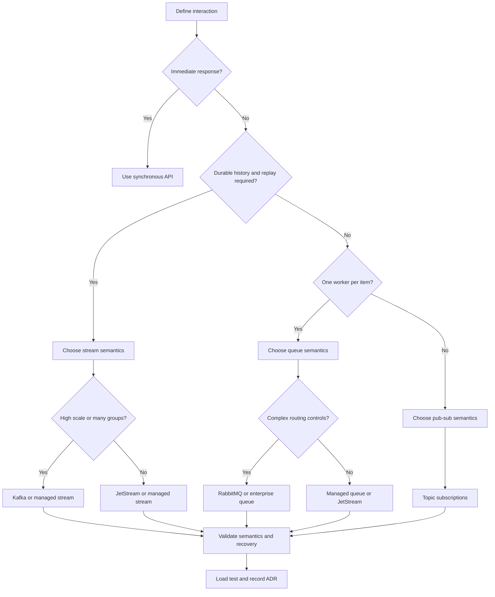
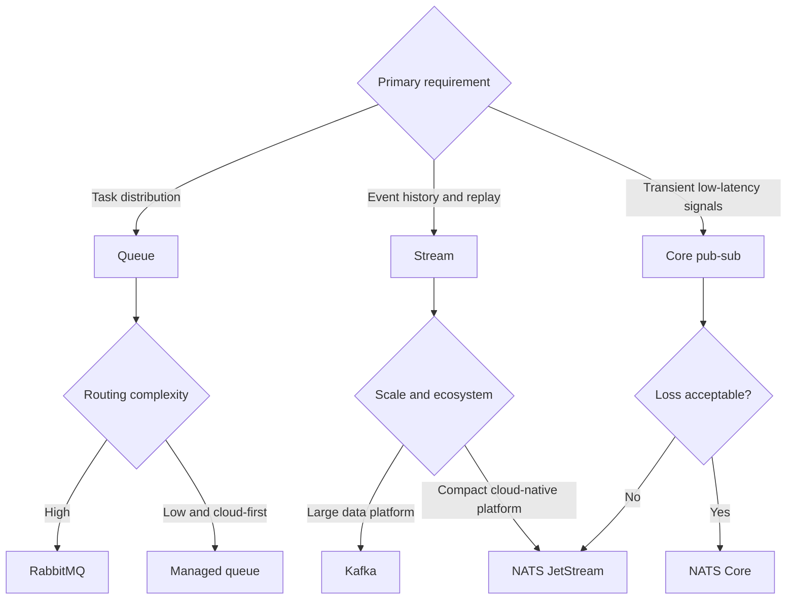
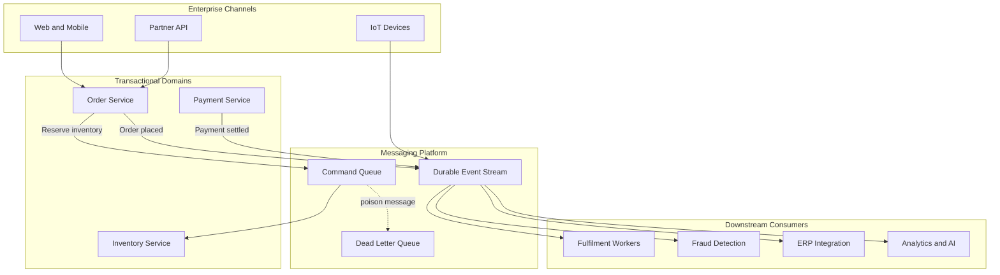

## 1. Executive Summary

A message broker decouples producers from consumers in time, location, and rate. Use one when asynchronous delivery, load leveling, fan-out, buffering, or replay is a business requirement—not merely because the architecture has multiple services.

The first decision is **queue versus stream**:

- Choose a **queue** when work should normally be completed once by one competing consumer, per-message routing and retry matter, and old messages have little value after acknowledgement.
- Choose a **stream** when events are a durable history, multiple consumer groups need independent views, replay is required, and throughput is scaled through partitions.
- Use both when commands and business events have different semantics. For example, queue `ReserveInventory` work but publish durable `InventoryReserved` events.


| Default choice | Best fit | Reconsider when |
| :--- | :--- | :--- |
| **RabbitMQ** | Rich routing, work queues, per-message acknowledgement, moderate scale | Long retention, replay, or very high event throughput dominates |
| **Kafka** | Durable event streams, replay, many independent consumer groups, high throughput | The workload is a simple task queue or strict global FIFO is required |
| **NATS with JetStream** | Low-latency cloud-native messaging with optional persistence and a compact operating model | The organization needs Kafka's mature data ecosystem or RabbitMQ's routing depth |
| **Managed cloud queue or stream** | Fast delivery with reduced broker operations | Portability, unsupported protocol semantics, egress cost, or regulatory control dominates |



There is no universal **exactly once**. Broker features can reduce duplicates inside a bounded pipeline, but end-to-end correctness still requires **idempotent consumers, stable message identity, atomic state transitions, and reconciliation**.


---

## 2. Business Problem

Synchronous calls couple availability and capacity: if the downstream system slows or fails, the caller also slows or fails. A broker introduces a controlled asynchronous boundary.

| Business need | Broker capability | Architectural consequence |
| :--- | :--- | :--- |
| Absorb traffic bursts | Durable buffering and backpressure | Consumers process at a sustainable rate, but queue age increases |
| Continue when a dependency is unavailable | Store-and-forward delivery | Eventual consistency and recovery procedures become explicit |
| Distribute an event to several domains | Topics, subscriptions, or consumer groups | Each consumer owns its failure and compatibility lifecycle |
| Preserve an auditable event history | Retained, replayable stream | Retention, privacy, and schema governance become platform concerns |
| Execute background work | Competing consumers on a queue | Duplicate execution and poison messages must be handled |
| Ingest telemetry at scale | Partitioned append-only stream | Ordering is scoped to a key or partition, not the entire stream |

### When a broker is the wrong choice

Do **not** introduce a broker when:

- The caller needs an immediate, authoritative answer.
- The operation is a simple local transaction.
- Traffic is small and stable.
- The organization cannot operate and observe asynchronous flows.

At modest scale, a database-backed job table or direct API can be the more reliable design.

---

## 3. Architecture Decision Flow

### Technology decision tree


Treat the tree as a **shortlist generator**. Test the final decision against recovery time, failure semantics, team capability, compliance, and total cost.


---

## 4. Where It Fits in Enterprise Architecture

A broker is an integration and reliability boundary between systems of record, domain services, workflow workers, analytics platforms, and external channels.

It is **not the system of record** and should not hide unclear domain ownership.

Architecture ownership should be explicit:

| Concern | Primary owner |
| :--- | :--- |
| Message contract and business meaning | Producing and consuming domain teams |
| Broker availability, upgrades, quotas, and capacity | Platform or cloud engineering |
| Retry, idempotency, DLQ disposition, and reconciliation | Application team |
| Identity, network controls, keys, audit, and retention policy | Security and platform teams |
| End-to-end SLO and business-flow observability | Service owner with SRE support |

> **Architect Recommendation:** Treat messaging as a shared platform with federated domain ownership. The platform owns broker health; domain teams own message meaning and business recovery.

---

## 5. Decision Checklist


1. Is each record a **command, event, document, or telemetry sample**?
2. Is the required model a **queue, pub-sub topic, or replayable stream**?
3. Is replay required? For how long, and from what unit: message, offset, timestamp, or snapshot?
4. What is the ordering scope: none, entity key, session, partition, or global?
5. What delivery behavior is acceptable: at-most-once, at-least-once, or effectively-once for a defined transaction?
6. How will consumers remain idempotent when delivery is repeated?
7. What is the retry budget, backoff policy, and poison-message disposition?
8. Are consumer groups independent applications or competing instances of one application?
9. What partition key preserves locality without creating hot partitions?
10. What are peak messages per second, payload size, retention, fan-out, and 12–24 month growth?
11. What queue-age, consumer-lag, availability, recovery-time, and recovery-point SLOs apply?
12. Are private networking, regional residency, encryption, audit, or payload-level controls required?
13. Can the team operate brokers, or is a managed service the responsible default?
14. How will contracts evolve, and who can publish or subscribe?
15. What is the exit plan for protocol, data, schemas, and retained history?


### Rapid decision matrix

| Requirement | Queue | Stream | Direct API / no broker |
| :--- | :---: | :---: | :---: |
| One consumer completes each work item | Strong | Possible, with consumer group | Weak |
| Independent consumer applications | Topic subscriptions | Strong | Requires custom fan-out |
| Replay after processing | Limited | Strong | None |
| Per-message priority and routing | Strong | Usually limited | Application-defined |
| High-throughput ordered ingestion | Limited to moderate | Strong per partition | Weak |
| Immediate response | Weak | Weak | Strong |
| Simple operational model at low scale | Moderate | Weak | Strong |

---

## 6. Architecture Decision Factors

### Queue versus stream

| Factor | Queue model | Stream model |
| :--- | :--- | :--- |
| Record lifecycle | Usually removed or hidden after acknowledgement | Retained for a time or size window |
| Consumption | Competing consumers share work | Consumer groups track independent positions |
| Replay | Usually exceptional or DLQ-driven | Native design capability |
| Scaling unit | Consumers, queues, and broker nodes | Partitions and consumers per group |
| Typical payload | Command, job, document to process | Fact, state change, telemetry, CDC record |
| Primary risk | Poison messages, retry storms, queue buildup | Hot partitions, lag, retention cost, rebalances |

### Ordering

Ordering has a cost. Global FIFO restricts parallelism and availability.

Most enterprise systems need ordering only per aggregate, such as `accountId`, `orderId`, or `deviceId`.

- Define the **business invariant** first: “transactions for one account are applied in sequence” is useful; “all messages are ordered” usually is not.
- Route related records using a stable key. In partitioned systems, ordering is normally guaranteed only within a partition.
- Retries can change observed order. If message 10 fails while 11 succeeds, decide whether to block the key, defer both, or tolerate reordering.
- Producer retries and failover can also create duplicates or sequence gaps. Include a sequence number where gaps matter.

### Retry and DLQ

| Failure type | Correct response | Incorrect response |
| :--- | :--- | :--- |
| Transient network or dependency failure | Exponential backoff with jitter and bounded attempts | Immediate infinite retry |
| Rate limiting or overload | Respect retry hints, reduce concurrency, apply backpressure | Add consumers until the dependency collapses |
| Invalid schema or business data | Quarantine promptly with reason and metadata | Reprocess unchanged data repeatedly |
| Permanent authorization or configuration error | Alert and stop the affected path | Send every record to DLQ without fixing configuration |
| Unknown consumer defect | Pause or isolate, preserve evidence, deploy fix, replay safely | Delete or manually edit production messages |


A DLQ is a **quarantine mechanism, not a recovery strategy**.

Every DLQ needs an owner, alert threshold, searchable failure reason, retention policy, redrive procedure, access control, and audit trail. Redrive into the original destination only after proving the consumer remains idempotent.


### Idempotency

Use at-least-once delivery as the default assumption. A robust consumer:

1. Receives a stable `messageId` and business key.
2. Validates the contract before side effects.
3. Atomically records the processed identifier with the business state change where possible.
4. Treats a duplicate as success and acknowledges it.
5. Uses reconciliation to detect lost, stuck, or partially completed business work.

For database state plus message publication, use a transactional outbox or equivalent change-data-capture pattern.

Avoid a distributed transaction between the application database and broker unless the platform, failure model, and operational burden are deliberately accepted.

### Consumer groups

A consumer group represents one logical application view of a stream.

Instances inside the group divide partitions. Separate groups each receive the events independently.

- Maximum active parallelism for one group is bounded by its partition count.
- Rebalances can pause work and repeat records whose offsets were not committed.
- Do not reuse one group identifier for unrelated applications; their consumption would become competitive rather than independent.
- Track lag by group, partition, and business age—not only record count.

### Partitioning

Choose a key that aligns ordering and workload distribution.

- A perfect hash distribution is not useful if it breaks required entity ordering.
- Strict entity ordering is not useful if one large tenant overloads a partition.

| Partition strategy | Benefit | Risk |
| :--- | :--- | :--- |
| Entity key | Preserves per-entity order | Large entities can become hot |
| Tenant key | Simple isolation and locality | A dominant tenant limits throughput |
| Composite key | Better distribution | Cross-key ordering is lost |
| Random / round-robin | Even distribution | No deterministic per-entity order |
| Dedicated lane for large tenants | Protects shared workload | More routing and operational complexity |

Partition count is a **capacity and compatibility decision**. Increasing it can:

- Change key-to-partition mapping.
- Affect ordering.
- Increase file descriptors and metadata.
- Increase rebalance time and cost.

---

## 7. Technology Categories

| Category | Characteristics | Use when | Avoid when |
| :--- | :--- | :--- | :--- |
| Work queue | Competing consumers, acknowledgement, visibility or redelivery | Background jobs and load leveling | Replayable business history is required |
| Enterprise message broker | Queues, topics, routing, priorities, TTL, DLQ, protocols | Integration workflows and command delivery | Very large retained streams dominate |
| Distributed event log | Partitioned storage, offsets, retention, consumer groups | Event sourcing, CDC, analytics, many consumers | Simple low-volume task execution is the only need |
| Lightweight cloud-native broker | Low latency, pub-sub, request-reply, optional persistence | Service messaging and edge/cloud systems | Rich transformation or broad data ecosystem is mandatory |
| Cloud event router | Managed filtering and push integration | Cloud resource events and serverless reactions | Durable high-volume stream processing is required |
| MQTT broker | Topic hierarchy, constrained clients, delivery QoS, retained state | IoT device messaging and unreliable networks | General enterprise streaming is the primary workload |

### Adjacent technologies

Queue, stream, event router, and workflow engine are not interchangeable:

- A **workflow engine** manages long-running state and timers; a broker transports records.
- A **schema registry** governs contracts; it does not provide delivery.
- An **integration platform** may transform and orchestrate, but adds a different operational and governance model.

---

## 8. Popular Products

### Kafka vs RabbitMQ vs NATS


| Dimension | Apache Kafka | RabbitMQ | NATS / JetStream |
| :--- | :--- | :--- | :--- |
| Core model | Partitioned durable event log | Queue and exchange-based message broker | Lightweight pub-sub; JetStream adds persistence |
| Best fit | Replayable streams, CDC, event platforms, high throughput | Work queues, commands, flexible broker-side routing | Low-latency service messaging, edge, compact cloud-native deployments |
| Consumption | Offsets and consumer groups | Broker deliveries and acknowledgements | Core subscriptions; JetStream consumers and acknowledgements |
| Replay | First-class within retention | Not the normal queue lifecycle | Supported by JetStream retention and consumers |
| Ordering | Per partition | Per queue, subject to concurrency, redelivery, and priorities | Per subject/stream sequence; parallel consumers affect processing order |
| Routing | Topic and application-level conventions | Rich exchanges, bindings, routing keys, priorities | Subject-based routing and wildcards |
| Scaling | Partitions across brokers | Queues, consumers, clusters; topology requires care | Subjects, streams, clustering, and consumers |
| Operational profile | Highest storage, partition, rebalance, and ecosystem complexity | Moderate; queue topology and clustering need expertise | Compact core; persistence and clustering still require engineering |
| Typical reason to reject | Too heavy for a simple queue | Retention/replay and streaming scale are central | Required ecosystem or enterprise routing features are missing |


### Other credible options

- **Apache Pulsar:** Multi-tenant streaming and queue-like subscriptions.
- **ActiveMQ Artemis:** JMS-oriented enterprise messaging.
- **Cloud-native queues and event streams:** Provider-operated messaging with cloud integration.
- **MQTT brokers:** Messaging for device estates.

Shortlist by semantics first. Then validate products against the organization's platform and support model.

---

## 9. Trade-offs

| Decision | Advantages | Disadvantages |
| :--- | :--- | :--- |
| Asynchronous boundary | Availability decoupling, load leveling, independent scaling | Eventual consistency, harder tracing, more failure states |
| Durable messages | Survive consumer outages, enable recovery | Storage cost, retention governance, stale backlog risk |
| At-least-once delivery | Favors availability and prevents silent loss | Duplicate processing is normal |
| Strict ordering | Simpler state-machine reasoning | Lower parallelism and harder recovery |
| More partitions | Higher potential throughput and concurrency | More metadata, rebalances, cost, and ordering complexity |
| Broker-side routing | Centralized delivery policy | Hidden coupling and topology governance burden |
| Managed service | Faster operations, integrated availability and security | Quotas, feature constraints, egress cost, provider dependency |
| Self-hosted platform | Control, protocol portability, custom tuning | 24×7 operations, patching, capacity, upgrades, and DR are yours |

> **Key Takeaway:** A broker improves temporal decoupling but increases semantic coupling through message contracts. Version contracts deliberately and assume consumers upgrade at different speeds.

---

## 10. Anti-patterns

- **Broker as a distributed database:** treating retention as authoritative state without query, governance, backup, and reconciliation design.
- **Everything is an event:** sending commands disguised as facts, so ownership and failure responsibility are unclear.
- **Dual write:** committing database state and publishing separately without an outbox, creating lost or phantom events.
- **Exactly-once slogan:** trusting a product setting while external API calls, databases, and manual redrive can repeat side effects.
- **Global ordering by default:** sacrificing throughput for an invariant the business does not need.
- **Retry forever:** turning a dependency outage into a retry storm and an unbounded backlog.
- **DLQ as a graveyard:** accumulating sensitive, failed records with no owner or redrive procedure.
- **One topic for the enterprise:** weak ownership, broad access, incompatible retention, and unmanageable schemas.
- **One consumer group for unrelated consumers:** accidentally load-balancing events that every application expected to receive.
- **Payload dumping:** placing large documents or binaries on the broker instead of storing them securely and sending a reference.
- **Broker choreography for every workflow:** hiding complex business state across dozens of handlers where an orchestrated workflow would be clearer.
- **Technology by brand:** selecting Kafka for prestige, RabbitMQ from habit, or NATS for simplicity before defining semantics and SLOs.

---

## 11. Production Considerations

### Scalability, throughput, and latency

Capacity planning must use **peak**, not average, traffic:

`ingress bytes/sec = peak messages/sec × average encoded message size × replication and protocol overhead`

Also model:

- Fan-out and retention.
- Retries and consumer downtime.
- Batch size and compression.
- Cross-zone traffic.
- Recovery catch-up.

A consumer must process faster than the long-term arrival rate, with headroom to drain backlog after an outage.

Track end-to-end business latency separately from broker publish latency. A broker can acknowledge in milliseconds while a record waits hours in a backlog.

### Availability and consistency

- Deploy across failure domains and understand quorum behavior during a network partition.
- Decide whether producers fail, block, or accept reduced durability when replicas are unavailable.
- Keep producer acknowledgement and replication settings aligned with the data-loss SLO.
- Size consumers so one zone or node failure does not violate queue-age objectives.
- Do not assume the broker makes downstream state consistent; sagas, idempotency, and reconciliation handle business consistency.

### Monitoring and observability

| Signal | Why it matters | Typical action |
| :--- | :--- | :--- |
| Oldest message age | Closest view of customer delay | Scale, pause producers, or fix dependency |
| Consumer lag by partition/group | Detects slow or stuck consumers | Inspect hot key, rebalance, or repair consumer |
| Publish and consume error rate | Reveals availability and contract failures | Alert by operation and error class |
| Retry and redelivery rate | Early warning of dependency or code failure | Apply backoff and investigate root cause |
| DLQ depth and age | Shows unrecovered business work | Triage under a defined SLO |
| Broker disk, memory, network, replicas | Predicts platform exhaustion | Add capacity or reduce retention |
| Rebalance and connection churn | Exposes instability | Tune clients and investigate deployments |

Propagate correlation and causation IDs, but do not use them as idempotency keys unless their lifecycle matches the business operation.

Trace producer, broker wait, consumer processing, downstream calls, retry, and DLQ transitions.

### Security and governance

- Use workload identity and least-privilege publish/subscribe permissions by domain and environment.
- Prefer private connectivity, TLS in transit, encryption at rest, and centrally rotated keys.
- Treat payloads as data assets: classify them, minimize personal data, and enforce retention and deletion obligations.
- Use payload-level encryption or tokenization when platform operators must not see sensitive fields; plan key rotation and replay.
- Audit topology and policy changes as well as data access. Prevent uncontrolled topic or queue creation.
- Validate schemas and payload size at ingress. Never deserialize untrusted polymorphic objects.

### Disaster recovery and deployment

Define RPO and RTO separately for:

- Broker configuration.
- Retained records and offsets.
- Schemas.
- Application state.

Cross-region replication may be asynchronous and can duplicate, reorder, or omit records during failover.

Exercise failover and failback with real consumers. DNS or endpoint switching alone is not a recovery test.

During application deployment:

- Support rolling versions of contracts.
- Drain consumers gracefully.
- Bound shutdown time.
- Avoid committing offsets before side effects are durable.

Broker upgrades need compatibility tests for clients, protocols, authentication, storage format, and partition leadership behavior.

### Operational complexity

The platform requires 24×7 ownership for:

- Quota management and cost allocation.
- Certificate rotation and upgrades.
- Partition changes.
- Runaway producers and stuck consumers.
- Replay approvals.


If broker operations are not a strategic capability, a managed service is usually the responsible choice.


---

## 12. Failure Scenarios

| Scenario | Effect | Design response |
| :--- | :--- | :--- |
| Producer times out after broker accepted record | Producer retries and creates a duplicate | Stable message ID, idempotent producer where supported, idempotent consumer |
| Consumer crashes after side effect but before acknowledgement | Record is redelivered | Atomic inbox/business update or deduplication record |
| Poison message blocks an ordered lane | Later records for the key cannot progress | Bounded retry, quarantine, keyed pause, controlled replay |
| Consumer deployment causes rebalance storm | Processing pauses and duplicates increase | Stable membership where available, graceful shutdown, staged rollout |
| Hot partition | One partition lags while cluster appears healthy | Better key, isolate large tenant, add shards with migration plan |
| Broker disk fills | Writes fail or retention deletes unexpectedly | Capacity alerts, quotas, retention policy, emergency runbook |
| Downstream outage | Backlog and retry traffic grow | Backoff, circuit breaker, admission control, catch-up capacity |
| Schema-breaking producer release | Consumers fail or silently misinterpret data | Compatibility checks, versioned contract, canary producer |
| Region loss | Publishing or consumption stops; replicated data may lag | Tested failover, documented RPO, duplicate-safe recovery |
| Credential or certificate expiry | Clients disconnect together | Automated rotation, overlap window, expiry monitoring |
| DLQ redrive floods repaired consumer | Dependency fails again | Rate-limited redrive, canary batch, audit and rollback |


Every failure test should verify both **technical recovery** and **business correctness**: no double charge, missing order, unauthorized disclosure, or unreconciled state.


---

## 13. Cloud Managed Services


| Need | AWS | Azure | Google Cloud | Self-hosted |
| :--- | :--- | :--- | :--- | :--- |
| Managed work queue | Amazon SQS | Azure Service Bus queues | Pub/Sub subscriptions or Cloud Tasks for controlled task dispatch | RabbitMQ, NATS JetStream, ActiveMQ Artemis |
| Enterprise broker protocols | Amazon MQ | Azure Service Bus | Partner or self-managed broker; Pub/Sub uses its service model | RabbitMQ, ActiveMQ Artemis |
| Durable event stream | Amazon MSK or Kinesis Data Streams | Event Hubs, including Kafka-compatible endpoint | Managed Service for Apache Kafka or Pub/Sub | Kafka, Pulsar, NATS JetStream |
| Event routing | Amazon EventBridge and SNS | Event Grid | Eventarc and Pub/Sub | Broker topics plus application routing |
| IoT messaging | AWS IoT Core | Event Grid MQTT namespaces / IoT services | Partner or self-managed MQTT broker | EMQX, HiveMQ, Mosquitto, NATS where appropriate |


Cloud products are not identical even when they occupy the same row. Validate:

- Ordering scope and delivery guarantees.
- Maximum payload and retention.
- Transactions and replay.
- Throughput quotas and private networking.
- Cross-region behavior and protocol compatibility.
- DLQ and redrive features.

### Managed versus self-hosted decision

| Favor managed | Favor self-hosted |
| :--- | :--- |
| Small platform team or rapid delivery | Broker operation is a strategic competency |
| Standard service semantics are sufficient | Custom protocol, plugin, topology, or tuning is essential |
| Cloud integration and identity are valuable | Hybrid, edge, air-gapped, or multi-cloud control dominates |
| Variable load benefits from service elasticity | Stable high scale makes infrastructure economics compelling |
| Provider's regional and compliance model fits | Regulatory or sovereignty requirements demand direct control |

### Cost comparison

Compare three-year total cost, including:

- Engineering on-call and upgrades.
- Observability and DR exercises.
- Support and data transfer.
- Idle capacity and migration.

Do not compare only the broker instance price.

---

## 14. Real-world Examples

### Banking — payment processing

- A queue distributes payment commands to competing workers.
- A stable payment ID makes execution idempotent.
- Settled-payment facts are published to a durable stream for fraud, ledger projection, notifications, and regulatory reporting.
- Ordering is scoped to the account or payment, not the bank.
- The DLQ is access-controlled because payloads may contain sensitive data.
- Reconciliation against the ledger remains authoritative.

### Retail — order and inventory

- The order service writes its transaction and outbox atomically.
- Inventory reservation commands use a queue with bounded retry.
- Order lifecycle events use a replayable stream consumed independently by fulfilment, customer communication, analytics, and ERP integration.
- Hot promotional SKUs are capacity-tested because key-based ordering can concentrate traffic.

### Healthcare — clinical integration

- Durable queues bridge systems with different maintenance windows.
- Contracts carry minimal patient data.
- Access is segmented by purpose, and retention follows clinical and privacy policy.
- A failed message is quarantined with metadata rather than copied into unsecured support tools.
- Delivery acknowledgement does not mean the receiving clinical workflow completed; business acknowledgements and reconciliation are separate.

### Gaming — sessions and telemetry

- Low-latency pub-sub distributes transient session signals.
- A partitioned stream ingests gameplay telemetry for anti-cheat, personalization, and analytics.
- Loss tolerance differs: a presence update may be replaced by the next update, but a purchase event requires durable, idempotent processing.

### AI and IoT — telemetry to model operations

- Devices publish telemetry through an MQTT-capable edge tier.
- A regional stream partitions by device or tenant.
- Separate consumer groups feed real-time anomaly detection, a data lake, and feature pipelines.
- Backpressure protects downstream inference services.
- Model outputs include model version and event identity so reprocessing is auditable.

---

## 15. Best Practices

1. Start with **message semantics and business invariants**, then choose a product.
2. Separate commands, business events, telemetry, and large payload references.
3. Design for at-least-once delivery and make externally visible side effects idempotent.
4. Preserve per-entity order only where the business requires it.
5. Use transactional outbox/inbox patterns and reconciliation for critical flows.
6. Bound retries; use exponential backoff with jitter and classify permanent failures.
7. Give every DLQ an owner, SLO, retention limit, and tested redrive runbook.
8. Govern schemas for backward and forward compatibility before allowing broad reuse.
9. Capacity-test peak ingress, consumer outage, catch-up, hot keys, and zone failure.
10. Monitor business age, consumer lag, retries, duplicates, and DLQ—not just broker health.
11. Apply least privilege and data minimization at topic, queue, and consumer-group boundaries.
12. Test regional failover, replay, and broker/client upgrades at least as seriously as normal delivery.
13. Record rejected alternatives, quantitative assumptions, and exit constraints in an ADR.

---

## 16. Interview Questions

1. How do you decide between a queue and a stream?
2. Why is end-to-end exactly-once difficult, and how do you achieve effectively-once business outcomes?
3. How do ordering requirements affect partitioning and scalability?
4. What is the difference between competing consumers and independent consumer groups?
5. How would you design retries and DLQ handling for a payment workflow?
6. When would you choose Kafka over RabbitMQ, and when would you choose NATS?
7. How do you recover safely after a consumer has been unavailable for six hours?
8. What metrics reveal a messaging incident before customers report it?
9. How do you prevent a hot tenant or key from dominating a partition?
10. What changes when the broker is managed by a cloud provider?
11. How do you evolve event contracts across independently deployed teams?
12. When is a broker the wrong architectural choice?

---

## 17. Interview Answer


“I choose a message broker by starting with the business interaction, not a vendor. I classify the record as a command or event and decide whether the system needs work distribution, fan-out, or a retained history with replay. That usually establishes queue versus stream semantics.

I then make ordering explicit—normally per business key, never global without a proven invariant—and assume at-least-once delivery. Consumers must be idempotent, retries bounded, poison records quarantined, and critical state reconciled. For streams, I validate partition keys, consumer-group concurrency, lag, retention, and recovery throughput. For queues, I focus more on routing, acknowledgement, retry, priority, and DLQ operations.

Kafka is a strong candidate for high-throughput retained event streams and many independent consumers. RabbitMQ fits work queues and rich routing. NATS fits low-latency cloud-native messaging and, with JetStream, compact persistent workloads. Managed services are my default when their semantics and compliance posture fit because broker operations are substantial, but I account for quotas, portability, egress, and disaster recovery.

Before approval, I load-test peak and catch-up scenarios, exercise duplicates and regional failure, define business-level observability, and document the trade-offs and rejected alternatives in an ADR. The decision is successful when the failure behavior is understood—not merely when messages flow in the happy path.”


---

## 18. Related Topics

- [Technology Playbook index](/technology-playbook/)
- [Event-Driven Architecture](/technology-playbook/event-driven-architecture/)
- [Outbox Pattern](/technology-playbook/outbox-pattern/)
- [Saga Pattern](/technology-playbook/saga-pattern/)
- [How to Choose an API Protocol](/technology-playbook/how-to-choose-api-protocol/)
- Product-specific pages in modules 3–6
