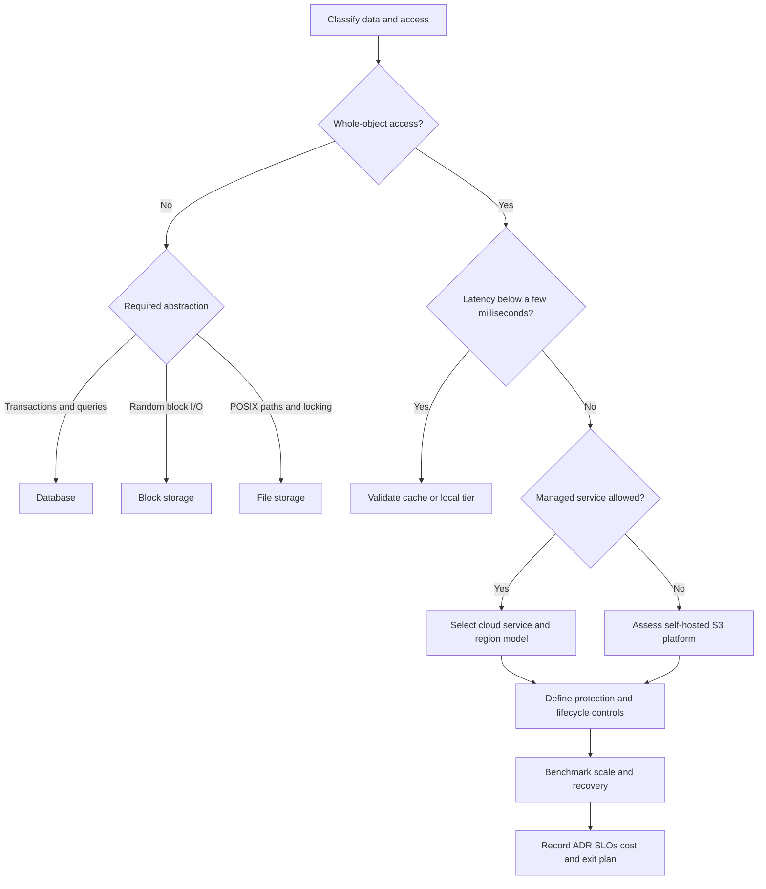
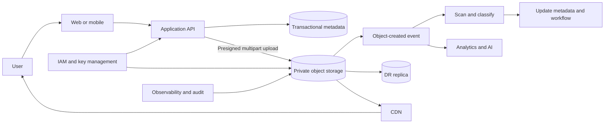
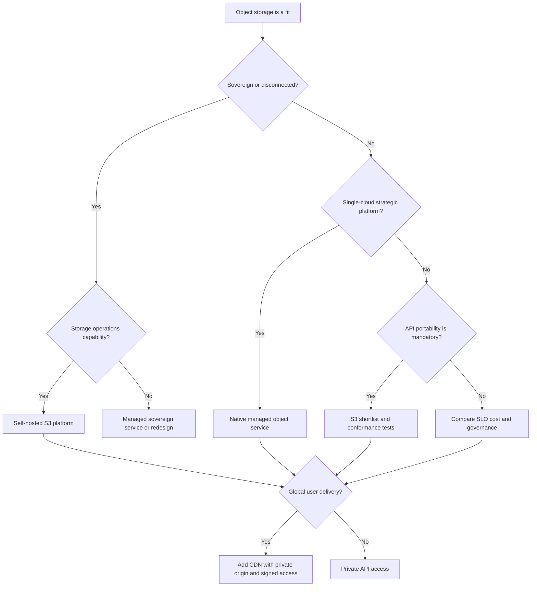

## 1. Executive Summary

Object storage keeps immutable or infrequently updated **blobs**—documents, images, video, backups, model artifacts, and data-lake files—under a key in a flat namespace.

It is designed for:

- **Very large object counts**
- **High durability** and elastic capacity
- **HTTP-based access**
- **Policy-driven retention**

It is not a general replacement for a relational database, block device, or shared POSIX file system.

Choose object storage when:

- The workload is dominated by **whole-object writes and reads**.
- Metadata can remain simple.
- Millisecond rather than microsecond latency is acceptable.
- Scale or durability matters more than in-place mutation.

Versioning, lifecycle policies, multipart upload, encryption, and CDN integration are architectural capabilities, not optional implementation details.

The principal decision is rarely **“Which S3 product?”** First determine whether the workload is actually object-shaped.

Then decide:

- Managed cloud versus self-hosted
- Required consistency and sovereignty
- Access tiers and recovery objectives
- Whether S3 API compatibility is sufficient or exact behavioral portability is required


Use it for durable, scalable blob retention and distribution. Do not use it for transactions across records, low-latency random block updates, filesystem locking, or frequent partial modification of large files.


---

## 2. Business Problem

Enterprises accumulate unstructured data faster than transactional data. Examples include statements, scans, exports, media, telemetry batches, backups, AI datasets, and compliance evidence.

Keeping those blobs inside a database inflates backup windows and compute cost. Keeping them on application servers creates capacity, availability, and recovery risks.

Object storage separates binary payloads from compute and transactional metadata:

- The **system of record** stores the authoritative object identifier, checksum, ownership, classification, and workflow state.
- The **object service** manages bytes, durability, replication, and retention.

| Business need | Object-storage response | Architectural qualification |
| :--- | :--- | :--- |
| Retain billions of files | Flat key namespace and elastic capacity | Listing and prefix design still require testing |
| Distribute global media | Origin for CDN and signed delivery | CDN invalidation and egress affect cost and freshness |
| Meet retention obligations | Versioning, object lock, lifecycle policies | Governance mode, legal hold, and deletion rights must be reconciled |
| Land analytics and AI data | Open file formats in durable storage | Catalog, schema, lineage, and small-file control remain separate concerns |
| Reduce backup footprint | Database stores metadata; object store holds payload | Cross-system integrity and orphan cleanup must be designed |
| Absorb large uploads | Multipart and resumable transfer | Upload sessions, checksums, quotas, and abandoned parts need controls |

---

## 3. Architecture Decision Flow

The flow deliberately rejects object storage early when application semantics require transactions, byte-range mutation, or filesystem behavior.


**Key takeaway:** S3 compatibility changes client integration. It does not change fundamental storage semantics.


---

## 4. Where It Fits in Enterprise Architecture

Object storage normally sits behind applications and data platforms rather than being exposed as an anonymous public bucket.

- The **transactional system** stores business state.
- **Asynchronous controls** scan, classify, replicate, and expire objects.
- A **CDN** serves approved public or customer-facing content.

| Architecture layer | Role | Boundary to preserve |
| :--- | :--- | :--- |
| Application | Authorizes uploads/downloads and owns business workflow | Never treat knowledge of an object key as authorization |
| Transactional database | Stores object ID, business metadata, checksum, status, and policy reference | Avoid storing large blobs unless atomicity outweighs scale and cost |
| Object store | Stores bytes and technical metadata | Avoid embedding mutable business truth only in object tags |
| Eventing | Starts scanning, transformation, indexing, and replication workflows | Design for duplicate, delayed, and out-of-order events |
| CDN | Caches distributable objects near consumers | Keep private origin access and explicit cache policy |
| Data platform | Reads governed landing, curated, and archive zones | Use catalogs and table formats rather than raw bucket listings as governance |

---

## 5. Decision Checklist


1. Are payloads written and read as complete objects or immutable versions?
2. Is typical latency in the tens of milliseconds acceptable, with a CDN or cache for hot delivery?
3. Do durability, elastic capacity, geographic replication, or retention policies matter?
4. Can business transactions reference an object without requiring one atomic commit across database and storage?
5. Can clients tolerate HTTP/API semantics rather than POSIX filesystem semantics?
6. Are object size distribution, request rate, retrieval tier, egress, and retention known well enough to model cost?
7. Is there a design for encryption, tenant isolation, malware scanning, lifecycle, audit, recovery, and deletion?
8. For self-hosting, can the platform team operate capacity, drives, networking, upgrades, quorum, and rebuilds continuously?


| If this requirement dominates | Prefer |
| :--- | :--- |
| Immutable blobs, huge namespace, HTTP access | Object storage |
| Shared directories, file locking, legacy applications | File storage |
| Boot volumes, databases, low-latency random I/O | Block storage |
| Relational queries and multi-record transactions | Relational database |
| Key/value lookups with sub-millisecond latency | Distributed cache or key/value database |
| Global static/media delivery | Object storage plus CDN |

---

## 6. Architecture Decision Factors

| Factor | Questions to resolve | Decision impact |
| :--- | :--- | :--- |
| Object profile | Median, p95, and maximum size? Many small objects or multi-terabyte objects? | Drives request cost, multipart thresholds, throughput, and metadata strategy |
| Access pattern | Write once/read many, overwrite, append simulation, range reads, list operations? | Frequent mutation or directory traversal may favor another store |
| Consistency | Must read-after-write, overwrite, delete, and list be immediately visible? | Confirm documented semantics and test gateways, replicas, and caches |
| Durability and availability | Required RPO/RTO? Zone or regional failure tolerance? | Determines redundancy, replication, and failover architecture |
| Retention | Versioning, WORM, legal hold, expiry, restore window? | Determines object lock, lifecycle, replication, and deletion process |
| Performance | First-byte latency, sustained throughput, request concurrency? | May require transfer acceleration, partition-aware keys, cache, or local tier |
| Network | Upload source, consumers, private endpoints, cross-region traffic? | Egress and constrained links can dominate cost and user experience |
| Security | Data classification, residency, tenant boundary, customer-managed keys? | Shapes accounts/projects, buckets, policies, encryption, and audit design |
| Ecosystem | Is S3 API support required by tools and libraries? | Narrows services, but feature compatibility must be tested operation by operation |
| Operations | Managed service or owned hardware? Available SRE maturity? | Self-hosting adds hardware lifecycle, healing, upgrades, and capacity risk |
| Economics | Storage-month, requests, retrieval, replication, CDN, and egress? | Cheapest capacity tier is not necessarily lowest total cost |
| Portability | Is migration a contractual or regulatory requirement? | Favor open formats, portable metadata, abstraction at the edge, and rehearsed export |

### Technology decision tree

---

## 7. Technology Categories

| Category | Best fit | Strengths | Limitations |
| :--- | :--- | :--- | :--- |
| Managed cloud blob/object storage | Most cloud-native enterprise workloads | Elasticity, high durability, IAM/KMS integration, low operations burden | Egress, provider-specific controls, service quotas, lock-in |
| S3-compatible self-hosted storage | Sovereign, edge, on-premises, or controlled infrastructure | S3 ecosystem, data locality, infrastructure control | Hardware, upgrades, capacity, failure-domain, and staffing burden |
| Distributed file storage with object gateway | Transitional estates needing file and object access | Supports legacy protocols and consolidation | Semantics and performance can differ between access paths |
| Archive object tier | Long retention with rare access | Low storage price and policy-driven retention | Retrieval delay, retrieval fees, and minimum-duration charges |
| CDN-backed object origin | Public/static assets and large global downloads | Lower origin load and latency | Cache staleness, invalidation cost, security configuration, egress |

### Blob storage and object storage

“Blob storage” and “object storage” are commonly used interchangeably in cloud architecture. Both store an opaque payload plus metadata under an identifier.

Product naming differs, but the decision should focus on:

- API operations and consistency
- Durability and replication
- Versioning and lifecycle
- Access control

### Versioning and lifecycle

Versioning protects against overwrite and deletion; it is not a complete backup.

- A compromised identity may delete versions unless retention controls prevent it.
- Every retained version consumes capacity.
- Lifecycle policies transition or expire versions, incomplete multipart uploads, and noncurrent data.

Policies must be tested against regulatory retention, legal hold, recovery needs, and erasure obligations.

### Multipart upload

Multipart upload improves resilience and throughput for large objects by uploading independently retryable parts.

The application must:

- Persist upload IDs.
- Verify final checksums.
- Enforce part and object limits.
- Abort abandoned sessions.
- Ensure completion is idempotent.


Do not infer content integrity from a provider-specific ETag. Use an explicit supported checksum.


### S3 compatibility

S3 compatibility is a spectrum, not a binary certification. Basic `PUT`, `GET`, and multipart calls may work while the following still differ:

- IAM policies and event notifications
- Object lock and checksums
- Conditional requests and presigned URLs
- Replication, tagging, and error behavior

Define the required API subset and run automated conformance tests before claiming portability.

---

## 8. Popular Products


| Product | Operating model | Interface emphasis | Best-fit context | Architectural caution |
| :--- | :--- | :--- | :--- | :--- |
| Amazon S3 | AWS managed | S3 API | AWS estates, data lakes, application blobs | Request, retrieval, replication, and egress costs require modeling |
| Azure Blob Storage / Data Lake Storage Gen2 | Azure managed | Azure Blob/DFS APIs | Azure estates, enterprise analytics, Microsoft identity integration | Namespace and access-model choices affect analytics behavior |
| Google Cloud Storage | Google Cloud managed | Native JSON/XML APIs with interoperability options | Google Cloud estates, analytics, media, AI | Validate tooling against the exact API and IAM model used |
| MinIO | Self-hosted or vendor-supported | S3-compatible API | On-premises, edge, sovereignty, Kubernetes or bare-metal platforms | S3 compatibility does not remove infrastructure and recovery ownership |
| Ceph Object Gateway | Self-hosted | S3- and Swift-compatible APIs | Large private-cloud platforms with experienced storage teams | Operational complexity and tuning are substantial |
| Cloudflare R2 | Managed | S3-compatible API | Internet delivery where egress economics and edge integration matter | Feature set and ecosystem differ from hyperscaler storage suites |


Product selection follows the requirements; it does not replace them.

For a regulated enterprise, identity boundaries, auditability, retention, residency, support, recovery, and operating ownership usually eliminate more options than raw benchmark results.

> **Architect Recommendation:** Shortlist products only after agreeing on workload semantics, governance constraints, recovery objectives, and operating ownership.

---

## 9. Trade-offs

| Advantage | Architectural value | Cost or qualification |
| :--- | :--- | :--- |
| Massive namespace and elastic capacity | Decouples data growth from application hosts | Listing and small-object workloads can be inefficient |
| High designed durability | Appropriate for authoritative blob copies | Availability and recoverability still require separate analysis |
| Simple HTTP APIs | Broad language and tool support | No general transactions, joins, or POSIX semantics |
| Independent compute and storage scaling | Supports analytics, AI, and stateless services | Network latency and data movement become first-class concerns |
| Lifecycle and tiering | Automates retention economics | Wrong rules can expire evidence or create retrieval surprises |
| Versioning and object lock | Supports recovery and immutable retention | Increases cost and complicates deletion/privacy workflows |
| CDN integration | Global delivery and origin offload | Cache keys, signed access, purge behavior, and stale content need design |
| S3 ecosystem | Enables tool reuse and some portability | Provider extensions and behavioral differences create hidden coupling |

### Managed versus self-hosted

| Criterion | Managed cloud | Self-hosted / MinIO-style platform |
| :--- | :--- | :--- |
| Time to production | Usually faster | Requires infrastructure and operational readiness |
| Capacity | Elastic within quotas | Procurement and headroom must precede growth |
| Availability | Provider operates service control plane and hardware | Enterprise owns failure domains, spares, healing, and upgrades |
| Data locality | Cloud regions and sovereign offerings | Full placement control, including disconnected sites |
| Unit economics | Storage, operations, retrieval, and egress charges | Hardware, facilities, licenses, network, and staffing |
| Governance integration | Native IAM, keys, policy, inventory, audit | Must integrate and continuously validate equivalent controls |
| Portability | Native features can increase coupling | S3 API helps, but data movement and feature parity remain constraints |

---

## 10. Anti-patterns


These patterns commonly pass a proof of concept but fail under production scale, governance, or recovery pressure.


- **Using a bucket as a database:** object listing and tags are not a transactional query model. Store searchable business metadata in an appropriate database or catalog.
- **Mounting object storage as a POSIX filesystem without qualification:** gateways cannot fully reproduce atomic rename, locks, append, permissions, and latency semantics expected by legacy software.
- **Public buckets for convenience:** distribute through controlled application or CDN paths with private origins, short-lived signed access, and explicit authorization.
- **One enterprise bucket:** weak isolation creates policy blast radius, naming conflicts, noisy neighbors, and difficult cost attribution. Partition by environment, sensitivity, ownership, and lifecycle—not by arbitrary proliferation.
- **Enabling versioning without lifecycle:** noncurrent versions and delete markers grow invisibly and may make deletion ineffective.
- **Treating versioning or replication as backup:** logical deletion, corruption, ransomware, or policy errors may replicate. Add immutable retention and independently tested recovery where risk requires it.
- **Using provider ETags as universal checksums:** multipart and encrypted objects may not expose a content MD5. Store and verify an explicit checksum.
- **Routing all transfers through application servers:** large uploads consume application bandwidth and memory. Prefer authorized direct multipart transfer when the threat model allows it.
- **Assuming S3 compatibility guarantees migration:** IAM, events, lock semantics, lifecycle, and replication often differ; bulk data transfer may take months.
- **Ignoring small-object overhead:** request cost, metadata pressure, and poor analytics throughput can dominate capacity cost.
- **Using CDN caching for confidential content without policy design:** cache keys, cookies, headers, signed URLs, and shared-cache behavior can leak data.

---

## 11. Production Considerations

| Concern | Production guidance | Evidence to capture |
| :--- | :--- | :--- |
| Scalability | Model objects/day, total objects, size distribution, prefixes, requests/sec, and annual growth | Load test at expected and 3x traffic with representative object sizes |
| Availability | Choose zone/region topology from business SLOs; degrade safely when storage is unavailable | Dependency SLO, timeout/retry policy, failover and restore exercises |
| Consistency | Document guarantees for create, overwrite, delete, and list; do not depend on unspecified cache behavior | Contract tests across primary, replica, gateway, and CDN paths |
| Latency | Measure first-byte and complete-transfer latency; keep hot metadata separate and use CDN/cache selectively | p50/p95/p99 by operation, size, region, and tier |
| Throughput | Use bounded parallelism and multipart transfers; avoid synchronized retry storms | Bytes/sec, requests/sec, throttles, retries, and connection saturation |
| Monitoring | Monitor request errors, latency, throttles, bytes, object count, capacity, replication lag, lifecycle failures, and abandoned parts | Dashboards with SLO-based alerts and ownership |
| Observability | Propagate request/correlation IDs; retain access, admin, IAM, key, and lifecycle audit trails | Searchable logs, audit immutability, trace links, retention proof |
| Security | Default private; least privilege; workload identity; TLS; encryption; private endpoints; malware/DLP pipeline | Policy tests, exposure scans, access reviews, key-rotation and incident evidence |
| Disaster recovery | Define whether restore, cross-region replication, or dual write meets RPO/RTO; account for metadata database consistency | Regular regional-failure and bulk-restore rehearsals |
| Capacity planning | Include versions, replicas, multipart remnants, erasure coding, growth, and rebuild headroom | Forecast thresholds and procurement/scale lead time |
| Deployment | Version bucket policies and lifecycle as code; stage destructive policy changes; separate environments | Reviewed plans, policy simulation, canary bucket, rollback procedure |
| Operations | Assign ownership for quotas, keys, certificates, upgrades, disk failures, lifecycle, and cost | Runbooks, on-call coverage, vendor escalation, recovery time measurements |

### Security and governance controls

1. Keep buckets private and block public access at the organization boundary where possible.
2. Use workload identities and short-lived credentials; avoid long-lived access keys.
3. Separate control-plane administration from data-plane read/write roles.
4. Encrypt in transit and at rest; select provider-managed or customer-managed keys based on threat, compliance, and recovery needs.
5. Validate tenant authorization before issuing presigned URLs; use short expiries and scope method, object, size, and content type.
6. Quarantine new external uploads until malware scanning, content validation, and classification complete.
7. Record access, policy, retention, and key-management events in a protected audit destination.
8. Maintain an object inventory reconciled with the system of record to find missing, orphaned, misclassified, and unexpectedly public data.

### CDN design

A CDN is a delivery tier, not durable storage.

- Use a private object-store origin, origin access controls, and TLS.
- Define deliberate cache keys and bounded TTLs.
- Use signed URLs or cookies for restricted content.
- Prefer content-addressed or versioned object names over frequent invalidation.
- Decide whether errors, authorization responses, and personalized variants may be cached.

---

## 12. Failure Scenarios

| Scenario | Likely effect | Prevention and recovery |
| :--- | :--- | :--- |
| Region unavailable | Reads/writes fail or latency spikes | Predefine RTO/RPO, replicate where justified, route deliberately, test application behavior |
| Accidental overwrite or delete | Business document disappears | Versioning, retention, least privilege, inventory, and rehearsed version restore |
| Credential compromise | Bulk read, encryption, or deletion | Short-lived identity, anomaly detection, restrictive policies, immutable retention, rapid revocation |
| Database commit succeeds but upload fails | Metadata points to a missing object | Pending state, checksum, idempotent finalize workflow, reconciliation job |
| Upload succeeds but database commit fails | Orphan consumes space and may bypass governance | Quarantine prefix/bucket, expiry window, reconciliation before promotion |
| Multipart upload abandoned | Hidden part storage and cost accumulate | Abort lifecycle rule and incomplete-upload metrics |
| Lifecycle rule error | Premature expiry or expensive transition | Policy as code, peer review, dry-run inventory, staged rollout, retention guardrails |
| Replica lag or replication misconfiguration | DR copy misses recent objects or deletions | Monitor replication status and lag; test failover with a known recovery point |
| CDN serves stale or private data | Incorrect content or confidentiality breach | Versioned keys, correct cache keys, private origin, tested invalidation and signed access |
| Small-object surge | Request cost and metadata load spike | Aggregate where appropriate, rate-limit, partition workload, benchmark representative sizes |
| Self-hosted node or disk failures | Reduced redundancy and slow rebuild | Failure-domain-aware layout, spare capacity, controlled rebuild rates, hardware telemetry |
| Key unavailable or destroyed | Data becomes unreadable | Key HA, rotation runbook, deletion controls, and recovery testing aligned to retention |


**Recovery rule:** Retries must be bounded, exponential, jittered, and limited to retryable operations. Completion, overwrite, and delete workflows should be idempotent or protected with conditional requests and application-level state.


---

## 13. Cloud Managed Services


| Capability | AWS | Azure | Google Cloud | Self-hosted |
| :--- | :--- | :--- | :--- | :--- |
| Core service | Amazon S3 | Azure Blob Storage | Google Cloud Storage | MinIO or Ceph Object Gateway |
| Primary API | S3 | Blob REST / Data Lake Storage APIs | Cloud Storage JSON/XML APIs | Usually S3-compatible |
| Version recovery | S3 Versioning | Blob versioning / soft delete | Object Versioning / soft delete | Product and configuration dependent |
| Immutable retention | S3 Object Lock | Immutable Blob Storage | Bucket Lock / object retention | Validate WORM and governance semantics |
| Lifecycle / tiers | Storage classes and Lifecycle | Access tiers and lifecycle management | Storage classes and lifecycle management | Policies and tiering vary; external archive may be needed |
| Global delivery | CloudFront | Azure Front Door / CDN options | Cloud CDN / Media CDN | External CDN or reverse proxy |
| Private connectivity | VPC endpoints / PrivateLink patterns | Private Endpoint | Private Service Connect and private access patterns | Enterprise network and load balancer design |
| Event integration | EventBridge, SQS, SNS, Lambda | Event Grid, Functions, queues | Eventarc, Pub/Sub, functions | Webhooks or message-broker integration varies |
| Analytics integration | Data lake ecosystem | Data Lake Storage Gen2 ecosystem | BigQuery and data/AI ecosystem | Spark, Trino, and other S3-capable engines |
| Operations ownership | Provider operates service | Provider operates service | Provider operates service | Enterprise operates software and infrastructure |


Complete the cloud comparison using the organization’s:

- Negotiated prices
- Supported regions and service quotas
- Compliance attestations
- Private-network design
- Key-management model
- Enterprise support terms

> **Key Takeaway:** Feature names are not proof of equivalent semantics.

---

## 14. Real-world Examples

### Banking: regulated statement archive

- The **transactional database** stores statement identity, customer relationship, generation status, checksum, and retention class.
- **Encrypted PDFs** are written to a private bucket with versioning and immutable retention.
- **Customer channels** obtain short-lived, authorized download URLs through an API.
- A **second recovery copy and legal-hold process** are selected from explicit RPO, RTO, and regulatory requirements—not from the storage durability claim alone.

### Healthcare: diagnostic image exchange

- Large imaging payloads land through **resumable multipart upload** into quarantine.
- A workflow validates format, scans content, associates the object with patient and consent metadata, and promotes it into a governed zone.
- Access is **private, audited, time-bound, and region-restricted**.
- Object storage holds the files; the clinical system remains the source of truth for patient context and authorization.

### Retail: product media at global scale

- Original product images are **immutable objects**.
- An object-created event generates approved renditions under content-versioned keys.
- A CDN serves public renditions from a private origin, while catalog metadata remains in the commerce platform.
- Lifecycle policies retain originals and expire obsolete derivatives, avoiding expensive CDN purges during catalog changes.

### Gaming: downloadable assets and player-generated content

- Versioned game assets are distributed through a CDN, enabling long cache lifetimes and deterministic rollback.
- Player uploads use presigned multipart transfer, quotas, moderation, and malware scanning before publication.
- Save-game state requiring transactional conflict control remains in a database rather than being implemented through object overwrites.

### AI and analytics: governed lake and model artifacts

- Raw, validated, and curated zones use **open columnar formats** in object storage.
- Catalog and table formats provide schema, partition, snapshot, and concurrency semantics above raw objects.
- Training pipelines read versioned datasets and publish model artifacts with checksums, lineage, evaluation results, and retention.
- Numerous tiny files are compacted to improve scan throughput and request economics.

### IoT: telemetry landing zone

- Gateways buffer telemetry during network interruption and upload compressed, time-bounded batches.
- Eventing registers each object in the data catalog and triggers validation.
- Lifecycle moves cold history to an archive tier.
- Device commands and latest device state use messaging and databases; object storage is the durable batch history, not the real-time control plane.

---

## 15. Best Practices

1. Decide from object semantics and workload evidence before comparing vendors.
2. Keep business metadata and workflow state in a transactional system; reconcile it with object inventory.
3. Use immutable or versioned object keys and conditional writes to avoid ambiguous overwrites.
4. Default to private access and authorize through application identity or narrowly scoped, short-lived signed requests.
5. Define multipart thresholds, parallelism, checksums, retry limits, and cleanup as shared platform standards.
6. Treat versioning, retention, replication, lifecycle, and key policies as reviewed infrastructure code.
7. Test the exact object-size distribution, concurrency, list behavior, failure modes, and network path—not a synthetic single-file benchmark.
8. Model total cost across capacity, versions, requests, retrieval, replication, CDN, egress, support, and operations at expected and 3x scale.
9. Use open data formats and isolate provider-specific features behind deliberate architecture boundaries where portability has business value.
10. Run restore, regional failover, key recovery, accidental deletion, and credential-compromise exercises.
11. For MinIO or other self-hosted platforms, design failure domains, erasure coding, rebuild headroom, load balancing, certificates, upgrades, and vendor support before production.
12. Capture the choice, rejected alternatives, assumptions, SLOs, cost thresholds, retention rules, and exit triggers in an Architecture Decision Record.

---

## 16. Interview Questions

1. When would you choose object storage over file storage, block storage, or a database?
2. Why is object-storage versioning not the same as backup?
3. How would you design secure direct browser uploads for multi-gigabyte files?
4. What does S3 compatibility guarantee, and what must still be tested?
5. How do lifecycle rules interact with versioning, legal hold, privacy deletion, and archive retrieval?
6. How would you provide global media delivery without exposing the origin bucket?
7. Which metrics and failure scenarios belong in an object-storage production readiness review?
8. When is self-hosted MinIO justified over a managed cloud service?
9. How would you keep a transactional database and object store consistent without a distributed transaction?
10. How do many small objects change performance and cost?
11. How would you design cross-region recovery, and how would you prove the RPO and RTO?
12. What would make you reject object storage for an otherwise blob-oriented workload?

---

## 17. Interview Answer


“I choose object storage when the payload is naturally a blob, normally written as an immutable object, and the business values elastic capacity, durability, retention, or global distribution more than filesystem semantics or microsecond latency. I first separate the bytes from transactional metadata: the database owns business state and authorization context; the object store owns durable payload storage.

I would not use it for relational queries, cross-record transactions, random block updates, file locking, or a latency-critical shared filesystem. For an approved use case, I quantify object sizes, request rates, consistency expectations, first-byte latency, throughput, RPO/RTO, residency, retention, and total cost including requests, retrieval, replication, CDN, and egress.

Managed cloud is my default when it satisfies sovereignty and commercial constraints because it reduces undifferentiated storage operations. I choose a self-hosted S3-compatible platform such as MinIO only when locality, disconnected operation, sovereignty, or infrastructure economics justify owning hardware failures, capacity, upgrades, and recovery. I treat S3 compatibility as a tested API contract, not a portability promise.

Before production I require private-by-default access, workload identity, encryption, explicit checksums, versioning and lifecycle aligned to policy, bounded multipart retries, inventory reconciliation, observability, and rehearsed restore and regional-failure procedures. The ADR records rejected alternatives, assumptions, SLOs, cost thresholds, and the exit plan.”


---

## 18. Related Topics

- [Technology Playbook index](/technology-playbook/)
- [How to Choose a Database](/technology-playbook/how-to-choose-database/)
- [How to Choose a Cache](/technology-playbook/how-to-choose-cache/)
- [How to Choose an API Protocol](/technology-playbook/how-to-choose-api-protocol/)
- [Event-Driven Architecture](/technology-playbook/event-driven-architecture/)
- [Sidecar Pattern](/technology-playbook/sidecar-pattern/)
