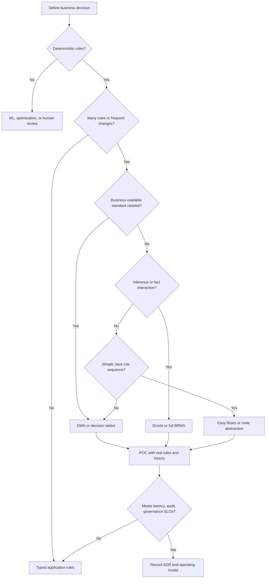
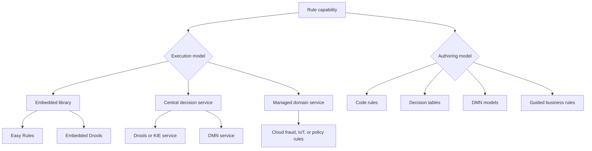
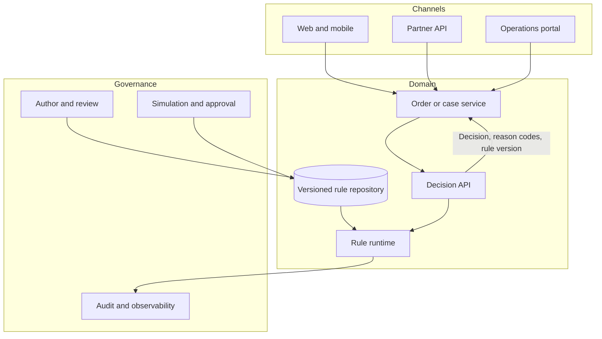

## 1. Executive Summary

A rule engine is appropriate when **business policy changes independently of application releases** and has one or more of these characteristics:

- Many interacting conditions
- Explainability or audit requirements
- Joint ownership by business and technology teams

Typical examples include eligibility, pricing, underwriting, fraud triage, claims routing, promotions, and regulatory controls.

Do not introduce a rule engine for a few stable `if/else` statements, workflow orchestration, statistical prediction, or data transformation. Externalizing rules adds a new runtime, deployment lifecycle, governance model, testing burden, and failure domain.

The architectural decision is not simply **Drools versus Easy Rules**. First decide whether rules should:

- Remain in code
- Use decision tables
- Adopt the **Decision Model and Notation (DMN)** standard
- Require a full business rule management system (BRMS)

Then evaluate rule complexity, authoring model, explainability, latency, versioning, governance, and operating capability.


**Architect recommendation:** Choose the simplest rule representation that satisfies change frequency, auditability, and governance. Introduce inference or a full BRMS only when the decision semantics require it.



| Situation | Default direction | Why |
| :--- | :--- | :--- |
| Fewer than 10 stable, developer-owned rules | Application code or Specification pattern | Lowest operational and cognitive cost |
| Many tabular rules maintained with domain experts | Validated decision table | Familiar authoring and review model |
| Decisions must be portable, visual, and auditable | DMN engine | Standard notation and explicit decision semantics |
| Stateful facts, temporal reasoning, or interacting rules | Drools or another inference engine | Supports forward chaining and conflict resolution |
| Small Java service with simple ordered rules | Easy Rules or a lightweight rules abstraction | Small footprint; limited governance expectations |
| Rules are predicted from data | ML model with policy guardrails | Prediction and deterministic policy are different concerns |


---

## 2. Business Problem

Enterprises often bury policy in service code, database procedures, spreadsheets, UI validation, and manual operating procedures.

This creates:

- Slow policy change
- Inconsistent decisions across channels
- Weak auditability
- Releases that mix business change with technical change

A rule capability separates three concerns:

1. **Decision input** — a versioned, validated business context such as customer, order, claim, or transaction facts.
2. **Decision logic** — deterministic business rules, decision tables, or DMN models.
3. **Decision evidence** — rule-set version, matched rules, output, reason codes, and correlation identifiers.

> **Key takeaway:** The goal is not “no-code.” The goal is **controlled policy change with deterministic execution and evidence**.

### When to use it

- Policy changes more frequently than the surrounding application.
- Multiple products or channels must apply the same decision consistently.
- Rules contain numerous combinations, priorities, exceptions, or effective dates.
- Regulators, auditors, customers, or operations need a reason for each decision.
- Business analysts must participate in authoring or approving policy.
- Rules must be simulated against historical data before activation.

### When not to use it

- Logic is small, stable, local to one service, and developer-owned.
- The problem is a long-running workflow, human task, or saga; use a workflow engine.
- The result is probabilistic; use an ML model and keep deterministic constraints as rules.
- The workload is primarily stream processing, SQL transformation, or complex optimization.
- The organization cannot own rule testing, approval, versioning, and production support.
- Sub-millisecond latency is mandatory and a remote decision service cannot meet the budget; prefer embedded, precompiled logic after measurement.

---

## 3. Architecture Decision Flow

### Technology decision tree

---

## 4. Where It Fits in Enterprise Architecture

A rule engine belongs in the **decision layer**. It consumes trusted facts and returns a decision; it should not become the system of record, orchestration engine, or integration hub.

### Placement choices

| Placement | Best fit | Primary trade-off |
| :--- | :--- | :--- |
| Embedded in each service | Very low latency, service-owned rules, autonomous deployment | Rule versions can drift across instances and services |
| Shared decision service | Cross-channel consistency, central audit, independent rule releases | Network latency and a new shared dependency |
| Sidecar or local runtime | Low latency with centrally distributed rule artifacts | More complex rollout and fleet-wide version tracking |
| Batch evaluation | Portfolio repricing, nightly eligibility, retrospective compliance | Decisions are not immediately current |
| Event-driven consumer | Asynchronous fraud flags, alerts, and classification | Requires idempotency and accepts eventual consistency |


**Architect recommendation:** Keep coarse domain ownership. A single enterprise-wide rules platform can provide standards and tooling, but each domain should own its vocabulary, rules, approval chain, and SLOs.


---

## 5. Decision Checklist


1. Is the outcome deterministic, and can inputs and outputs be expressed as a stable decision contract?
2. How often do rules change, and must they deploy independently from application code?
3. Who authors, reviews, approves, activates, and retires rules?
4. Are decision tables, DMN, code, or guided forms the most maintainable representation?
5. Are rules independent, ordered, mutually exclusive, or inference-based?
6. What are the p95 and p99 latency, throughput, and availability objectives?
7. Must every decision be reproduced later with the original data and rule version?
8. How are effective dates, jurisdiction, product, tenant, and customer segment modeled?
9. Can the engine be embedded, or is a shared service required for consistency and governance?
10. What happens when the engine, rule repository, or dependent data is unavailable?
11. How will historical simulation, regression testing, canary activation, and rollback work?
12. Does the team have the operational capacity to run and govern the chosen platform?


### Fast decision matrix

| Factor | Code | Easy Rules | Decision table / DMN | Drools / BRMS |
| :--- | :---: | :---: | :---: | :---: |
| Small rule set | Strong | Strong | Moderate | Weak |
| Business-readable authoring | Weak | Weak | Strong | Strong with tooling |
| Standardized decision model | Weak | Weak | Strong with DMN | Moderate to strong |
| Complex rule interaction | Weak | Weak | Moderate | Strong |
| Independent rule deployment | Moderate | Moderate | Strong | Strong |
| Audit and simulation | Build it | Build it | Tool-dependent | Platform-dependent |
| Runtime and operations cost | Lowest | Low | Medium | Highest |

---

## 6. Architecture Decision Factors

### Rule semantics and complexity

Distinguish simple predicates from inference. Most enterprise eligibility and pricing decisions are better represented as stateless decision tables or DMN.

Use an inference engine only when the outcome depends on:

- Interactions among facts
- Salience or agenda groups
- Temporal events
- Forward chaining

Otherwise, inference behavior can make execution order difficult to reason about.

### Change ownership

“Business-managed rules” still require engineering controls.

- **Business owners** propose and validate changes.
- **Technology teams** remain responsible for schemas, security, performance, automated tests, and deployment pipelines.

Define a RACI before selecting authoring tooling.

### Explainability and auditability

Store stable reason codes rather than engine-specific trace text. A decision record should normally include:

- Input reference or snapshot
- Output
- Rule-set identifier and semantic version
- Execution timestamp
- Reason codes
- Correlation ID

Sensitive input must be minimized or tokenized.

### Consistency and effective time

Decide whether all callers must use one active rule version immediately or whether eventual rollout is acceptable.

Rules often need both:

- **Valid time:** when policy applies to the business
- **System time:** when the rule was loaded

This distinction is essential for backdated claims, regulatory changes, and dispute replay.

### Latency and throughput

Measure rule compilation separately from evaluation.

- Compile and validate rule artifacts before serving traffic.
- Never compile large rule sets on the request path.
- Benchmark with realistic fact counts, rule counts, match density, and explanation logging.

### Portability and lock-in

DMN improves model portability but does not guarantee identical behavior across engines. Supported DMN levels, FEEL functions, extensions, and hit-policy behavior vary.

> **Key takeaway:** Treat conformance tests as the portability boundary.

### Security and compliance

Rules are executable policy and must follow software supply-chain controls:

- Apply least privilege to authoring and activation.
- Separate duties for high-risk changes.
- Sign artifacts and record approvals.
- Encrypt data.
- Prevent rules from calling arbitrary external code.

---

## 7. Technology Categories

| Category | Appropriate use | Strengths | Limitations |
| :--- | :--- | :--- | :--- |
| Rules in application code | Stable, service-local invariants | Type safety, familiar testing, simple deployment | Business visibility and independent change are limited |
| Lightweight rule library | Simple ordered predicates and actions | Low runtime overhead and easy embedding | Governance, authoring, and audit usually custom-built |
| Decision tables | Repeated conditions across products, tiers, or jurisdictions | Compact, reviewable, accessible to domain experts | Overlapping rows and spreadsheet errors require validation |
| DMN engine | Explicit decisions with reusable sub-decisions | Standard notation, hit policies, decision requirements diagrams | Vendor conformance and FEEL support differ |
| Inference engine | Many interacting facts or event-driven rules | Forward chaining, conflict resolution, temporal reasoning | Steep learning curve and less predictable behavior |
| Full BRMS | Enterprise authoring, repository, approval, simulation, deployment | End-to-end lifecycle and governance | Cost, platform coupling, and operational complexity |
| Domain-specific managed rules | Fraud, IoT routing, cloud policy, or access control | Managed scale and domain integration | Narrow semantics; not a general-purpose BRMS |

### Business rules, decision tables, and DMN

- **Business rules** are policy statements independent of notation: “Refer claims above the threshold for manual review.”
- **Decision tables** organize related conditions and outcomes into rows or columns. Define an explicit hit policy such as first, unique, collect, or priority.
- **DMN** standardizes decisions, input data, knowledge requirements, decision tables, and FEEL expressions. It is preferable when shared understanding and model interchange matter.
- A spreadsheet is only an authoring format. It becomes production-safe after schema validation, overlap/gap analysis, tests, approval, immutable versioning, and controlled compilation.

---

## 8. Popular Products

| Product / approach | Category | Best fit | Architectural caution |
| :--- | :--- | :--- | :--- |
| [Drools](/technology-playbook/drools/) | JVM inference engine and rule platform | Complex business rules, forward chaining, CEP, DMN in JVM estates | Agenda behavior, memory use, upgrade compatibility, and specialist skills |
| [Easy Rules](/technology-playbook/easy-rules/) | Lightweight Java rules library | Small, developer-owned, ordered rules embedded in a service | Not a BRMS; lifecycle, authoring, clustering, audit, and governance are yours |
| [OpenL Tablets](/technology-playbook/openl-tablets/) | Spreadsheet-oriented decision tables | Business-friendly tabular rules in Java environments | Spreadsheet governance and platform coupling require discipline |
| Camunda DMN | DMN engine often paired with process automation | Decisions linked to BPMN processes or exposed independently | Do not couple simple decisions to a workflow platform without need |
| Flowable DMN | DMN and process platform | Organizations already operating the Flowable stack | Evaluate DMN conformance and independent decision deployment |
| Custom decision service | Code, tables, or DSL behind an API | Stable domain contract and tailored controls | The organization owns tooling, validation, audit, and support |

Product selection should follow a representative proof of concept using:

- Real rule sets and historical cases
- Conflicting rules and rule upgrades
- Replay and failover scenarios
- Peak-volume tests

---

## 9. Trade-offs


| Decision | Advantages | Disadvantages |
| :--- | :--- | :--- |
| Externalize rules | Faster policy change, reuse, traceable versions | New runtime, governance process, and failure domain |
| Embedded engine | Lowest network latency; service autonomy | Duplicated memory; version drift; coordinated artifact rollout |
| Central decision service | Consistent policy, centralized audit and operations | Network hop, shared-service blast radius, scaling responsibility |
| Decision tables | Compact and business-readable | Hidden overlaps, gaps, ordering errors, and spreadsheet-control risk |
| DMN | Explicit model, hit policies, reusable decisions | Training cost and uneven vendor implementation |
| Inference engine | Handles interacting and temporal facts | Harder debugging, tuning, and deterministic explanation |
| Managed domain service | Reduced infrastructure operations | Narrow use case, provider semantics, data residency, and lock-in |
| Self-hosted BRMS | Maximum control and customization | Patching, HA, capacity, security, and DR remain enterprise duties |



**Key takeaway:** The largest hidden cost is usually **organizational**, not licensing. It includes ownership, domain vocabulary, test data, rule-conflict resolution, and support for policy changes outside normal application releases.


---

## 10. Anti-patterns

- **Rules as an untyped dumping ground:** moving all conditional code into strings or spreadsheets destroys compiler safety without creating governance.
- **Business users deploy directly to production:** authoring access is not activation authority; use review, separation of duties, and automated gates.
- **One global rule base:** mixing unrelated domains increases collision risk, startup time, access scope, and blast radius.
- **Rule engine as workflow engine:** rules decide; workflows coordinate state and time. Avoid encoding long-running sequences as salience and side effects.
- **Rule engine as integration layer:** rule actions should not make arbitrary database writes or remote calls. Return decisions to an application boundary that owns effects.
- **Inference for ordinary lookup:** a decision table or typed map is clearer when inputs map directly to outputs.
- **Mutable rules without immutable versions:** overwriting an active artifact prevents replay, audit, and safe rollback.
- **Testing only individual rows:** test rule-set interactions, gaps, overlaps, priority, boundary values, and historical outcomes.
- **Assuming DMN guarantees portability:** verify behavior with engine-neutral conformance cases.
- **Logging every fact:** verbose traces can expose health, identity, payment, or customer data and can dominate latency and storage cost.

---

## 11. Production Considerations

### Scalability and capacity planning

- Model throughput as `peak decisions per second × average evaluation cost × safety factor`.
- Include rule count, facts per request, match density, working-memory size, explanation depth, and artifact reload time.
- Keep stateless sessions and pure decisions where possible. Partition stateful workloads by a stable business key.
- Scale a central service horizontally and bound queues, execution time, request size, and concurrent sessions.
- Load-test the largest expected rule set and a 2–3× growth case, not only a happy-path sample.

### Availability and consistency

- Keep the last known good, immutable rule artifact locally available when the repository is down.
- Choose fail-open, fail-closed, cached decision, or manual review **per decision type**. A payment sanction rule normally fails closed; a low-risk recommendation may degrade gracefully.
- Report the active rule version from every instance and alert on version skew.
- Make asynchronous consumers idempotent; redelivery must not duplicate business effects.

### Latency and throughput

- Precompile rule packages and warm runtimes before receiving traffic.
- Avoid remote data lookups from individual rules; assemble the decision context before invocation.
- Set timeouts, bulkheads, and circuit breakers around a shared decision service.
- Measure p50, p95, and p99 evaluation time by rule-set version and outcome, while controlling metric cardinality.

### Monitoring and observability

Track:

- Decision, error, no-match, fallback, and timeout rates
- Evaluation latency
- Rule version and version skew
- Rule-fire distribution
- Queue depth, memory, and garbage collection

Emit business-safe reason codes and trace the call across the decision boundary.

Alert on outcome-distribution shifts as well as technical errors. A valid deployment can still encode the wrong policy.

### Security

- Authenticate callers and authorize by domain, tenant, and rule operation.
- Separate author, reviewer, approver, and deployer roles for high-impact rules.
- Treat rules and test data as sensitive artifacts; sign, scan, encrypt, and retain provenance.
- Sandbox expressions and restrict custom functions, reflection, file access, and outbound networking.
- Redact sensitive facts from traces and enforce retention policies on decision evidence.

### Versioning and deployment

- Use immutable semantic versions for the rule set.
- Record the compatible decision-contract version.
- Promote the same artifact through environments.
- Prefer shadow evaluation, historical replay, canary activation, and feature-flagged rollout.
- Never edit an active rule package in place.
- Retain the previous version and its dependencies for immediate rollback.


**Production warning:** An in-place rule edit destroys reproducibility and weakens rollback. Activate only immutable, traceable artifacts.


### Rule governance

| Lifecycle stage | Required control |
| :--- | :--- |
| Propose | Owner, rationale, jurisdiction, effective dates, expected outcome |
| Author | Validated vocabulary, bounded expressions, peer review |
| Test | Unit, interaction, boundary, historical replay, and performance tests |
| Approve | Business and technical approval; separation of duties where required |
| Activate | Immutable artifact, signed provenance, canary or scheduled activation |
| Observe | Technical SLOs, outcome distributions, reason codes, version skew |
| Retire | End date, dependency check, archived evidence, rollback expiry |

### Disaster recovery

Back up:

- Source models
- Immutable compiled artifacts
- Approvals and metadata
- The decision audit store

Test restoration independently of the authoring platform.

Define RPO/RTO separately for authoring, execution, and audit. Execution may need multi-zone recovery in minutes, while authoring can tolerate a longer outage.

---

## 12. Failure Scenarios

| Failure scenario | Impact | Detection | Mitigation |
| :--- | :--- | :--- | :--- |
| Conflicting or overlapping rules | Wrong or non-deterministic outcome | Static analysis, hit-policy validation, regression suite | Explicit priority/hit policy; reject ambiguous tables |
| Bad rule release | Broad systematic business error | Canary metrics, outcome drift, replay comparison | Kill switch, immutable rollback, dual approval |
| Rule repository unavailable | New instances cannot load policy | Artifact-load and readiness alerts | Bundle or cache last known good artifact |
| Central runtime unavailable | Synchronous business path fails | Availability and timeout SLOs | Multi-zone replicas, bulkheads, domain-specific fallback |
| Version skew across instances | Same input receives different decisions | Version metric and response metadata | Atomic rollout, readiness gate, traffic draining |
| Rule evaluation explosion | CPU, memory, and latency saturation | Fire-count, session-size, GC, timeout metrics | Bound facts and iterations; simplify rule graph; capacity limits |
| External lookup inside a rule stalls | Thread exhaustion and cascading failure | Dependency latency and thread-pool saturation | Prefetch facts; prohibit rule-side I/O |
| Audit data contains sensitive facts | Compliance breach | DLP checks and audit review | Data minimization, tokenization, encryption, retention controls |
| Clock or effective-date error | Incorrect policy applied | Synthetic boundary tests and time telemetry | UTC, explicit business timezone, tested valid-time semantics |
| Duplicate event evaluation | Repeated downstream action | Idempotency and duplicate metrics | Decision IDs, deduplication, effect handling outside rules |

---

## 13. Cloud Managed Services

The major clouds do **not** offer a single fully managed, general-purpose Drools/DMN equivalent across all workloads.

Their rule-named services are commonly domain-specific. Validate semantics before treating them as a BRMS replacement.

| Deployment | Relevant services or patterns | Best fit | Important limitation |
| :--- | :--- | :--- | :--- |
| AWS | AWS IoT Core Rules; Amazon EventBridge rules; AWS WAF; Amazon Fraud Detector where available; containerized decision service on ECS/EKS | IoT routing, event matching, security policy, domain services, or self-managed engines | Event and IoT rules are routing/filtering, not general business decision management |
| Azure | Azure Logic Apps conditions; Azure Policy; Microsoft RulesEngine library; containerized engine on App Service or AKS | Integration conditions, cloud governance, .NET applications, or hosted custom decisions | Logic Apps is workflow/integration; Azure Policy governs Azure resources rather than domain decisions |
| Google Cloud | Eventarc filters; Cloud Armor rules; organization policy; custom decision service on Cloud Run or GKE | Event routing, security/cloud policy, or serverless custom decisions | No native general-purpose managed DMN/BRMS service |
| Self-hosted | Drools/KIE, Easy Rules, OpenL Tablets, Camunda/Flowable DMN, custom service on VMs or Kubernetes | Full control, JVM integration, portability, custom governance | Enterprise owns patching, scaling, HA, DR, and security |


**Architect recommendation:** Keep cloud-native policy engines such as IAM, WAF, organization policy, and API gateway policy in their intended control plane. Do not centralize them in a business rule engine merely to claim one rules platform.


---

## 14. Real-world Examples

### Banking — credit and transaction decisions

- **Decision model:** DMN decision tables for product eligibility, affordability bands, and referral reasons.
- **Separation of concerns:** A model produces a probability of default; deterministic rules apply regulatory exclusions and risk appetite.
- **Governance:** Every response includes model version, rule-set version, and reason codes. High-risk releases run in shadow mode against recent applications before approval.

### Retail — promotions and order policy

- **Decision model:** Effective-dated decision tables by market, channel, loyalty tier, and product category.
- **Service boundary:** The pricing service owns monetary calculation; the rules service selects applicable offers and explains rejected offers.
- **Resilience:** Promotion rules are cached locally for peak events, with a last-known-good version when the authoring repository is unavailable.

### Healthcare — prior authorization triage

- **Decision model:** Governed rules route authorization requests by procedure, coverage, clinical documentation, and jurisdiction.
- **Human boundary:** Rules assist triage but do not replace clinical judgment.
- **Compliance:** Protected health information is excluded from verbose traces, and disputed decisions can be replayed with the original rule version.

### ERP — procurement and approval policy

- **Decision model:** Decision tables select approval levels from cost center, amount, supplier risk, and purchase category.
- **Service boundary:** The workflow engine manages human approvals; the rule engine only determines the required route.
- **Outcome:** Policy remains deterministic, and workflow state remains observable.

### IoT — alert classification

- **Decision model:** Rules determine alert severity, suppression windows, and maintenance routing.
- **Service boundary:** The stream processor calculates rolling metrics; the rule engine applies explainable policy.
- **Safety boundary:** Safety-critical control loops remain on the device or industrial controller rather than depending on a remote rules service.

### AI — deterministic guardrails

- **Model role:** Extract and classify documents.
- **Rule role:** Enforce permitted actions, confidence thresholds, mandatory human review, and jurisdictional restrictions.
- **Boundary:** Rules provide an auditable policy boundary; they do not attempt to reproduce the model.

---

## 15. Best Practices

1. Define the decision contract and domain vocabulary before choosing an engine.
2. Start with the simplest representation that meets change and governance needs: code, table, DMN, then inference.
3. Keep rules deterministic and side-effect free; perform external actions after the decision returns.
4. Model explicit hit policies, reason codes, effective dates, jurisdictions, and precedence.
5. Partition rule sets by bounded context and assign a named business and technical owner.
6. Version source, compiled artifact, input schema, test suite, approvals, and custom functions together.
7. Test gaps, overlaps, boundaries, rule interactions, historical cases, and expected outcome distributions.
8. Precompile and warm artifacts; do not fetch data or compile rules on the request path.
9. Use shadow evaluation and canaries for high-impact changes, with an immediate rollback path.
10. Preserve enough evidence to reproduce a decision without retaining unnecessary sensitive data.
11. Measure operational cost and specialist skill requirements during the proof of concept.
12. Review and retire obsolete rules; accumulation is a correctness and performance risk.

---

## 16. Interview Questions

1. When would you choose a rule engine instead of application code?
2. How do decision tables, DMN, lightweight libraries, and inference engines differ?
3. When is Drools justified, and when is Easy Rules sufficient?
4. Would you embed the engine or expose a central decision service?
5. How do you prevent conflicting rules and non-deterministic outcomes?
6. How would you version, approve, deploy, and roll back business rules?
7. How do you reproduce a decision made six months ago?
8. What should happen when the rule engine is unavailable?
9. How do you combine ML predictions with deterministic business policy?
10. Which metrics reveal a technically healthy but logically incorrect rule release?
11. How do you secure business-authored rules and protect sensitive decision data?
12. What proof-of-concept tests would you require before platform selection?

---

## 17. Interview Answer


“I choose a rule engine only when policy complexity, change frequency, reuse, or auditability justifies a separate decision lifecycle. I first define the decision contract, ownership, effective-time semantics, reason codes, latency and availability SLOs, and the evidence required to replay a decision.

For a few stable service-owned rules, I keep typed logic in code. For straightforward ordered Java rules, a lightweight library such as Easy Rules may be enough. For business-readable, portable decisions, I evaluate decision tables and DMN. I consider Drools or a full BRMS when rules genuinely require inference, interacting facts, temporal behavior, or enterprise authoring and governance—not simply because the rule count is large.

I then decide placement. Embedding reduces latency and isolates failures but complicates version consistency; a central service improves cross-channel consistency and audit but creates a shared dependency. In either case I require immutable versions, automated overlap and regression tests, historical replay, signed promotion, canary or shadow deployment, outcome monitoring, and a tested rollback. Rules remain side-effect free, and the application owns data access and business effects.

Finally, I compare products using real rules and production-shaped load. My recommendation includes rejected alternatives, operating cost, failure behavior, cloud constraints, and governance ownership. The successful architecture is not the engine with the most features; it is the simplest decision capability the organization can operate safely and explain later.”


---

## 18. Related Topics

- [Technology Playbook index](/technology-playbook/)
- [Drools](/technology-playbook/drools/)
- [Easy Rules](/technology-playbook/easy-rules/)
- [OpenL Tablets](/technology-playbook/openl-tablets/)
- [AWS Rules](/technology-playbook/aws-rule-engine/)
- [Azure Logic Apps](/technology-playbook/azure-logic-apps/)
- [Workflow engine decision guide](/technology-playbook/how-to-choose-workflow-engine/)
- [Specification Pattern](/design-patterns/06-architectural-principles/specification-pattern/)
