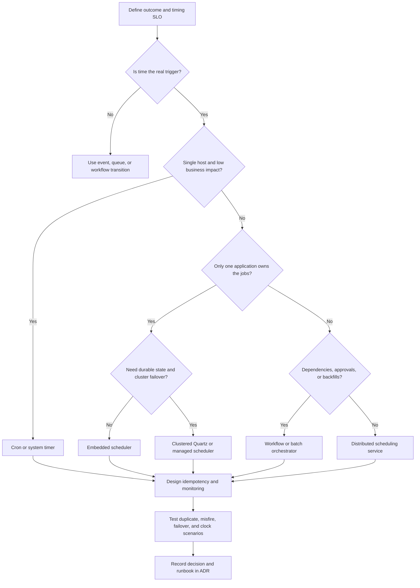
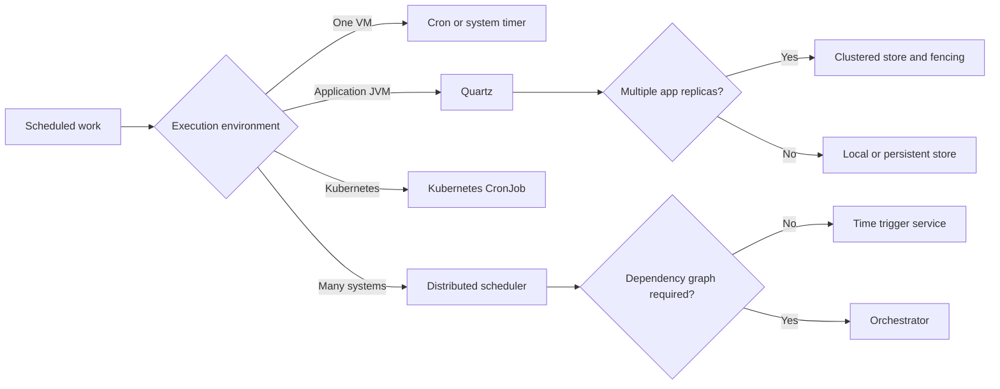
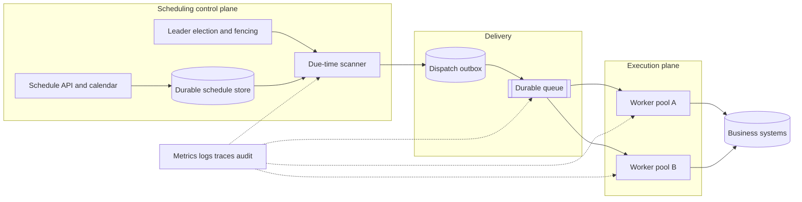

## 1. Executive Summary

A scheduler decides **when work becomes eligible to run**. It is distinct from:

- The **worker** that performs the work.
- A **workflow engine** that manages long-running business state.

The right choice depends less on syntax and more on whether schedules must:

- Survive failures.
- Run exactly once at the business level.
- Coordinate dependencies.
- Support calendars.
- Operate across nodes or regions.

| Requirement | Default direction |
| :--- | :--- |
| One host, low-impact maintenance, safe rerun | **Operating-system Cron** |
| Application-owned schedules, persistent job metadata, seconds-level timing | **Quartz or an equivalent embedded scheduler** |
| Containerized task with simple calendar or interval trigger | **Kubernetes CronJob** |
| Fleet-wide schedules, HA dispatch, tenant isolation, audit, backfill | **Distributed scheduler** |
| Cross-system dependencies, approvals, data intervals, backfills | **Workflow or batch orchestrator** |
| Durable, long-running business process with waits and compensation | **Workflow engine**, not a scheduler |


Choose the simplest scheduling control plane that can preserve schedule state, prevent unsafe duplicate business effects, recover missed executions, and meet the required availability and audit SLO.


---

## 2. Business Problem

Enterprises need work to start under one of three timing conditions:

- At a **wall-clock time**.
- After an **interval**.
- When a **calendar condition** becomes true.

Typical workloads include end-of-day settlement, ERP close, certificate rotation, inventory synchronization, report generation, model retraining, and telemetry compaction.

The real requirement is not merely “run at 02:00.” It includes:

- Which **time zone**, holiday calendar, daylight-saving rule, and business date apply?
- What happens if the scheduler, worker, or dependency is unavailable at 02:00?
- May two executions overlap, or must they be serialized?
- Is a late run still useful, and when does it become dangerous or obsolete?
- How are duplicate triggers prevented from creating duplicate payments, orders, or notifications?
- Who can create, pause, backfill, or manually rerun a schedule, and is that action audited?
- How quickly must scheduling recover after a regional failure?

Use a scheduler when time is the primary trigger. Do not use one to approximate real-time event handling, conceal missing workflow state, or embed the business transaction inside the scheduling control plane.

---

## 3. Architecture Decision Flow

### Technology decision tree


The decisive test is **failure behavior**, not whether the happy-path job starts on time.


---

## 4. Where It Fits in Enterprise Architecture

Scheduling belongs in the **control plane**. It creates a uniquely identified execution request. A queue or dispatcher buffers that request, workers execute it, and domain systems enforce business idempotency.

| Concern | Primary owner |
| :--- | :--- |
| Time calculation, calendar, misfire policy | Scheduler |
| Durable delivery and backpressure | Queue or dispatcher |
| Retry of technical execution | Worker platform or orchestrator |
| Business deduplication and correctness | Job/application and target system |
| Dependency graph and compensation | Orchestrator or workflow engine |
| CPU, memory, and runtime isolation | Execution platform |

---

## 5. Decision Checklist


1. Is the trigger based on wall-clock time, elapsed interval, data availability, or a business event?
2. Is the identity of a run defined by schedule ID, tenant, business date, and attempt?
3. Can a run overlap the previous run? If not, should the next run wait, skip, or replace it?
4. How late may a run start before it should be skipped?
5. Are holiday, market, fiscal, or regional calendars required?



1. What availability, start-latency SLO, RTO, and RPO apply to schedule state?
2. What is the misfire policy: fire now, skip, coalesce, or replay each missed occurrence?
3. Where are retries owned, and can repeated execution safely reproduce business effects?
4. How is a stale leader fenced after network partition or long pause?
5. Can operators query, pause, resume, backfill, and audit executions without database edits?


### Fast decision matrix


| Factor | Cron | Quartz | Kubernetes CronJob | Distributed scheduler / orchestrator |
| :--- | :--- | :--- | :--- | :--- |
| Scope | One operating system | One application or JVM cluster | One Kubernetes cluster | Multiple apps, clusters, or systems |
| State | Host files and logs | Memory or persistent database | Kubernetes API objects | Durable distributed metadata |
| HA | External host failover | Clustered JDBC store | Control-plane HA | Designed for HA; verify guarantees |
| Misfire handling | Usually custom | Explicit policies | Starting deadline and concurrency policy | Usually explicit and auditable |
| Dependencies | None | Limited/custom | None | Common in orchestrators |
| Best fit | Simple local tasks | Application-owned schedules | Container jobs | Enterprise scheduling and dependency control |
| Main risk | Silent host failure | DB contention and duplicate configuration | missed/duplicate Jobs and cluster coupling | Operational complexity and control-plane blast radius |


---

## 6. Architecture Decision Factors

### Trigger semantics

**Cron** expresses recurring calendar times but not business intent. Record the time zone explicitly.

An interval such as “every 24 hours” is not equivalent to “every day at 09:00” across daylight-saving changes.

| Approach | Behavior | Trade-off |
| :--- | :--- | :--- |
| **Fixed-rate scheduling** | Targets planned start times | Can create a backlog if execution is slow |
| **Fixed-delay scheduling** | Waits after completion | Drifts, but prevents schedule-driven overlap |

Choose based on business semantics, not convenience.

### Delivery and consistency

Schedulers commonly provide **at-least-once trigger delivery**. A leader can fail at two critical points:

- After persisting a trigger but before recording dispatch completion.
- After dispatch but before acknowledgement.

End-to-end exactly-once execution is rarely available across the scheduler, queue, worker, and business database.

Use a stable key such as `schedule_id + scheduled_time + tenant` and enforce it in the job or target store. Where dispatch durability matters, persist a trigger and an outbox record atomically, then publish asynchronously.

### Leader election and fencing

Leader election reduces concurrent dispatch but does not by itself guarantee safety.

During a network partition, the former leader may continue working after its lease expires. Attach a monotonically increasing **fencing token** or database ownership version to writes so downstream state rejects a stale leader.

Database row locks, advisory locks, leases, Kubernetes Leases, or consensus systems can coordinate leadership. The choice must account for clock assumptions, lease renewal latency, failover time, and metadata-store availability.

### Retries, misfires, and overlap

| Mechanism | Purpose | Key decision |
| :--- | :--- | :--- |
| Dispatch retry | Deliver a trigger after transient transport failure | Bound attempts and retain the same execution identity |
| Job retry | Repeat a failed technical operation | Retry only transient failures with backoff and jitter |
| Rerun / backfill | Reprocess a known business interval | Require scope, idempotency, capacity limits, and audit |
| Misfire handling | Decide what to do after a missed fire time | Fire now, skip, coalesce, or replay every occurrence |
| Concurrency policy | Control overlapping runs | Allow, forbid, queue, or replace |

Do not allow both scheduler and worker to perform independent unbounded retries. Their multiplicative effect can overwhelm a recovering dependency.

### Scale and precision

Capacity is driven by more than the total number of jobs. Model:

- Schedules scanned.
- Triggers due per second.
- Burst concentration.
- Dispatch latency.
- Retained history.

Minute-level enterprise workloads usually favor partitioned due-time indexes and queues.

Sub-second, high-cardinality timers may require a timer service, partitioned timing wheel, or event-stream design rather than periodic database polling.

---

## 7. Technology Categories

| Category | Use when | Strengths | Limits |
| :--- | :--- | :--- | :--- |
| **OS scheduler** | Host-local, low-risk administration | Minimal footprint, mature, transparent | Weak HA, fleet governance, history, and dependency support |
| **Embedded application scheduler** | Schedules are part of one application's domain | Code integration, persistent metadata, fine timing controls | Couples control plane to app lifecycle and database |
| **Cluster-native scheduler** | Work is packaged as containers in one cluster | Native identity, quotas, placement, and deployment | Cluster-scoped; business calendars and workflows remain custom |
| **Managed time-trigger service** | Serverless event delivery at large schedule counts | Low infrastructure burden, cloud integration | Provider semantics, quotas, regional design, and lock-in |
| **Enterprise workload automation** | Mainframe, ERP, files, scripts, and cross-system calendars | Central governance, dependencies, audit, operator tooling | Cost, specialized skills, central blast radius |
| **Data orchestrator** | Data intervals, dependencies, sensors, and backfills | DAG visibility, lineage integration, catch-up controls | Poor fit for high-frequency general-purpose timers |
| **Durable workflow engine** | Long-lived state, waits, signals, compensation | Durable process state and retries | Greater conceptual and operating cost than a time trigger |

---

## 8. Popular Products

| Product or approach | Category | Appropriate fit | Architectural caution |
| :--- | :--- | :--- | :--- |
| **Cron / systemd timers** | OS scheduler | Host maintenance and low-impact scripts | HA, audit, locking, and notification must be designed |
| **Quartz Scheduler** | Embedded/clustered scheduler | JVM applications needing calendars, persistence, misfire policies, and clustering | Shared-store throughput, clock behavior, and app coupling |
| **Kubernetes CronJob** | Cluster-native scheduler | Scheduled container jobs in Kubernetes | Design concurrency, deadlines, history retention, and idempotency |
| **Apache Airflow** | Data orchestrator | Scheduled data DAGs, backfills, and dependency visibility | Not a general sub-minute timer or business workflow engine |
| **Argo Workflows** | Kubernetes workflow orchestrator | Container-native DAGs and scheduled workflows | Kubernetes dependence and control-plane capacity |
| **Control-M / AutoSys** | Enterprise workload automation | Heterogeneous estates, calendars, governed operations | Licensing, specialist ownership, and centralized dependency |
| **Temporal** | Durable workflow engine | Timers inside long-running, stateful workflows | Do not adopt solely to replace a few Cron entries |

Popular does not mean interchangeable. Evaluate failure semantics and operating ownership before feature breadth.

---

## 9. Trade-offs


| Decision | Advantage | Disadvantage | Guardrail |
| :--- | :--- | :--- | :--- |
| Local Cron | Lowest complexity | Host is a state and availability boundary | Use only for low-impact, replay-safe work with external alerts |
| Embedded Quartz | Close to application domain | Deployments and DB health affect scheduling | Separate worker pool, persistent store, and cluster tests |
| Shared database clustering | Familiar consistency and failover | Polling, locks, and hot indexes limit throughput | Index due-time queries and benchmark failover bursts |
| Leader-only dispatch | Simplifies ordering | Leader bottleneck and split-brain risk | Lease plus fencing, standby capacity, bounded batches |
| Active-active regional scheduling | Regional resilience | Duplicate dispatch, clock, and consistency complexity | Home-region ownership or globally consistent run identity |
| Managed cloud scheduler | Reduced platform operations | Quotas, provider coupling, opaque internals | Validate SLOs, export definitions, and keep jobs idempotent |
| Central enterprise scheduler | Governance and unified operations | Large blast radius and organizational bottleneck | Federation, tenant quotas, change controls, DR tests |
| Replay every misfire | No logical interval omitted | Recovery storm and obsolete work | Rate-limit catch-up and define maximum useful lateness |
| Coalesce misfires | Fast recovery | Intermediate intervals are lost | Use only when latest-state processing is correct |


---

## 10. Anti-patterns

- **Cron as an enterprise integration platform:** dependencies, audit, HA, and ownership become shell-script conventions.
- **Scheduler as execution engine:** long-running work consumes scheduler threads and makes control-plane failure more likely.
- **Leader election without fencing:** a paused or partitioned old leader can still dispatch after a new leader starts.
- **Exactly-once by configuration:** cluster mode or a lock cannot make remote side effects exactly once.
- **Retry at every layer:** scheduler, queue, platform, and application retries multiply traffic during an incident.
- **Ignoring misfires:** restarting after an outage can either lose required work or release an uncontrolled trigger storm.
- **One global time zone:** business dates, DST, market calendars, and regional holidays become ambiguous.
- **Mutable job definitions without versioning:** a rerun silently executes different logic from the original.
- **Unbounded overlapping runs:** slow jobs accumulate until the target database or API collapses.
- **Database polling without indexes:** due-time scans and history growth degrade the same store needed for HA.
- **Using polling for event-driven work:** it adds latency, load, and duplicate windows where a durable event is the natural trigger.
- **Multi-region active-active by default:** complexity is accepted without a business RTO that justifies it.

---

## 11. Production Considerations

### Scalability and capacity planning

Model the following capacity inputs:

- Average and peak **triggers per second**.
- Schedule count and scan batch size.
- Dispatch latency and history retention.
- Retry and misfire bursts.

A top-of-hour burst can be orders of magnitude above the daily average. Apply jitter where exact alignment has no business value.

- Partition schedules by stable hash, tenant, or time bucket and avoid a single hot due-time range.
- Keep scheduler threads free of business execution; dispatch to queues or independent workers.
- Apply per-tenant quotas, maximum active runs, queue depth limits, and downstream concurrency caps.
- Load-test a cold restart with accumulated misfires and a degraded metadata store.

### Availability and disaster recovery

- Replicate and back up schedules, calendars, run identities, and audit history according to their RPO.
- Make scheduler nodes replaceable and keep leader election independent of local disk.
- Define whether failover catches up, skips, or coalesces work; RTO alone is insufficient.
- Prevent primary and DR regions from owning the same schedule simultaneously using region ownership and fencing.
- Test regional promotion, clock skew, expired leases, duplicate dispatch, and restoration from backup.

### Monitoring and observability

| Signal | Why it matters | Example alert |
| :--- | :--- | :--- |
| Schedule lag: actual dispatch minus planned time | Measures the scheduler's primary SLO | p99 lag exceeds threshold |
| Due but undispatched count | Detects scanner or leader failure | Count grows for two scan intervals |
| Misfire count and age | Reveals outage impact | Oldest actionable misfire exceeds business limit |
| Duplicate execution key | Exposes fencing or delivery problems | Any duplicate for a non-idempotent job |
| Active, queued, and overlapping runs | Detects saturation | Concurrency policy or tenant quota breached |
| Retry and dead-letter counts | Identifies dependency or poison-job failures | Retry rate deviates from baseline |
| Leader changes and lease-renewal latency | Detects control-plane instability | Repeated elections or lease near expiry |
| Metadata query latency and lock waits | Predicts missed schedules | p95 scan time approaches polling interval |

Correlate logs and traces with `schedule_id`, `scheduled_time`, `execution_id`, `attempt`, tenant, job-definition version, leader epoch, and region.

### Security and deployment

- Separate permissions to define, approve, pause, execute, and backfill schedules; audit every privileged action.
- Use workload identity and a secret manager. A schedule should reference a credential, never contain one.
- Sign or version executable artifacts and restrict which images, commands, or endpoints a schedule may invoke.
- Isolate tenants and sensitive jobs with queues, namespaces, service accounts, and network policy.
- Deploy scheduler changes separately from job code where possible; use backward-compatible metadata migrations.
- Drain or fence a node before shutdown, and verify that rolling deployment does not create duplicate leaders.

---

## 12. Failure Scenarios

| Failure | Consequence | Recovery design |
| :--- | :--- | :--- |
| Leader crashes before dispatch | Late or missed run | Durable due state; new leader rescans after lease expiry |
| Leader crashes after dispatch but before acknowledgement | Duplicate run | Stable execution key and idempotent business operation |
| Network partition creates two apparent leaders | Double dispatch | Consensus/lease plus monotonically increasing fencing token |
| Metadata database is unavailable | No new schedules or dispatch | Degrade safely, alert, recover store; do not invent local state |
| Worker is slower than recurrence interval | Overlap and resource exhaustion | Forbid/queue/replace policy and runtime deadline |
| Scheduler restarts after long outage | Misfire storm | Per-schedule policy, catch-up throttling, priority, and expiration |
| Daylight-saving transition | Duplicate or absent local time | Explicit time zone and tested DST policy; prefer UTC internally |
| Clock skew or VM pause | Early/late trigger and stale lease | Time synchronization, bounded drift, monotonic durations, fencing |
| Queue unavailable after trigger commit | Trigger stuck or lost | Transactional outbox and replayable publisher |
| Poison job fails repeatedly | Retry storm | Retry classification, bounded attempts, dead-letter state, owner alert |
| Region fails during execution | Unknown outcome | Reconcile by execution key before rerun in recovery region |
| Schedule definition changes during backfill | Non-reproducible results | Pin job-definition and calendar versions to each execution |


A scheduler can guarantee that it recorded or attempted a trigger. It cannot alone guarantee that an external business effect occurred exactly once. State the guarantee at each boundary and reconcile the final business outcome.


---

## 13. Cloud Managed Services


| Capability | AWS | Azure | Google Cloud | Self-hosted |
| :--- | :--- | :--- | :--- | :--- |
| Managed time-to-event trigger | EventBridge Scheduler | Logic Apps recurrence or Functions timer trigger | Cloud Scheduler | Cron, Quartz |
| Scheduled container execution | ECS scheduled tasks, EKS CronJob, AWS Batch submission | Container Apps Jobs, AKS CronJob, Azure Batch | Cloud Run jobs, GKE CronJob, Batch | Kubernetes CronJob, Nomad periodic jobs |
| Data/workflow orchestration | Step Functions, MWAA, Glue Workflows | Data Factory, Fabric Data Factory, Logic Apps | Workflows, Cloud Composer | Airflow, Argo Workflows, Prefect |
| Enterprise heterogeneous automation | Partner products and managed hosting patterns | Partner products and managed hosting patterns | Partner products and managed hosting patterns | Control-M, AutoSys and similar platforms |
| Durable business workflow with timers | Step Functions | Durable Functions | Workflows | Temporal, Camunda |


Cloud selection questions:

- Is the scheduler regional, and what happens to schedules during regional failover?
- What delivery guarantee, retry policy, retention, precision, quota, maximum delay, and target types are supported?
- Can schedules use private networking and workload identity without static secrets?
- Are schedule definitions, execution history, and audit events exportable?
- Does the service support the required time zones and DST behavior, or should schedules be normalized to UTC?
- Is pricing driven by schedules, invocations, workflow transitions, compute, or retained history?

Managed services reduce control-plane operations; they do not remove idempotency, misfire policy, capacity protection, or DR ownership. Verify current service limits and regional capabilities during the ADR because they change over time.

---

## 14. Real-world Examples

### Banking — end-of-day settlement

An enterprise scheduler opens a run for business date and legal entity after the ledger cutoff. It dispatches bounded settlement jobs and waits for control totals before downstream reporting.

Duplicate runs are rejected by settlement identity. Holiday calendars are versioned. A late start invokes a documented recovery window rather than blindly replaying every trigger.

### ERP — month-end close

A workload-automation platform coordinates:

- Extracts.
- Revaluation.
- Consolidation.
- Reporting across ERP, databases, and file transfers.

Dependencies and approvals justify orchestration beyond Cron. Legal entities can run in parallel, but final consolidation is fenced by accounting period and begins only after reconciliation.

### Healthcare — regulated report generation

A scheduled container produces daily compliance extracts from an immutable cutoff.

- Workload identity and private networking protect access.
- Logs exclude patient data.
- The execution manifest records data snapshot, code version, scheduled time, and approver.

A misfire fires once if still within the submission window; otherwise, it escalates for controlled backfill.

### Retail — inventory synchronization

Regional inventory syncs run every few minutes with jitter to avoid top-of-minute load.

The scheduler emits an execution key to a queue. Workers upsert by store, product, and source version.

When a prior run is still active, new work coalesces to the latest watermark rather than replaying obsolete intervals.

### AI — model retraining

A data orchestrator starts retraining only after the feature snapshot and quality checks complete.

The calendar trigger initiates the DAG, but dependency state—not elapsed time—controls later steps. Artifacts, parameters, and source snapshots are pinned so a backfill is reproducible.

### IoT — telemetry compaction

Hourly compaction jobs process closed object-storage partitions.

- Schedules are staggered by tenant and region.
- Workers are capacity-limited.
- Late-arriving telemetry is handled by a separate reconciliation window.

Event-driven finalization may replace the timer when partition-complete events become reliable.

---

## 15. Best Practices

1. Define a stable business execution identity independently of retry attempt.
2. Treat trigger delivery as at least once and make every externally visible job idempotent.
3. Keep scheduling, dispatch, execution, and business state as explicit architectural boundaries.
4. Persist schedules and trigger state when missed work has business impact.
5. Specify time zone, DST, holiday calendar, lateness limit, overlap, and misfire policy per schedule.
6. Use leader leases with fencing; never rely on leader election alone for correctness.
7. Centralize retry ownership, use exponential backoff with jitter, and cap total retry time.
8. Buffer execution through a durable queue when bursts or dependency outages are expected.
9. Add jitter to non-critical schedules and quotas to protect shared downstream systems.
10. Version schedules, calendars, job definitions, parameters, and executable artifacts.
11. Alert on schedule lag, stalled due work, misfires, duplicate keys, and projected deadline breach.
12. Test crash points before and after dispatch, long pauses, network partitions, DST changes, and DR promotion.
13. Provide controlled pause, resume, rerun, backfill, and reconciliation runbooks.
14. Record the rejected simpler option and the operational owner in the ADR.

---

## 16. Interview Questions

1. When would you choose Cron, Quartz, Kubernetes CronJob, or a distributed scheduler?
2. Why does leader election not guarantee single execution?
3. How do fencing tokens prevent a stale scheduler leader from dispatching work?
4. What is a misfire, and when should it be skipped, coalesced, or replayed?
5. How do you prevent duplicate business effects after scheduler or worker failure?
6. How would you design HA scheduling across two regions?
7. What is the difference between a scheduler, batch engine, orchestrator, and workflow engine?
8. How do fixed-rate and fixed-delay scheduling differ?
9. Which metrics demonstrate that a scheduling platform meets its SLO?
10. How would you handle top-of-hour bursts and accumulated work after an outage?
11. What problems do daylight-saving changes create for Cron schedules?
12. When is a managed cloud scheduler a poor fit?

---

## 17. Interview Answer


“I begin by separating timing from execution and business correctness.

If the requirement is a low-impact task on one host, Cron is often sufficient. If one application owns persistent schedules and needs calendars, misfire handling, and clustered failover, I consider Quartz. For container jobs within one Kubernetes boundary, CronJob may be the simplest fit.

When schedules span systems, require governed calendars, dependencies, backfills, or enterprise audit, I move to distributed workload automation or orchestration. A durable workflow engine is justified only when the process itself has long-lived state, waits, signals, or compensation.

I assume trigger delivery is at least once. Each planned occurrence receives a stable business execution key, and the worker or target enforces idempotency.

For HA, I require a durable schedule store, leader election with fencing, independent workers, and an explicit regional ownership model. I define overlap and misfire behavior per job—fire now, skip, coalesce, or replay—because indiscriminate catch-up can be more damaging than a missed run.

Before approving the platform, I test duplicate dispatch, leader loss, network partition, metadata-store degradation, DST, slow jobs, queue outage, and regional recovery.

I compare schedule lag and throughput SLOs, security and audit controls, operating skills, three-year cost, portability, and blast radius.

Managed services can reduce operational work, but they do not eliminate business idempotency, downstream capacity protection, or disaster-recovery decisions.”


---

## 18. Related Topics

- [Technology Playbook index](/technology-playbook/)
- [Quartz](/technology-playbook/quartz/)
- [AutoSys](/technology-playbook/autosys/)
- [Control-M](/technology-playbook/control-m/)
- [Airflow](/technology-playbook/airflow/)
- [Argo Workflows](/technology-playbook/argo-workflows/)
- [Temporal](/technology-playbook/temporal/)
- [How to Choose a Workflow Engine](/technology-playbook/how-to-choose-workflow-engine/)
- [How to Choose a Batch Processing Engine](/technology-playbook/how-to-choose-batch-engine/)
- [Distributed Job Scheduler](/system-design/distributed-job-scheduler/)
- Product-specific pages in modules 3–6
