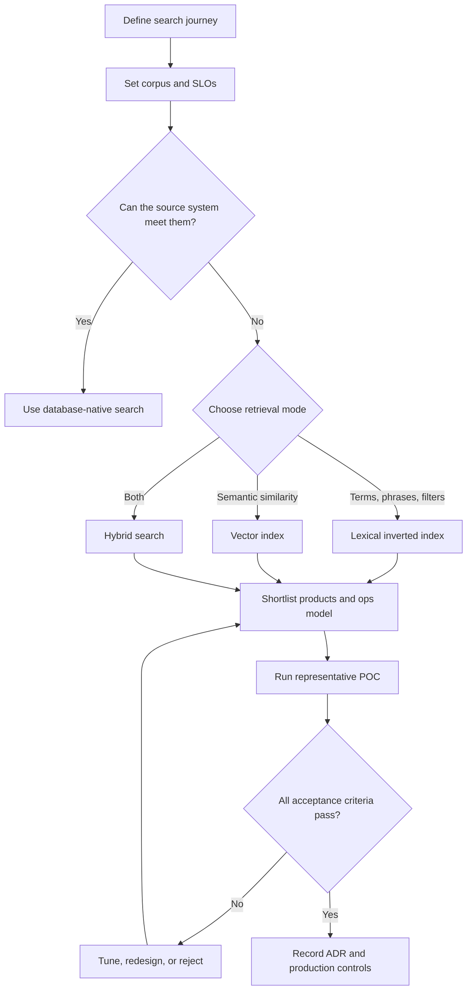
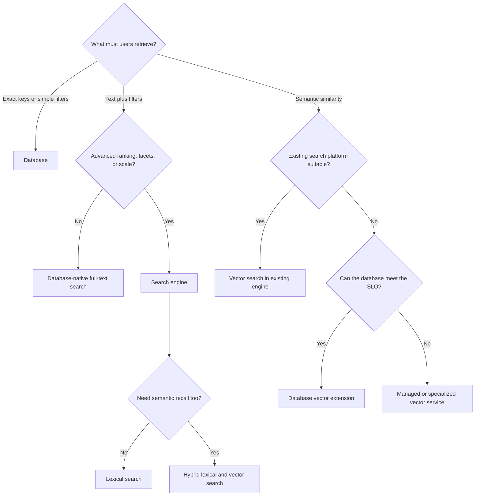
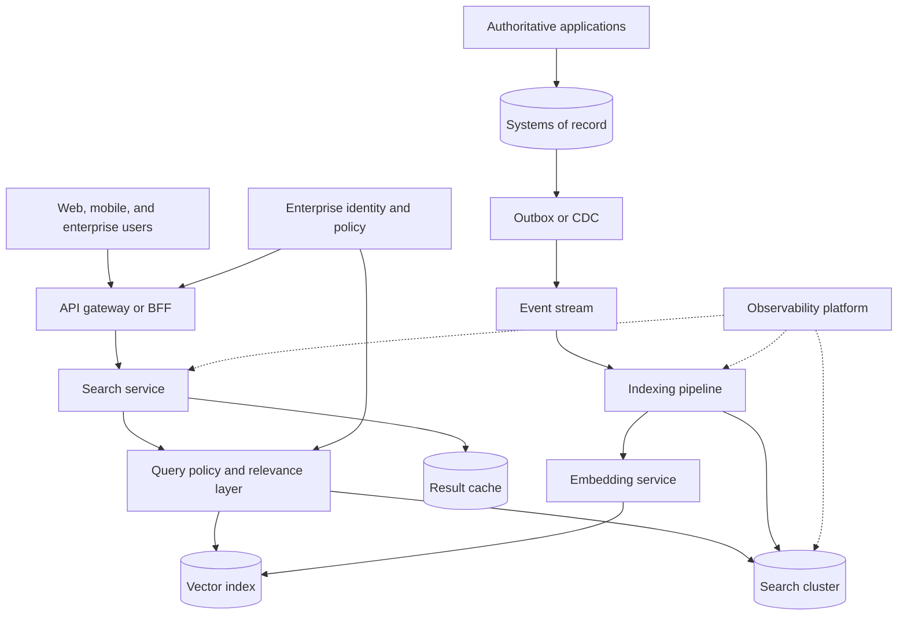

## 1. Executive Summary

A search engine is a **derived retrieval system** optimized for finding and ranking information. It is not a default system of record.

Choose one when the authoritative database cannot economically or predictably provide:

- Relevance-ranked full-text search
- Language analysis
- Facets and large-scale filtering
- Autocomplete
- Vector similarity
- Hybrid lexical-semantic retrieval

Do not introduce a search engine for exact primary-key lookups, transactional constraints, or simple SQL filters at modest scale. Existing availability in the enterprise catalog is not sufficient justification.

Search adds:

- A second data representation
- Asynchronous synchronization
- Relevance governance
- Shard operations
- Recovery obligations

The principal architecture decision is therefore broader than **Elasticsearch versus OpenSearch**:

1. Does the business journey require a dedicated search capability?
2. Is lexical, vector, or hybrid retrieval appropriate?
3. Which system remains authoritative, and how is the index rebuilt?
4. What relevance, freshness, latency, availability, security, and cost targets apply?
5. Does a managed service, self-hosted engine, or database-native search best fit the operating model?

| Requirement | Default direction | Important qualification |
| :--- | :--- | :--- |
| Exact lookup and transactional update | Primary database | Add indexes before adding a new platform |
| Full-text search with ranking | Inverted-index search engine | Validate analyzers and relevance with real queries |
| Navigation by category, brand, price, or status | Faceted search | Control field cardinality and aggregation cost |
| Type-ahead suggestions | Dedicated autocomplete index or service | Keep latency low and prevent sensitive-term leakage |
| Meaning-based retrieval | Vector search | Measure recall, latency, filtering, and embedding cost |
| Exact terms plus semantic intent | Hybrid search | Define score fusion and evaluation, not merely two queries |
| Logs and telemetry exploration | Search/analytics engine | Apply retention tiers and cost controls |


**Architect recommendation:** Use a dedicated search engine only when retrieval value exceeds the synchronization and operational cost of maintaining a derived index.


---

## 2. Business Problem

Users rarely ask for a search engine. They ask to:

- Find a product despite spelling variation
- Locate a policy by meaning
- Filter open claims
- Discover a clinician
- Investigate an incident
- Ground an AI answer in approved enterprise content

The architect must translate that outcome into retrieval requirements.

| Business question | Architecture requirement |
| :--- | :--- |
| Can users find the right result? | Relevance metrics, language analysis, synonyms, ranking signals |
| Can they narrow a large result set? | Filters, facets, aggregations, stable pagination |
| How quickly must new data appear? | Defined freshness SLO and ingestion architecture |
| May every user see every result? | Document-level authorization or secure post-filtering |
| Can the journey continue during a failure? | Multi-zone design, graceful degradation, recovery plan |
| Can we explain why a result ranked highly? | Versioned relevance configuration and evaluation evidence |
| Can we remove regulated data everywhere? | Deletion propagation, audit, snapshots, retention controls |

Define success using business and retrieval measures together:

- **Business outcomes:** search conversion, click-through rate, and abandonment
- **Retrieval quality:** zero-result rate, mean reciprocal rank, nDCG, and Recall@k
- **Service quality:** p95/p99 latency and indexing freshness
- **Economics:** cost per thousand queries

---

## 3. Architecture Decision Flow

### Technology decision tree

> **Key takeaway:** The output is an ADR with measurable acceptance criteria, rejected alternatives, operational ownership, data synchronization design, and explicit reassessment triggers.

---

## 4. Where It Fits in Enterprise Architecture

The search index normally sits behind a search API as a **read-optimized projection**.

- Transactional writes go to the system of record.
- Change events or change data capture update the index asynchronously.
- Search availability and schema evolution remain separate from transactional integrity.

| Architecture role | Guidance |
| :--- | :--- |
| System of record | Keep authoritative state and business invariants in the transactional platform |
| Search projection | Store denormalized, query-ready documents that can be recreated |
| Search service | Own query contracts, security filtering, pagination, ranking, and vendor isolation |
| Ingestion pipeline | Transform, enrich, version, retry, quarantine, and reconcile changes |
| Event backbone | Decouple source transactions from indexing and absorb bursts |
| Embedding service | Version models and embeddings; do not silently mix incompatible vectors |
| Analytics loop | Convert anonymized search behavior into evaluated relevance improvements |


**Architect recommendation:** Do not allow every application to query the cluster directly. A service boundary prevents query DSL leakage, centralizes authorization and guardrails, and makes product migration more realistic.


---

## 5. Decision Checklist


- Users require relevance-ranked full-text search across a substantial corpus.
- Language analysis, stemming, synonyms, typo tolerance, phrase matching, or highlighting materially improves discovery.
- Facets, aggregations, filtering, and sorting must be combined interactively.
- Autocomplete must respond at low latency from a curated suggestion corpus.
- Vector similarity or hybrid retrieval is justified by measured semantic-recall needs.
- Search is a derived view and the organization can operate the ingestion and reconciliation path.



- Exact key lookup, small-scale filtering, or relational queries already meet the SLO.
- The workload requires multi-record transactions, foreign keys, or immediate authoritative reads.
- There is no owner for relevance, schema evolution, cluster operations, and index recovery.
- Index staleness is unacceptable and the design has no read-your-writes mechanism.
- Sensitive content cannot be safely indexed or filtered before retrieval.
- Vector search is proposed without an evaluation set, embedding lifecycle, or measurable benefit.


Before approval, confirm:

- The corpus size, document shape, languages, query mix, update rate, retention, and growth are quantified.
- Relevance and semantic recall have offline and online success measures.
- Freshness, p95/p99 latency, throughput, availability, RPO, and RTO have targets.
- The source of truth and delete/update propagation behavior are explicit.
- Authorization is enforced before unauthorized content can be returned.
- At least two viable approaches are tested against the same corpus and query set.
- Total cost includes replicas, shards, storage tiers, data transfer, observability, snapshots, and engineering.
- Reindex, rollback, restore, and regional recovery have been rehearsed.

---

## 6. Architecture Decision Factors

| Factor | Questions experienced architects ask | Decision impact |
| :--- | :--- | :--- |
| Search semantics | Exact terms, phrases, fuzzy matching, natural language, similarity, or a combination? | Selects lexical, vector, or hybrid retrieval |
| Relevance | Which judgments define a good result, and how is ranking measured? | Determines scoring, evaluation tooling, and product fit |
| Corpus | How many documents, fields, languages, vectors, and tenants exist? | Drives mapping, shards, storage, and isolation |
| Query profile | What are peak QPS, concurrency, filters, sorts, aggregations, and top-k? | Determines replicas, caches, and capacity tests |
| Write profile | Are updates append-only, partial, bursty, or frequent on the same documents? | Determines refresh interval and indexing pressure |
| Freshness | Must changes appear in seconds, minutes, or hours? | Shapes CDC, refresh, and read-your-writes design |
| Consistency | What happens when search lags the source of truth? | Requires UX disclosure, fallback, or authoritative verification |
| Latency | What are end-to-end p95 and p99 targets under peak load? | Influences topology, query limits, and result enrichment |
| Availability | Is degraded search preferable to an unavailable business journey? | Drives replicas, zones, fallbacks, and cached results |
| Security | Are document, field, tenant, and purpose restrictions required? | May eliminate products or demand index isolation |
| Operability | Who owns mapping, shards, upgrades, incidents, and relevance? | Often favors managed services or fewer platforms |
| Portability | Are proprietary APIs, plugins, connectors, or ranking features acceptable? | Determines abstraction and exit cost |
| Economics | What is cost at normal, peak, failure, and 3x scale? | Favors right-sized tiers, retention, or simpler alternatives |

### Ranking and relevance

The ranking approach depends on the retrieval model:

- **Lexical engines** commonly use BM25-like term statistics, then incorporate field boosts, freshness, popularity, business rules, or learning-to-rank signals.
- **Vector retrieval** ranks by distance in embedding space.
- **Hybrid search** combines candidates or scores from both.

These scores are not inherently comparable. Use a defined fusion strategy such as reciprocal rank fusion or calibrated weighted scores.

Treat relevance configuration as versioned application behavior. Build a judged query set covering:

- Head, torso, and tail queries
- Multilingual queries
- Zero-result queries
- Adversarial queries
- Regulated queries

A change that improves average relevance can still damage high-value journeys.

### Consistency and freshness

Search engines are commonly near-real-time rather than transactionally consistent with the source. Define freshness as a measurable SLO, such as “99% of approved catalog changes searchable within 30 seconds.”

For workflows that require immediate confirmation:

- Return the authoritative entity by ID.
- Overlay recent writes.
- Temporarily route the user to a transactional read.

### Multi-tenancy

Choose the tenancy model deliberately:

| Model | Advantage | Trade-off |
| :--- | :--- | :--- |
| Shared index with tenant filters | Efficient resource use | Requires non-bypassable filters |
| Index per tenant | Improved isolation | Can create thousands of small shards |
| Cluster per tenant | Strongest isolation | Highest cost and operational burden |

---

## 7. Technology Categories

| Category | How it works | Best fit | Limitations |
| :--- | :--- | :--- | :--- |
| Inverted-index full-text search | Maps analyzed terms to documents and positions | Keyword, phrase, multilingual, faceted, and log search | Derived state; mapping and shard management |
| Database-native full-text search | Search indexes inside the primary database | Moderate corpus and traffic with simpler operations | Fewer ranking, scale, and analysis controls |
| Faceted search | Aggregates structured fields beside matching results | Retail catalogs, case search, knowledge portals | High-cardinality facets consume memory and CPU |
| Autocomplete | Prefix, edge n-gram, completion structure, or curated suggestions | Type-ahead and query assistance | Write/storage amplification; abuse and privacy risks |
| Vector search | Approximate or exact nearest-neighbor search over embeddings | Semantic discovery, recommendations, RAG | Recall/latency trade-off and embedding lifecycle |
| Hybrid search | Combines lexical and vector candidates or scores | Mixed exact terminology and natural-language intent | More tuning, compute, and evaluation complexity |
| Specialized vector database | Vector-first storage and retrieval | Very large vector workloads or advanced vector operations | Additional platform and source synchronization |
| Managed application search | Provider-managed ingestion and relevance abstraction | Teams prioritizing speed and low operational ownership | Less index control and greater service lock-in |

### Full-text search and the inverted index

An inverted index analyzes text into tokens and records which documents contain them, often including frequency and position.

- **Benefit:** Fast term lookup
- **Trade-off:** Increased storage and write amplification
- **Schema impact:** Changing tokenization, stemming, or normalizers usually requires reindexing

### Facets

Facets summarize result dimensions such as brand, region, specialty, status, or price range.

- Index only fields users can meaningfully navigate.
- Avoid aggregating unbounded identifiers or free-form fields.
- Treat high cardinality as a latency and memory risk.

### Autocomplete

Use a purpose-built suggestion index for predictable low latency. Sources may include:

- Curated terms
- Catalog names
- Privacy-reviewed query logs


Do not expose raw historical queries. They may contain personal, confidential, or abusive content.


### Vector and hybrid search

Vector search helps when users express concepts differently from indexed documents.

It does not replace lexical search for product codes, names, legal clauses, error messages, and other exact terminology.

> **Key takeaway:** Hybrid search is often the safer enterprise default for semantic discovery because it retains lexical precision while improving conceptual recall.

---

## 8. Popular Products

| Product or approach | Strengths | Prefer when | Cautions |
| :--- | :--- | :--- | :--- |
| Elasticsearch | Mature distributed search, analytics, ecosystem, vector and hybrid capabilities | Existing Elastic skills/ecosystem or required Elastic features fit licensing and operations | Verify licensing, version, plugins, and managed-service compatibility |
| OpenSearch | Open-source search/analytics engine with strong AWS ecosystem and vector support | Open governance, Amazon OpenSearch alignment, or existing OpenSearch estate matters | Do not assume complete Elasticsearch API, plugin, or snapshot compatibility |
| Apache Solr | Mature Lucene-based search with strong search controls | Organizations already operate Solr or require its collection/config model | Smaller mindshare in some teams; operations remain substantial |
| Azure AI Search | Managed lexical, vector, hybrid, and enterprise content search | Azure-aligned application or RAG search with low engine-management appetite | Not Elasticsearch-compatible; schema and ingestion are service-specific |
| Vertex AI Search | Managed website, enterprise, and generative-AI retrieval | Google Cloud applications favor managed relevance and connectors | Less low-level engine control; migration is a redesign |
| PostgreSQL full-text plus pgvector | Search and vectors near relational data | Moderate scale where one operational store meets measured SLOs | Avoid forcing large search workloads onto OLTP capacity |
| Specialized vector services | Vector-first scale and managed ANN retrieval | Vector volume, filtering, or latency exceeds existing platforms | Adds another projection, vendor model, and operating surface |

### Elasticsearch versus OpenSearch

Both derive from the same historical codebase and use Lucene. However, they are distinct products with separate:

- Release paths and features
- Plugins and APIs
- Security models
- Commercial ecosystems

Choose through workload and compatibility testing rather than assuming interchangeability.

| Decision area | Elasticsearch | OpenSearch |
| :--- | :--- | :--- |
| Ecosystem alignment | Elastic tooling, Elastic Cloud, and Elastic-specific capabilities | OpenSearch community and AWS-managed ecosystem |
| Compatibility | Best for applications standardized on supported Elastic versions and features | Best for applications tested against OpenSearch APIs and plugins |
| Vector/hybrid | Strong and evolving; validate required algorithms and ranking | Strong and evolving; validate required algorithms and ranking |
| Migration | Version, license, plugin, snapshot, and client checks required | Reindexing may be safer than assuming snapshot/API portability |
| Architecture advice | Select on evidence and lifecycle fit, not ancestry or brand |

---

## 9. Trade-offs


| Decision | Advantages | Disadvantages |
| :--- | :--- | :--- |
| Dedicated search engine | Rich relevance, facets, scale, independent read model | Synchronization, eventual consistency, cluster operations |
| Database-native search | Fewer systems, simpler transactions and governance | May contend with OLTP and offer fewer retrieval controls |
| Managed service | Faster provisioning, patching, backups, platform integration | Cost premium, quotas, reduced control, provider-specific features |
| Self-hosted | Maximum topology, plugin, version, and tuning control | Staffing, upgrades, security, recovery, and 24x7 operations |
| Lexical search | Explainable exact-term precision and mature tooling | Misses semantic equivalence and vocabulary mismatch |
| Vector search | Semantic recall and natural-language matching | Approximate recall, embedding drift, compute and governance cost |
| Hybrid search | Balances exact precision and semantic recall | More latency, tuning, evaluation, and failure modes |
| Denormalized documents | Fast query-time retrieval and simple response assembly | Write amplification and complex update propagation |
| Frequent refresh | Better freshness | Lower indexing throughput and higher resource use |
| More replicas | Higher query capacity and availability | Higher storage and synchronization cost |


---

## 10. Anti-patterns

| Anti-pattern | Why it fails | Better approach |
| :--- | :--- | :--- |
| Search engine as system of record | Weak fit for transactions and invariants; accidental deletion becomes authoritative loss | Keep a durable source and make indexes reproducible |
| Dual writes from request code | Partial failure creates silent divergence | Commit once, then publish via outbox or CDC |
| One index for unrelated workloads | Log bursts, analytics, and user search contend for heap and I/O | Separate workloads by SLO and failure domain |
| Index per small tenant | Excess shards consume heap and slow cluster operations | Shared indexes with enforced routing/filtering or tiered isolation |
| Dynamic mapping without governance | Mapping explosion and type conflicts destabilize clusters | Explicit templates, field limits, and schema review |
| Facet on every field | High-cardinality aggregations create unpredictable cost | Curate business-relevant facets and set query budgets |
| Deep offset pagination | Every shard retains and sorts discarded hits | Use cursor/search-after patterns with stable sort keys |
| Wildcard or regex everywhere | Expensive broad scans cause latency spikes | Use analyzers, prefixes, n-grams, or controlled query policies |
| Vector search because AI | Adds cost without proven user value | Establish a lexical baseline and measured semantic gap |
| Authorization after retrieval | Leaks counts, snippets, timing, or documents | Enforce security filters within candidate retrieval |
| Manual in-place reindex | Risky cutovers and long outages | Build versioned index, validate, switch alias, retain rollback |

---

## 11. Production Considerations

### Scalability and capacity planning

Estimate:

- Primary data and analyzed terms
- Stored fields and doc values
- Vectors and replicas
- Segment overhead and growth

Size for peak queries and peak ingestion **during node loss**, not average traffic.

Validate shard size and count experimentally. Excessive small shards waste heap, while oversized shards slow recovery and rebalance.

Capacity tests should reproduce:

- Document distributions and long-tail queries
- High-cardinality filters
- Concurrent indexing, merges, and refreshes
- Cache misses and vector searches

Maintain headroom for relocation, rolling upgrades, and traffic bursts.

### Availability, recovery, and disaster recovery

Use replicas across failure domains, but do not confuse replicas with backups. Replicas copy corruption and accidental deletion.

Maintain tested snapshots in a separate trust boundary. Define RPO/RTO, and rehearse:

- Full restoration
- Index rebuild from the authoritative source

Multi-region search may use independent regional indexes fed from the same event stream. This often provides clearer failure isolation than stretching one cluster across high-latency regions.

Define traffic failover, event replay, embedding availability, and relevance-configuration promotion.

### Latency and throughput

Set end-to-end percentiles for autocomplete and full search separately.

Protect the cluster by bounding:

- Page size and aggregation count
- Wildcard complexity
- Vector top-k and candidate count
- Script use and request timeout

Use circuit breakers, concurrency limits, backpressure, and load shedding.

### Indexing and deployment

Version mappings, analyzers, relevance settings, embedding models, and ingestion code.

Deploy incompatible schema changes through blue-green indexing:

1. Create a new versioned index.
2. Backfill from an authoritative snapshot.
3. Apply changes that occurred during backfill.
4. Compare counts, sampled documents, relevance, latency, and security behavior.
5. Atomically switch an alias or service route.
6. Retain the old index for a bounded rollback period.

### Monitoring and observability

| Signal | Why it matters |
| :--- | :--- |
| Query p50/p95/p99 by query class | Reveals tail latency and expensive patterns |
| Query and indexing rejection rate | Shows exhausted pools or backpressure |
| Indexing lag and dead-letter volume | Measures freshness and data loss risk |
| Zero-result and reformulation rate | Identifies relevance and content gaps |
| Shard count, size, allocation, and recovery time | Exposes topology and recoverability risk |
| Heap, GC, CPU, disk watermarks, cache evictions, I/O | Predicts saturation and instability |
| Segment merge and refresh pressure | Explains indexing/search contention |
| Vector recall and latency by filter/top-k | Prevents silent semantic-quality regression |
| Authorization-filter failures | Detects potential data exposure |
| Snapshot age and restore-test result | Demonstrates recoverability rather than backup existence |

Correlate query traces with:

- Sanitized query shape
- Index version and tenant
- Result count and timeout

Do not log sensitive query text by default.

### Security and compliance

- Use private networking, TLS, workload identity, least-privilege roles, and auditable administrative access.
- Enforce tenant and document permissions inside retrieval; test that caching cannot cross security contexts.
- Minimize indexed PII and secrets. Search copies need the same classification, residency, retention, and deletion controls as the source.
- Protect bulk export, snapshot, reindex, query, and script capabilities separately.
- Treat embeddings as potentially sensitive derived data and include them in deletion and residency policies.
- Redact query logs; user searches often reveal health, legal, financial, or employee concerns.

### Operational complexity

Name owners for:

- Source connectors and schema
- Relevance and cluster reliability
- Security and incident response


**Operational reminder:** Managed services reduce infrastructure tasks. They do not remove shard design, query governance, data correctness, relevance evaluation, cost control, or recovery testing.


---

## 12. Failure Scenarios

| Failure | User/business impact | Prevention and response |
| :--- | :--- | :--- |
| CDC or consumer stalls | Results become stale while cluster appears healthy | Freshness SLO, lag alarms, replayable stream, reconciliation job |
| Poison document | Partition repeatedly fails and blocks subsequent updates | Schema validation, bounded retry, dead-letter queue, alerting |
| Mapping explosion | Heap pressure and unstable cluster state | Explicit mappings, field-count limits, reject unknown fields |
| Hot shard | High p99 and request rejection | Better routing, balanced keys, split/reindex, isolate tenants |
| Disk watermark reached | Shards stop allocating; writes may be blocked | Forecasting, retention, tiering, autoscaling, emergency runbook |
| Node or zone loss | Reduced capacity during recovery | Zone-aware replicas and capacity headroom under failure |
| Bad relevance release | Conversion or findability drops | Versioned configs, canary/A-B test, fixed judgment set, rollback |
| Unauthorized result | Privacy or regulatory incident | In-engine security filters, policy tests, cache isolation, audit |
| Embedding model change | Mixed vector spaces degrade results silently | Version embeddings and indexes; rebuild and validate before switch |
| Source/index divergence | Missing, duplicated, or outdated results | Periodic reconciliation by counts, checksums, and sampled entities |
| Accidental index deletion | Search outage or data loss if misused as source | Restricted privileges, snapshots, rebuild automation |
| Region loss | Search journey unavailable | Tested regional failover, portable config, event replay or restore |
| Query storm or expensive query | Cluster-wide latency and rejection | Query budgets, rate limits, circuit breakers, workload isolation |


**Design graceful degradation by business journey.** A retail site may fall back to curated categories and popular products. A clinical search must fail closed rather than return results without correct authorization.


---

## 13. Cloud Managed Services

Managed offerings change the operating model, not the need for architecture.

Confirm:

- Engine and version compatibility
- Regional availability and zone topology
- Quotas and network controls
- Encryption keys and backup/restore behavior
- Vector limits and observability
- Pricing and export path

| Environment | Managed choices | Best fit | Key cautions |
| :--- | :--- | :--- | :--- |
| AWS | Amazon OpenSearch Service; OpenSearch Serverless; Elastic Cloud on AWS | OpenSearch-compatible application search, analytics, vector/hybrid search; Elastic Cloud for Elastic fidelity | Service tiers differ in control and compatibility; validate plugins, versions, quotas, snapshots, and network cost |
| Azure | Azure AI Search; Elastic Cloud on Azure | Managed application, enterprise content, vector, hybrid, and RAG retrieval; Elastic for engine compatibility | Azure AI Search is not Elasticsearch; migration requires schema, ingestion, scoring, and security redesign |
| Google Cloud | Vertex AI Search; Elastic Cloud on Google Cloud | Managed enterprise/website/AI search; Elastic for existing Elasticsearch workloads | Vertex AI Search abstracts index internals; validate access control, ranking, connectors, export, and regional support |
| Self-hosted | OpenSearch, Elasticsearch where licensing permits, Apache Solr | Required plugins, topology control, isolation, on-premises, or specialized operations | Organization owns patching, scaling, security, backups, recovery, upgrades, and 24x7 support |

### Cloud mapping by decision

| Decision priority | AWS | Azure | Google Cloud | Self-hosted |
| :--- | :--- | :--- | :--- | :--- |
| OpenSearch API/ecosystem | Amazon OpenSearch Service | Self-managed/partner deployment | Self-managed/partner deployment | OpenSearch |
| Elasticsearch engine fidelity | Elastic Cloud | Elastic Cloud | Elastic Cloud | Elasticsearch subject to chosen license and support model |
| Fully managed application search | OpenSearch Serverless where fit | Azure AI Search | Vertex AI Search | Usually not the preferred model |
| Maximum low-level control | Self-managed on compute/Kubernetes | Self-managed on compute/Kubernetes | Self-managed on compute/Kubernetes | Direct cluster ownership |
| Lowest operational burden | Serverless/managed tier after limits are validated | Azure AI Search | Vertex AI Search | Not applicable |


Do not select solely from a cloud catalog. Terms such as **Elasticsearch-compatible**, **vector**, and **hybrid** do not guarantee identical APIs, algorithms, filters, scoring, or operational controls. Run compatibility and relevance tests.


---

## 14. Real-world Examples

### Retail product discovery

- **Source of truth:** The commerce database remains authoritative for products, prices, and inventory.
- **Search design:** CDC builds denormalized search documents with analyzed descriptions, brand/category facets, availability filters, and embeddings.
- **Retrieval:** Hybrid retrieval improves natural-language queries, while exact lexical boosts preserve SKU and brand precision.
- **Validation:** Checkout revalidates price and stock against the source of truth.

### Banking operations and customer service

- **Indexed content:** A bank indexes approved customer, account, case, and policy projections for authorized service agents.
- **Security:** Results use strict tenant, role, geography, and purpose filters; sensitive fields are minimized.
- **Validation:** Search may locate a case, but balance and transaction decisions are always verified against authoritative systems.
- **Governance:** Query audit and deletion propagation are mandatory.

### Healthcare knowledge and provider search

- **Retrieval:** A healthcare portal combines controlled clinical terminology, synonyms, phrase matching, provider facets, and semantic retrieval across approved guidance.
- **Security:** Patient-specific content is isolated and filtered before retrieval.
- **Governance:** Semantic recall is evaluated by clinical reviewers, and the system fails closed if authorization policy cannot be applied.

### ERP catalog and order investigation

- **Source of truth:** An ERP uses relational systems for inventory and orders.
- **Search design:** It indexes material descriptions, supplier references, document identifiers, and order status for operational discovery.
- **Ranking:** Exact identifiers receive strong lexical boosts.
- **Validation:** Index lag is visible, and users open the authoritative ERP record before taking action.

### AI knowledge assistant

- **Retrieval:** An enterprise assistant retrieves approved document chunks through hybrid search.
- **Security:** Metadata filters enforce business unit, jurisdiction, validity period, and user entitlements.
- **Grounding:** The retrieval layer returns citations and provenance; the generation layer cannot access content excluded by search policy.
- **Evaluation:** A fixed question set measures Recall@k and grounded-answer quality after every embedding or ranking change.

### Gaming content and player discovery

- **Indexed content:** A game platform indexes titles, creators, tags, localized descriptions, moderation state, and behavioral popularity signals.
- **Autocomplete:** Autocomplete is curated to prevent abusive or private queries from becoming suggestions.
- **Freshness:** Rapidly changing entitlements and moderation decisions use aggressive freshness targets and authoritative validation.

---

## 15. Best Practices

1. **Start with a lexical baseline.** Add vectors only when a judged query set proves a semantic-recall gap.
2. **Keep one source of truth.** Treat indexes, facets, suggestions, and embeddings as reproducible projections.
3. **Own relevance as a product capability.** Combine domain experts, search engineering, analytics, and business measures.
4. **Use a search service boundary.** Hide vendor DSL, enforce policy, constrain queries, and support migration.
5. **Design idempotent ingestion.** Use stable document IDs, version checks, replay, dead-letter handling, and reconciliation.
6. **Version everything.** Mappings, analyzers, synonyms, ranking, embedding models, pipelines, and judgment sets must be traceable.
7. **Prefer blue-green reindexing.** Validate and switch aliases; do not mutate critical indexes without rollback.
8. **Test with production-shaped data.** Include skew, multilingual content, bursts, failures, and expensive query classes.
9. **Secure before retrieval.** Authorization filters and tenant isolation belong in candidate generation, not only response rendering.
10. **Control query cost.** Bound facets, regex, scripts, page depth, vector candidates, and timeouts.
11. **Prove recovery.** Restore snapshots and rebuild from sources on a schedule.
12. **Record exit triggers.** Revisit the decision when corpus, QPS, relevance, regulation, licensing, cost, or operational ownership changes materially.

---

## 16. Interview Questions

1. When does a dedicated search engine add enough value to justify operational complexity?
2. Why is an inverted index effective for full-text search?
3. How would you choose between database-native search, Elasticsearch, and OpenSearch?
4. When is vector search appropriate, and when is lexical search better?
5. How do you design and evaluate hybrid search?
6. How do you keep a search index synchronized with a transactional database?
7. How would you support read-your-writes when indexing is asynchronous?
8. What causes shard hotspots and mapping explosion?
9. How would you implement secure multi-tenant search?
10. Which metrics demonstrate relevance, freshness, reliability, and cost?
11. How do you perform a zero-downtime mapping or analyzer change?
12. How would you recover from loss of an entire search cluster or region?
13. What managed-service questions belong in an enterprise ADR?
14. Why should embeddings be versioned and governed?

---

## 17. Interview Answer


"I begin with the business search journey, not a vendor. I quantify the corpus, query and update profile, languages, relevance objective, freshness, p99 latency, availability, recovery, security, and cost. If exact lookups or simple filters meet the requirement in the system of record, I avoid adding a search platform. I introduce a dedicated engine when full-text analysis, ranking, facets, autocomplete, vector similarity, or search scale creates clear value.

I then choose the retrieval model. Inverted-index lexical search remains the baseline for precise terms, identifiers, filters, and explainable ranking. Vector search is useful where vocabulary mismatch creates a measured semantic-recall problem. For many enterprise knowledge and commerce journeys, I evaluate hybrid retrieval because it combines lexical precision with semantic recall, but I require a judged query set and explicit score-fusion strategy.

Architecturally, the transactional platform remains authoritative. An outbox or CDC pipeline builds idempotent, versioned search documents, and reconciliation detects drift. The application uses a search service boundary to enforce authorization, limit query cost, and isolate vendor APIs. I evaluate Elasticsearch, OpenSearch, managed application-search services, database-native search, and specialist vector services against the same workload rather than assuming feature or API equivalence.

Before approval, I test relevance, p95 and p99 latency, peak ingestion, shard failure, stale data, restore, reindex, tenant isolation, and cost at expected and degraded capacity. The ADR records accepted trade-offs, operational ownership, exit conditions, and how the user journey degrades safely when search is unavailable."


---

## 18. Related Topics

- [Technology Playbook index](/technology-playbook/)
- [How to Choose a Database](/technology-playbook/how-to-choose-database/)
- [Elasticsearch](/database-handbook/elasticsearch/)
- [OpenSearch](/database-handbook/opensearch/)
- [Elasticsearch vs OpenSearch](/database-handbook/elasticsearch-vs-opensearch/)
- [ClickHouse vs Elasticsearch](/database-handbook/clickhouse-vs-elasticsearch/)
- [MongoDB Text Search](/mongodb-cheatsheet/03-query-performance/text-search/)
- [Proximity Search](/system-design/proximity-search/)
