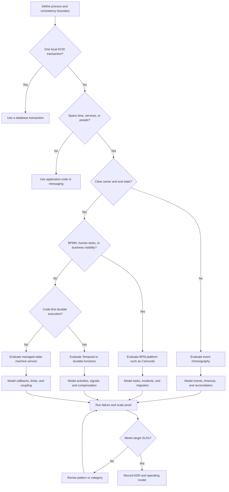
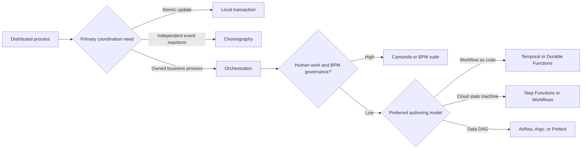
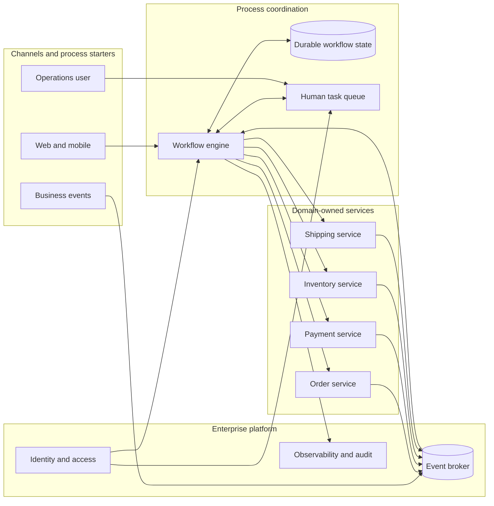

## 1. Executive Summary

A workflow engine durably coordinates a process that spans **time, systems, failures, and often people**. It:

- Persists progress.
- Schedules work.
- Waits for events or timers.
- Applies retries.
- Exposes the state of each process instance.

Its strongest use cases are **long-running transactions**, **multi-service sagas**, **regulated business processes**, and operations that must resume safely after an outage.

Do not introduce one merely to sequence a few synchronous calls. A local transaction, application service, state machine, queue consumer, or scheduled job is often simpler.

A workflow engine is justified when the cost of **lost process state**, **inconsistent recovery**, **opaque compensation**, or **manual reconciliation** exceeds the platform's development and operating cost.

| Situation | Default direction |
| :--- | :--- |
| Days-long onboarding, approvals, SLAs, and audit evidence | **BPM or human-centric workflow engine** |
| Code-owned saga with durable timers, signals, retries, and compensation | **Developer-centric durable workflow engine** |
| Short cloud-native integration across one provider's services | **Managed cloud orchestrator** |
| Independent reactions to business events with no central process owner | **Choreography using messaging** |
| One database and one atomic consistency boundary | **Local ACID transaction** |
| Simple service-owned sequence with bounded retries | **Application code**, possibly with a queue |
| Data pipelines, backfills, and scheduled DAGs | **Data orchestrator**, not a business workflow engine |


Use a workflow engine when the business process must survive restarts and partial failure, its state must remain visible and auditable, and neither a local transaction nor loosely coupled events can provide understandable recovery at lower complexity.


---

## 2. Business Problem

Enterprise processes rarely share one database transaction.

- A **retail order** may reserve inventory, authorize payment, arrange shipment, notify a customer, and wait days for delivery.
- A **banking case** may require sanctions screening and human approval.

Each step can succeed, fail, time out, or produce a late response.

The resulting **long-running transaction** cannot hold database locks across services or for hours. It needs explicit business state and recovery policy:

- What has completed, and what is still pending?
- Which errors are transient, business rejections, or terminal failures?
- Which actions can be retried safely?
- Which successful actions need compensation if a later step fails?
- Who can intervene, and is that intervention audited?
- What happens when a duplicate, late, or out-of-order signal arrives?
- Can millions of open instances survive a deployment or regional outage?

A **saga** addresses this problem as a sequence of local transactions. If a later transaction fails, compensating actions attempt to restore an acceptable business state.


**Compensation is not technical rollback.** A refund does not erase a card charge, and a cancellation cannot always recall a shipped parcel. The architecture must define irreversible steps, points of no return, escalation, and reconciliation.


---

## 3. Architecture Decision Flow

### Technology decision tree


**The proof is not a happy-path demo.** Test worker loss after an external side effect, duplicate messages, unavailable dependencies, late signals, retry exhaustion, version deployment with open workflows, and regional recovery.


---

## 4. Where It Fits in Enterprise Architecture

A workflow engine sits in the **process coordination layer**. It owns durable process state and control flow.

Domain services continue to own business rules, data, and local transactions. A broker transports events and commands but does not replace workflow state. An API gateway secures APIs but does not coordinate a saga.

| Concern | Correct owner |
| :--- | :--- |
| Process progress, timers, retries, correlations, and compensation sequence | Workflow engine |
| Invariants within one aggregate and local commit | Domain service and its database |
| Transport, buffering, fan-out, and replay | Message broker or event stream |
| Business policy such as eligibility or approval threshold | Domain service, decision service, or rule engine |
| Human task assignment and escalation | BPM or task-management capability |
| Cross-process reporting | Operational data store or analytics platform, fed from workflow events |
| End-to-end audit | Workflow history plus immutable domain and security audit records |

---

## 5. Decision Checklist


1. Does the process cross service, database, organizational, or time boundaries?
2. What is the business completion condition, and who owns it end to end?
3. Which steps are retryable, compensatable, irreversible, or manually recoverable?
4. Are intermediate states visible to customers, operations, regulators, or partners?
5. How are duplicate starts, messages, callbacks, and user actions deduplicated?
6. Is eventual consistency acceptable, and for how long?



1. How many workflows start per second, remain open, and complete per day?
2. What are the longest duration, largest history, timer density, and fan-out?
3. Can in-flight instances cross deployments, schema changes, and workflow-definition versions?
4. What RTO, RPO, residency, retention, and audit requirements apply?
5. Who handles stuck workflows, exhausted retries, compensation failure, and manual repair?
6. Can the organization operate the engine, persistence layer, workers, and upgrades at the required availability?


### Fast decision matrix


| Factor | Application code | Choreography | Code-first engine | BPM engine | Cloud state machine |
| :--- | :--- | :--- | :--- | :--- | :--- |
| Process duration | Short | Any, but implicit | Long | Long | Product-limit dependent |
| Central visibility | Custom | Low | High | Very high | High |
| Human tasks | Custom | Poor fit | Possible, often custom UI | Strong | Callback pattern or integration |
| Compensation | Hand-coded | Distributed reactions | Explicit in code | Explicit in process model | Explicit states |
| Coupling | Low infrastructure | Semantic event coupling | Engine and SDK coupling | BPMN and platform coupling | Provider coupling |
| Operational cost | Low initially | Broker plus observability | Engine plus workers | Engine plus modeling and task ops | Lower platform ops, usage cost |
| Best fit | Simple owned flow | Emergent reactions | Developer-owned sagas | Governed business processes | Cloud-local integration |


---

## 6. Architecture Decision Factors

| Factor | Questions that change the decision | Architectural implication |
| :--- | :--- | :--- |
| **Consistency** | Is temporary inconsistency allowed? What invariant cannot be violated? | Keep hard invariants local; use saga and reconciliation across boundaries |
| **Duration** | Milliseconds, days, or months? | Long waits require durable state and timers, not threads or locks |
| **Human participation** | Approvals, reassignment, delegation, SLA escalation? | Favors BPM and task-management capabilities |
| **Process change rate** | Must business analysts inspect models? Are instances migrated? | Favors explicit versioned models and strong governance |
| **Developer model** | BPMN or general-purpose code? Which teams own changes? | Camunda and Temporal optimize for different ownership models |
| **Compensation** | Can each side effect be semantically undone? | Requires explicit compensators, idempotency, and manual fallback |
| **Throughput** | Starts per second, task dispatch rate, concurrent instances? | Benchmark history persistence, partitions, queues, and downstream limits |
| **Latency** | Is orchestration overhead material? | Avoid workflow engines in ultra-low-latency request paths |
| **Availability** | Can coordination pause? Can activities continue safely? | Engine state must be durable; workers need bounded retries and backpressure |
| **Audit and privacy** | What history must be retained, redacted, or deleted? | Do not place secrets or unnecessary personal data in workflow payloads |
| **Portability** | Is cloud or product exit likely? | Separate domain activities from engine APIs; accept that workflow migration is rarely automatic |
| **Operating model** | Managed or self-hosted? Who owns incidents and upgrades? | Platform maturity can outweigh feature differences |

### Orchestration versus choreography

| Dimension | Orchestration | Choreography |
| :--- | :--- | :--- |
| Control flow | Explicit and centrally observable | Emerges from event subscriptions |
| Process owner | Clear coordinator | Distributed across participants |
| Coupling | Participants depend on coordinator commands/contracts | Participants depend on event semantics and timing assumptions |
| Change impact | Flow change concentrated in coordinator | Change may cross many producers and consumers |
| Failure handling | Central retry, timeout, compensation, and status | Each consumer handles its own recovery; end-to-end status is harder |
| Best use | Owned saga with a defined outcome | Independent reactions and extensible fan-out |

> **Architect Recommendation:** Combine the patterns deliberately. Orchestrate the critical business transaction and publish domain events for independent downstream reactions.

---

## 7. Technology Categories

| Category | Primary model | Strong fit | Poor fit |
| :--- | :--- | :--- | :--- |
| **BPM and process automation** | BPMN, task forms, decision models | Human workflows, case handling, compliance, business visibility | High-frequency technical pipelines with no human or modeling need |
| **Durable execution** | Deterministic workflow code plus activities | Code-owned sagas, durable timers, signals, retries, long-running transactions | Analyst-owned process modeling |
| **Cloud state machine** | Provider DSL and service integrations | Cloud-local orchestration with minimal control-plane operations | Multicloud portability or deep BPM requirements |
| **Microservice orchestrator** | JSON or code-defined task graph | Polyglot service tasks and explicit central coordination | Complex human case management |
| **Data and container DAG** | Scheduled directed acyclic graph | ETL, ML pipelines, backfills, container jobs | Stateful business processes with arbitrary signals and compensation |
| **Event choreography** | Brokered domain events | Independent, scalable reactions and loose runtime coupling | Processes needing one authoritative state and predictable recovery |
| **Embedded state machine** | Library inside an application | One-service lifecycle with modest durability needs | Cross-service, months-long, independently operated processes |

### Terminology boundaries

- **BPM is not synonymous with orchestration.** BPM adds business-readable process models, human work management, governance, and often decision modeling.
- **Saga is not a product.** It is a consistency pattern that can be implemented through orchestration or choreography.
- **Compensation is not rollback.** It is a new business action with its own failure modes.

---

## 8. Popular Products


| Product | Category | Authoring model | Best-fit decision | Important caution |
| :--- | :--- | :--- | :--- | :--- |
| **Temporal** | Durable execution | Workflow code and activities | Developer-owned long-running workflows, timers, signals, and sagas | Deterministic workflow constraints, history growth, worker/versioning discipline |
| **Camunda** | BPM and process orchestration | BPMN and DMN with workers | Human and service processes needing visual governance and operations | BPMN governance, engine operations, and process-model complexity |
| **AWS Step Functions** | Managed state machine | Amazon States Language | AWS service orchestration and bounded managed workflows | State-transition cost, quotas, payload/history limits, provider coupling |
| **Azure Durable Functions** | Durable serverless orchestration | Orchestrator and activity code | Stateful function workflows in Azure | Replay-safe orchestrator code, storage/task-hub design, hosting constraints |
| **Azure Logic Apps** | Managed integration workflow | Visual and declarative workflow | SaaS and enterprise integration with connector-heavy flows | Connector semantics, cost, source-control discipline, platform coupling |
| **Google Cloud Workflows** | Managed state machine | YAML or JSON | Google Cloud and HTTP API orchestration | Quotas, expression/DSL limits, provider coupling |
| **Netflix Conductor** | Microservice orchestrator | JSON-defined workflows and workers | Polyglot service orchestration with a central task model | Self-hosted operational burden and custom human-task experience |
| **Airflow / Argo Workflows / Prefect** | Data or container DAG | Python or Kubernetes DAG | Data pipelines, scheduled dependencies, backfills | Do not force long-lived business transactions into a batch DAG |
| **Flowable / jBPM** | BPM engine | BPMN and related standards | Self-hosted BPM where standards and embedding matter | Platform capability and community/support model require validation |
| **Custom saga coordinator** | Application-owned orchestration | Service code and database state | Small, stable flow with strong domain ownership | Teams often rebuild timers, visibility, versioning, and recovery poorly |


> **Key Takeaway:** The shortlist should follow the process model and operating constraints. Do not compare Temporal and Camunda only by feature count; decide whether **workflow-as-code** or **BPMN-centered process governance** is the dominant requirement.

---

## 9. Trade-offs

| Advantage | Architectural value | Cost introduced |
| :--- | :--- | :--- |
| Durable process state | Resume after worker or service failure | Persistent history, storage growth, and recovery semantics |
| Built-in timers and retries | Removes fragile polling and ad hoc schedulers | Retry storms unless bounded and backpressured |
| Explicit process status | Faster support and audit investigation | Sensitive data and retention must be governed |
| Central compensation flow | Understandable saga recovery | Coordinator coupling and compensator complexity |
| Independent workers | Horizontal scaling and deployment isolation | Queue latency, duplicates, and version compatibility |
| Visual or code-defined model | Repeatable process behavior | Specialized skills and product coupling |
| Managed service option | Reduced control-plane operations | Usage cost, quotas, regional availability, and exit cost |

### Advantages and disadvantages by pattern

| Pattern | Advantages | Disadvantages |
| :--- | :--- | :--- |
| Orchestrated saga | Clear owner, status, timeouts, and compensation order | Central dependency and workflow-platform coupling |
| Choreographed saga | Independent teams, natural event fan-out, no central coordinator | Hidden process, difficult troubleshooting, cyclic event chains |
| BPM workflow | Business-readable process and strong human-task governance | Modeling discipline, specialist platform, possible over-centralization |
| Durable workflow code | Strong developer ergonomics, testing, reuse, and code review | Replay constraints and less direct business authoring |

---

## 10. Anti-patterns

- **Distributed monolith through orchestration:** every internal service call is centrally sequenced, so small domain changes require coordinator changes.
- **Workflow engine as a database:** large business objects and documents are stored in workflow variables instead of references to authoritative stores.
- **Remote calls inside replayed workflow logic:** nondeterministic I/O, current time, or randomness is executed where the engine expects deterministic decisions.
- **Infinite retries:** permanent business failures consume capacity and hide incidents. Retries need classification, exponential backoff, jitter, limits, and escalation.
- **Compensation assumed to be rollback:** irreversible actions and compensation failure are ignored.
- **Exactly-once side-effect claim:** engine durability is confused with exactly-once effects across external systems. Activities and callbacks still require idempotency.
- **BPMN as integration spaghetti:** transport mapping, low-level transformations, and every technical detail are placed in the business process model.
- **Choreography without ownership:** no service can answer whether the end-to-end process completed.
- **One global workflow platform for every use case:** data DAGs, approval flows, and low-latency APIs are forced into the same engine.
- **Mutable process definition without version policy:** a deployment breaks thousands of in-flight instances.
- **Manual database repair as operations:** staff edit engine persistence because supported remediation commands and audited runbooks do not exist.

---

## 11. Production Considerations

### Scalability and capacity planning

Size for more than completed workflows per second. Measure:

- **Workflow starts** and open instances.
- **Activity and task dispatch** rates.
- **Timers**, signals, history events, and retries.
- **Payload bytes** and visibility queries.

Long retention and high-cardinality search attributes can dominate storage and indexing.

- Partition workers by task type or domain.
- Set concurrency from downstream capacity.
- Apply backpressure.
- Load-test peak starts plus a recovery surge after an outage.

A workflow engine can dispatch work faster than a payment gateway, mainframe, or clinical system can accept it.

### Availability, consistency, and latency

- Give the control plane and durable store **multi-zone resilience** where the business SLO requires it.
- Keep workers **disposable and independently scalable**.
- Treat engine acknowledgements, activity completion, and external side effects as **separate failure boundaries**.

Orchestration adds persistence and queue hops, so it is normally unsuitable for microsecond or very low-millisecond paths.

Keep hard invariants inside a domain's local transaction. Across services, publish the temporary inconsistency window and provide reconciliation.

### Monitoring and observability

| Signal | Why it matters |
| :--- | :--- |
| Start, completion, failure, and cancellation rate | Detects business and platform shifts |
| End-to-end duration by workflow type and version | Protects business SLA, not just task latency |
| Scheduled-to-start and execution latency | Separates worker capacity from dependency latency |
| Retry and timeout rate by activity and cause | Finds unstable dependencies and bad policies |
| Open, stuck, and aging instances | Exposes stranded business work |
| Compensation started, failed, and awaiting manual action | Shows unresolved consistency risk |
| Queue or task backlog and worker saturation | Drives autoscaling and incident response |
| History size, persistence latency, and storage growth | Prevents control-plane degradation |

- Propagate a **business correlation ID** and trace context into activities and messages.
- Link workflow history, service traces, domain audit, and operator actions.
- Keep unbounded payloads out of telemetry.

### Security and compliance

- Use workload identity, mutual TLS where required, private networking, and least-privilege task access.
- Separate workflow authors, deployers, operators, and auditors; record privileged actions.
- Encrypt persistence, backups, search indexes, and transport.
- Store secrets in a secret manager and fetch them in activities, never in workflow definitions or history.
- Minimize personal and regulated data in durable payloads because histories, retries, logs, and backups multiply retention surfaces.
- Threat-model callbacks and signals: authenticate the sender, authorize the target instance, validate schema, prevent replay, and rate-limit input.

### Deployment and versioning

In-flight workflows outlive application releases.

- Use additive payload changes, versioned task contracts, compatible workers, and controlled routing.
- Decide whether old instances finish on old code, use explicit compatibility branches, or migrate through a tested product-supported mechanism.
- Canary not only new starts but also signals and activities received by old instances.

### Disaster recovery

Define **RPO and RTO** for workflow state and separately for domain systems.

A restored engine may replay activities whose external side effects already occurred; idempotency keys and reconciliation are mandatory. Test:

- Regional loss and restoration order.
- DNS or endpoint changes.
- Worker re-registration.
- Encryption-key access.
- Backlog drainage.


**Active-active workflow execution is unsafe** unless the product and business-key design prevent two regions from advancing the same instance.


### Operational complexity

| Operating model | Enterprise responsibility |
| :--- | :--- |
| **Self-hosted** | Persistence, indexing, partitions, upgrades, backups, certificates, worker compatibility, and control-plane incidents |
| **Managed service** | Process modeling, idempotency, compensation, observability, quota management, and cost control remain enterprise responsibilities |

---

## 12. Failure Scenarios

| Failure | Expected design response | Evidence to test |
| :--- | :--- | :--- |
| Worker crashes before starting an activity | Task becomes available to another worker | No lost work; bounded redelivery delay |
| Worker crashes after side effect but before acknowledgement | Activity may execute again | Same idempotency key produces one business effect |
| Dependency is unavailable for hours | Bounded retry with backoff, circuit breaking, and visible aging | No retry storm; SLA alert and controlled recovery |
| Business rejection occurs | Follow modeled alternate or compensation path | Rejection is not retried as a transient error |
| Compensating action fails | Retry independently, then route to audited manual resolution | Original and compensating states remain visible |
| Duplicate start or callback arrives | Deduplicate by business and message identity | One authoritative process instance advances |
| Late event arrives after timeout or cancellation | Apply explicit late-message policy | No invalid state transition or silent loss |
| New code is incompatible with history | Route to compatible worker or version branch | Old and new instances both progress during rollout |
| Engine is available but task queue is saturated | Backpressure, autoscaling, admission control | Critical workflows retain capacity |
| Visibility index fails | Execution continues where supported; search degrades visibly | Operations has fallback lookup and alerting |
| Region is lost | Invoke tested failover or restore procedure | RPO, RTO, duplicate-execution behavior measured |
| Workflow history or payload exceeds limits | Continue-as-new, child workflow, externalized payload, or redesigned granularity | Longest realistic process stays within quotas |

---

## 13. Cloud Managed Services


| Platform | Managed options | Natural fit | Decision cautions |
| :--- | :--- | :--- | :--- |
| **AWS** | AWS Step Functions Standard and Express; Amazon Managed Workflows for Apache Airflow for data DAGs | AWS service orchestration, callbacks, serverless workflows, data pipelines | Standard and Express have different duration and delivery semantics; validate quotas, transition cost, payloads, history, and region support |
| **Azure** | Durable Functions; Logic Apps; Power Automate for user-centric automation | Code-first durable functions, connector-driven integration, Microsoft ecosystem approvals | Replay constraints, task-hub/storage design, connector behavior, licensing, and environment governance |
| **Google Cloud** | Google Cloud Workflows; Cloud Composer for Airflow DAGs | Google Cloud and HTTP orchestration, data pipelines | Validate execution, concurrency, callback, quota, retention, and regional requirements |
| **Vendor managed** | Temporal Cloud; Camunda SaaS | Managed durable execution or BPM without owning the full control plane | Network locality, tenant isolation, residency, service limits, egress, support, and exit planning |
| **Self-hosted** | Temporal, Camunda, Conductor, Flowable, jBPM, Airflow, Argo Workflows | Control, customization, on-premises, regulated isolation | Enterprise owns HA, persistence, scaling, patching, observability, backups, DR, and upgrades |


Cloud services are not interchangeable.

- **AWS Step Functions Standard** targets durable, auditable workflows.
- **AWS Step Functions Express** targets short, high-volume execution with different delivery semantics.
- **Azure Durable Functions** persists orchestration state and replays orchestrator logic, making deterministic code a design constraint.

> **Architect Recommendation:** Confirm current limits and regional capabilities during the ADR rather than copying them into a long-lived architecture standard.

---

## 14. Real-world Examples

### Banking: payment and account opening

An account-opening process coordinates identity verification, sanctions screening, risk scoring, document collection, human review, and core-banking provisioning over several days. BPM is a strong fit because task ownership, escalation, evidence, and regulatory audit are first-class.

Payment orchestration may use a code-first saga, but ledger posting remains an atomic domain transaction. Compensation can release a reservation or initiate a refund; it must never rewrite an immutable ledger history.

### Retail: order fulfillment saga

The workflow reserves inventory, authorizes payment, requests fulfillment, waits for carrier acceptance, and notifies the customer. A workflow engine owns the order journey and timeouts; inventory, payment, and shipment services own local state.

If fulfillment fails before dispatch, compensation releases stock and voids authorization. Recommendations and analytics react through choreography because they are not part of checkout correctness.

### Healthcare: referral and prior authorization

A referral can wait days for records, payer authorization, clinical review, scheduling, and patient response. Human tasks, deadlines, consent, audit, and protected-data minimization favor a BPM workflow.

Clinical records stay in authoritative systems; the workflow stores references and process status, not a duplicate medical record.

### ERP: procure-to-pay

Purchase requests route according to amount, cost center, risk, and segregation-of-duties policy, then wait for approvals, goods receipt, invoice matching, and payment.

BPM handles tasks and escalation; a rule or decision service selects the route; ERP modules remain systems of record. Cancellation after goods receipt is not a rollback and requires a controlled business exception.

### IoT: device remediation

A fleet platform detects a device fault, gathers diagnostics, schedules a safe update window, waits for device acknowledgement, retries through intermittent connectivity, and escalates persistent failure. Durable timers and signals fit naturally.

High-volume raw telemetry remains on the event or streaming platform rather than passing through workflow history.

### AI: governed model or agent action

An AI-assisted claims process may collect evidence, invoke models, wait for human approval above a risk threshold, call deterministic business services, and record the model and policy versions used.

The workflow provides durable control and audit, not model reasoning. Irreversible actions require explicit authorization, bounded autonomy, idempotency, and a human recovery path.

---

## 15. Best Practices

1. Define the business state machine, owner, terminal states, invariants, and consistency window before selecting a product.
2. Keep domain logic and authoritative data in domain services; let the workflow coordinate.
3. Make every externally visible activity idempotent with a durable business key and recorded outcome.
4. Classify failures as transient, business, terminal, or unknown; give each a different policy.
5. Design compensation when designing the forward path, including irreversible steps and manual resolution.
6. Use orchestration for the critical process and choreography for independent side effects.
7. Externalize large payloads and pass immutable references with integrity and access controls.
8. Version workflow definitions, activity contracts, payload schemas, and worker routing deliberately.
9. Provide search, pause, resume, retry, cancel, and repair operations through authenticated, authorized, audited interfaces.
10. Test duplicates, timeouts, worker death, dependency outage, compensation failure, deployment compatibility, and regional recovery.
11. Set SLOs for business completion and aging instances, not only engine uptime.
12. Use a representative proof of concept that includes peak open instances and failure recovery, then record rejected alternatives in an ADR.


**Architect Recommendation:** Set SLOs for business completion and aging instances, not only engine uptime. Test recovery behavior at peak load before approving the platform.


---

## 16. Interview Questions

1. When is a workflow engine justified over application code and a queue?
2. What is the difference between BPM, orchestration, choreography, and a saga?
3. Why is a long-running transaction not a distributed database transaction?
4. How do you choose between Temporal and Camunda without relying on feature checklists?
5. How do you design idempotent workflow activities?
6. Why is compensation not equivalent to rollback?
7. What happens if a worker completes a payment but crashes before acknowledging the activity?
8. How do workflow engines recover state, and what constraints does replay introduce?
9. How do you deploy a workflow change while old instances are still running?
10. When should choreography be preferred, and when does it become dangerous?
11. What metrics reveal a workflow platform that is failing at the business level?
12. How would you design disaster recovery without advancing one workflow in two regions?
13. How do you prevent sensitive data from spreading through workflow histories and logs?
14. When should Airflow or Argo be chosen instead of a business workflow engine?
15. What evidence would you require before approving a workflow platform for production?

---

## 17. Interview Answer


"I start with the consistency boundary and process ownership, not the vendor. If one database transaction can enforce the invariant, I keep it local. If independent consumers only need to react to facts, I prefer choreography. I introduce a workflow engine when a named business process crosses services, time, or people and must survive failure with visible state, timers, retries, and controlled compensation.

I then choose the category. BPMN-centered platforms such as Camunda fit governed human and service processes where operations and business stakeholders need a shared model. Code-first durable execution such as Temporal fits developer-owned sagas with complex control flow, signals, and long waits. A cloud state machine fits cloud-local integration when its limits, semantics, and coupling are acceptable. Data DAG tools fit pipelines, not long-running business transactions.

Before approval, I require explicit idempotency and compensation design, failure classification, versioning for in-flight instances, capacity estimates for open workflows and task dispatch, security and retention controls, business-level observability, and tested DR. I also state when not to use the platform, because the simplest reliable architecture is often application code, a local transaction, or messaging rather than another enterprise control plane."


---

## 18. Related Topics

- [Technology Playbook index](/technology-playbook/)
- [Temporal](/technology-playbook/temporal/)
- [Camunda](/technology-playbook/camunda/)
- [Netflix Conductor](/technology-playbook/netflix-conductor/)
- [Airflow](/technology-playbook/airflow/)
- [Argo Workflows](/technology-playbook/argo-workflows/)
- [How to Choose a Scheduler](/technology-playbook/how-to-choose-scheduler/)
- [How to Choose a Batch Processing Engine](/technology-playbook/how-to-choose-batch-engine/)
- [How to Choose a Message Broker](/technology-playbook/how-to-choose-message-broker/)
- [Event-Driven Architecture](/technology-playbook/event-driven-architecture/)
- Product-specific pages in modules 3–6
