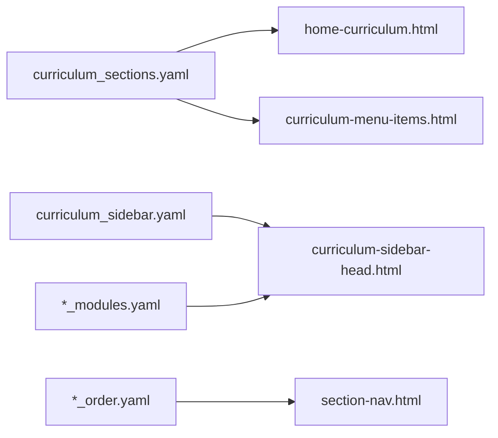

# Architecture — Hugo Layout & Navigation

Technical reference for AI agents editing this site. Read this before searching `layouts/` or `themes/`.

## Stack

| Layer | Technology |
|-------|------------|
| Static generator | Hugo (extended) |
| Theme | PaperMod (`themes/PaperMod/`) — do not edit; override in `layouts/` |
| Content | Markdown + Goldmark (`unsafe = true` for shortcodes) |
| CI | `.github/workflows/hugo.yml` |

## Layout Override Pattern

Each curriculum section has:

```
layouts/<section>/list.html    → section index (module TOC)
layouts/<section>/single.html  → individual topic page
```

Both typically delegate to shared partials:

| Partial | Purpose |
|---------|---------|
| `curriculum-module-list.html` | Renders module-grouped topic list on `_index.md` |
| `curriculum-section-single.html` | Wraps single page content + TOC |
| `section-nav.html` | Prev/next from `data/<section>_order.yaml` |
| `curriculum-sidebar-head.html` | Left sidebar module tree |
| `section-collapsible.html` | Collapsible `###` sections (playbooks) |
| `cs-quick-ref-head.html` | Flat quick-ref styling (cheat sheets) |

## Content Type → Layout Mapping

| Front matter flag | Layout behavior | CSS class |
|-------------------|-----------------|-----------|
| (default playbook) | Collapsible sections | `.sd-collapsible-content` |
| `cheatSheet: true` | Flat headings, no collapse | `.cs-quick-ref` |
| `interviewHandbook: true` | Standard single + impl-tabs | — |

## Navigation Wiring



Key data files:

- `data/curriculum_sections.yaml` — ordered list of top-level sections + group (design/handbooks/practice/career/security)
- `data/curriculum_sidebar.yaml` — per-section keys pointing to `modules` and `order` data file stems

## Shortcodes Inventory

Site shortcodes live in `layouts/shortcodes/` (not theme).

### Code presentation

| Shortcode | Params | Used in |
|-----------|--------|---------|
| `impl-tabs` | `default`, `java`, `golang` | dsa-coding, design-patterns |
| `impl-tab` | `lang="java"` or `lang="golang"` | inside impl-tabs |
| `code-tabs` | language label keys | microservices, system-design |
| `code-tab` | `lang` | inside code-tabs |

**Rule:** Use `` delimiters when panels contain fenced code blocks.

### System design API blocks

| Shortcode | Purpose |
|-----------|---------|
| `api-endpoint` | REST endpoint definition |
| `api-request` | Request body/schema |
| `api-response` | Response body/schema |
| `api-errors` | Error codes table |
| `api-notes` | Implementation notes |

### Content helpers

| Shortcode | Purpose |
|-----------|---------|
| `note`, `tip`, `warning` | Callout boxes |
| `java-note`, `java-tip`, `java-warning` | Java-specific callouts |
| `comparison-table` | Side-by-side comparison |
| `pros-cons` | Pros/cons table |
| `decision-card` | Technology decision card |
| `technology-fit` | Fit assessment |
| `interview-answer` | Collapsible interview answer |

### Partial head injectors

Loaded via `layouts/partials/extend_head.html` and `extend_footer.html`:

| Partial | Loads |
|---------|-------|
| `impl-tabs-head.html` | impl-tabs CSS |
| `code-tabs-head.html` | code-tabs CSS |
| `diagram-lightbox-head.html` | Mermaid diagram lightbox |
| `section-collapsible-head.html` | Collapsible section JS/CSS |
| `cs-quick-ref-head.html` | Cheat sheet flat layout CSS |
| `playbook-shortcodes-head.html` | API shortcode styles |

## Adding a New Curriculum Section

Checklist (see also `curriculum-sections.mdc`):

1. Append to `data/curriculum_sections.yaml` (slug, menuLabel, group)
2. Create `content/<slug>/_index.md`
3. Create `data/<slug>_modules.yaml` + `data/<slug>_order.yaml` (if modular)
4. Register in `data/curriculum_sidebar.yaml`
5. Create `layouts/<slug>/list.html` + `single.html`
6. Add `.cursor/rules/<slug>-posts.mdc` authoring rule
7. Run `python scripts/generate_ai_index.py`
8. Restart `hugo server` (new sections require restart)

## Build Scripts

Scripts that sync navigation yaml or regenerate content:

| Script | Section |
|--------|---------|
| `build_dsa_coding_handbook.py` | dsa-coding |
| `build_java_engineering_handbook.py` | java-engineering |
| `build_spring_boot_handbook.py` | spring-boot |
| `build_python_cheatsheet_handbook.py` | python-cheatsheet |
| `build_golang_cheatsheet.py` | golang-cheatsheet |
| `build_kubernetes_cheatsheet.py` | kubernetes-handbook |
| `build_postgresql_cheatsheet.py` | postgresql-cheatsheet |
| `build_redis_cheatsheet.py` | redis-cheatsheet |
| `generate_lld_stubs.py` | design-patterns (stubs only) |

Sections without build scripts (hand-maintained markdown): system-design, microservices, technology-playbook, kafka-handbook, database-handbook, mongodb-cheatsheet, cloud-handbook, interview-prep, ai-for-engineers, security-architecture.

## Cursor Rules Map

| Rule file | Scope |
|-----------|-------|
| `project-index.mdc` | alwaysApply — routes to AGENTS.md |
| `curriculum-sections.mdc` | new section registration |
| `cheatsheet-template.mdc` | all cheat-sheet handbooks |
| `dsa-coding-posts.mdc` | dsa-coding content + scripts |
| `lld-posts.mdc` | design-patterns |
| `system-design-posts.mdc` | system-design |
| `microservices-posts.mdc` | microservices |
| `java-cheatsheet-posts.mdc` | java-engineering |
| `spring-boot-handbook-posts.mdc` | spring-boot |
| `engineering-handbook-cheatsheets.mdc` | k8s, postgresql, redis, etc. |
