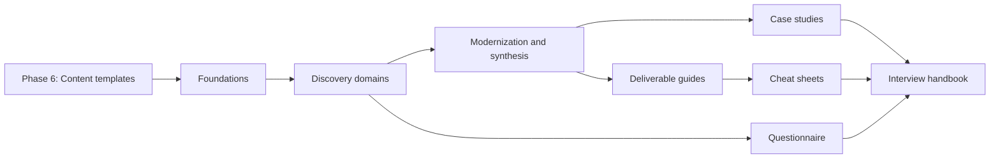

# Architecture Discovery Framework — Content Roadmap

**Status:** Phase 5 plan  
**Date:** 2026-08-04  
**Source:** `docs/architecture-discovery-gap-analysis.md`  
**Scope:** Chapter planning only; no handbook articles are generated by this phase.

## 1. Roadmap principles

1. Architecture Discovery owns elicitation, evidence, validation, traceability, and governance.
2. System Design, Microservices, Technology Decisions, Security Architecture, and engineering handbooks remain canonical for solution patterns and implementation.
3. A chapter must answer one architectural question and produce or improve a concrete discovery outcome.
4. Core chapters precede templates, case studies, cheat sheets, and interview material.
5. Similar artifacts are consolidated unless they require materially different audiences, evidence, or acceptance criteria.
6. Reading times are editorial targets and should be recalibrated after drafting.

## 2. Scales

| Field | Values |
|---|---|
| Difficulty | Foundational, Intermediate, Advanced |
| Interview importance | Low, Medium, High, Critical |
| Enterprise importance | Medium, High, Critical |
| Dependency | Roadmap chapter ID; `—` means the chapter can stand alone |

## 3. Core handbook roadmap

These chapters establish the reusable discovery method and domain playbooks. They should be authored during Phase 7 in the sequence shown.

### Module 1 — Foundations

| ID | Chapter | Purpose | Prerequisites | Time | Difficulty | Interview | Enterprise | Dependencies |
|---|---|---|---|---:|---|---|---|---|
| F01 | Architecture Discovery: Scope and Outcomes | Define discovery, distinguish it from solution design, and establish expected outcomes | Architecture fundamentals | 12 min | Foundational | High | Critical | — |
| F02 | Discovery Engagement Charter | Define objectives, scope, constraints, participants, decision rights, cadence, and exit criteria | F01 | 18 min | Intermediate | Medium | Critical | F01 |
| F03 | Stakeholders and Decision Rights | Identify knowledge holders, outcome owners, approvers, risk owners, and escalation paths | F01 | 20 min | Intermediate | High | Critical | F01–F02 |
| F04 | Discovery Lifecycle and Governance | Move from framing through evidence collection, synthesis, validation, decisions, and closure | F01–F03 | 22 min | Advanced | High | Critical | F02–F03 |
| F05 | Discovery Workshops | Plan, facilitate, document, and follow up workshops without treating consensus as evidence | F02–F04 | 24 min | Advanced | Critical | Critical | F02–F04 |
| F06 | Evidence, Assumptions, and Confidence | Classify sources, score confidence, resolve contradictions, and expose evidence debt | F04 | 22 min | Advanced | High | Critical | F04 |
| F07 | Current-State Architecture Baseline | Build a decision-useful baseline of systems, dependencies, ownership, pain points, and constraints | F03–F06 | 28 min | Advanced | Critical | Critical | F03, F05–F06 |
| F08 | Findings, Requirements, and Decision Traceability | Trace observations into requirements, risks, decisions, deliverables, and roadmap work | F06–F07 | 22 min | Advanced | High | Critical | F06–F07 |
| F09 | Discovery Questionnaire Operating Guide | Select, tailor, sequence, record, and validate reusable discovery questions | F03–F06 | 18 min | Intermediate | High | High | F03, F05–F06 |

### Module 2A — Business, domain, functional, and process discovery

| ID | Chapter | Purpose | Prerequisites | Time | Difficulty | Interview | Enterprise | Dependencies |
|---|---|---|---|---:|---|---|---|---|
| B01 | Business Context and Strategic Drivers | Connect strategy, market forces, regulation, cost, risk, and transformation goals to architecture scope | F02–F06 | 22 min | Advanced | High | Critical | F02–F06 |
| B02 | Business Outcomes and Success Measures | Convert stated goals into measurable outcomes, baselines, leading indicators, and owners | B01 | 20 min | Advanced | High | Critical | B01 |
| B03 | Business Capability Mapping | Discover what the enterprise must be able to do and expose capability gaps without modeling the org chart | B01–B02 | 25 min | Advanced | High | Critical | B01–B02 |
| B04 | Value Streams and Operating Model | Map value delivery, participants, handoffs, funding, governance, and organizational constraints | B01–B03 | 25 min | Advanced | Medium | Critical | B01–B03 |
| D01 | Domain Language and Business Rules | Establish shared vocabulary, invariants, policies, exceptions, and sources of truth | B01, F05–F06 | 22 min | Intermediate | High | Critical | B01, F05–F06 |
| D02 | Domain Boundaries and Ownership | Identify bounded-context candidates, ownership conflicts, coupling, and change boundaries | D01, B03–B04 | 28 min | Advanced | Critical | Critical | B03–B04, D01 |
| D03 | Domain Events and Cross-Domain Collaboration | Discover meaningful business events, dependencies, handoffs, and consistency expectations | D01–D02 | 25 min | Advanced | Critical | High | D01–D02 |
| FN01 | Personas, Actors, and User Journeys | Identify actors, goals, channels, accessibility needs, and end-to-end journeys | B02, D01 | 20 min | Intermediate | High | High | B02, D01 |
| FN02 | Use Cases, Scenarios, and Scope | Capture normal, alternate, failure, and recovery scenarios with clear system boundaries | FN01, D01 | 24 min | Intermediate | Critical | Critical | D01, FN01 |
| FN03 | Functional Rules and Acceptance Boundaries | Make validations, permissions, calculations, exceptions, and acceptance criteria traceable | D01, FN02, F08 | 22 min | Advanced | High | Critical | D01, FN02, F08 |
| BP01 | Current-State Process Discovery | Map actual work, handoffs, systems, controls, queues, delays, and manual intervention | FN01–FN03 | 24 min | Intermediate | High | Critical | FN01–FN03 |
| BP02 | Process Exceptions and Compensations | Discover failure paths, retries, reversals, escalations, reconciliation, and human recovery | BP01, D03 | 24 min | Advanced | Critical | Critical | BP01, D03 |
| BP03 | Target Process and Automation Opportunities | Redesign flow around outcomes while preserving controls and operational recoverability | BP01–BP02, B02 | 25 min | Advanced | High | High | B02, BP01–BP02 |

### Module 2B — Quality, integration, data, security, technology, and operations

| ID | Chapter | Purpose | Prerequisites | Time | Difficulty | Interview | Enterprise | Dependencies |
|---|---|---|---|---:|---|---|---|---|
| N01 | Quality-Attribute Discovery | Elicit quality scenarios with stimulus, environment, measurable response, owner, and validation method | F06–F08, FN02 | 28 min | Advanced | Critical | Critical | F06–F08, FN02 |
| N02 | NFR Prioritization and Conflict Resolution | Expose conflicts among availability, latency, consistency, security, cost, operability, and delivery speed | N01 | 24 min | Advanced | Critical | Critical | N01 |
| N03 | NFR Acceptance and Traceability | Assign evidence, budgets, owners, tests, exceptions, and review triggers to quality requirements | N01–N02, F08 | 20 min | Advanced | High | Critical | F08, N01–N02 |
| I01 | Integration Landscape and Dependency Mapping | Inventory inbound and outbound interfaces, owners, criticality, contracts, and dependency chains | F07, D03 | 26 min | Advanced | Critical | Critical | D03, F07 |
| I02 | Integration Requirements and Failure Semantics | Discover interaction style, ordering, delivery, idempotency, timeout, retry, reconciliation, and recovery needs | I01, BP02, N01 | 28 min | Advanced | Critical | Critical | BP02, N01, I01 |
| I03 | Integration and API Catalog Governance | Define catalog fields, ownership, lifecycle, change policy, consumer impact, and evidence quality | I01–I02, F08 | 22 min | Advanced | High | High | F08, I01–I02 |
| DA01 | Data Domains, Meaning, and Ownership | Discover business meaning, authoritative sources, stewardship, consumers, and ownership conflicts | D01–D02, F07 | 25 min | Advanced | Critical | Critical | D01–D02, F07 |
| DA02 | Data Flows, Lineage, Quality, and Reconciliation | Trace creation, transformation, movement, quality controls, duplication, and reconciliation | DA01, I01 | 28 min | Advanced | High | Critical | I01, DA01 |
| DA03 | Data Classification, Lifecycle, and Recovery | Capture sensitivity, access, residency, retention, deletion, backup, restore, RPO, and RTO | DA01–DA02, N01 | 26 min | Advanced | High | Critical | N01, DA01–DA02 |
| S01 | Security Discovery: Assets, Actors, and Trust | Identify assets, identities, trust transitions, abuse cases, and required threat-model inputs | F07, FN01, I01, DA03 | 26 min | Advanced | Critical | Critical | F07, FN01, I01, DA03 |
| S02 | Compliance, Controls, and Evidence | Map obligations to scope, control owners, evidence, exceptions, audit needs, and retention | S01, F06 | 24 min | Advanced | High | Critical | F06, S01 |
| S03 | Security Gaps and Risk Acceptance | Record control gaps, compensating controls, exposure, decision authority, expiry, and review triggers | S01–S02, F08 | 22 min | Advanced | Critical | Critical | F08, S01–S02 |
| T01 | Technology Estate and Lifecycle Assessment | Inventory platforms, versions, ownership, support, licensing, hosting, skills, and lifecycle risk | F07 | 25 min | Intermediate | High | Critical | F07 |
| T02 | Standards, Constraints, and Technical Debt | Separate mandated standards, preferences, constraints, exceptions, and debt with business impact | T01, B02, F06 | 24 min | Advanced | High | Critical | B02, F06, T01 |
| T03 | Technology Decision Inputs | Convert discovery findings into workload characteristics, evaluation criteria, experiments, and ADR inputs | T01–T02, N01–N03 | 25 min | Advanced | Critical | Critical | N01–N03, T01–T02 |
| O01 | Service Ownership and Operating Model | Discover ownership, support tiers, staffing, escalation, service boundaries, and shared responsibilities | F03, B04, F07 | 22 min | Advanced | High | Critical | F03, B04, F07 |
| O02 | Reliability, Incidents, and Observability Baseline | Use incidents, telemetry, SLOs, alerts, runbooks, and failure evidence to expose operational gaps | O01, N01 | 28 min | Advanced | Critical | Critical | N01, O01 |
| O03 | Delivery, Environment, and Release Discovery | Capture environments, pipelines, controls, release patterns, rollback, configuration, and deployment constraints | T01, O01–O02 | 24 min | Advanced | High | Critical | T01, O01–O02 |
| O04 | Capacity, Continuity, Cost, and FinOps | Discover demand, headroom, DR, continuity, consumption, allocation, optimization, and financial constraints | N01–N03, O01–O03 | 28 min | Advanced | Critical | Critical | N01–N03, O01–O03 |

### Module 3 — Modernization, risk, and synthesis

| ID | Chapter | Purpose | Prerequisites | Time | Difficulty | Interview | Enterprise | Dependencies |
|---|---|---|---|---:|---|---|---|---|
| M01 | Modernization Drivers and Scope | Tie modernization to measurable outcomes and define assessment boundaries and exclusions | B01–B04, F07 | 22 min | Advanced | High | Critical | B01–B04, F07 |
| M02 | Application and Component Assessment | Score value, fit, quality, risk, operability, cost, dependency, and change readiness | Core domain chapters | 30 min | Advanced | Critical | Critical | B01–O04 |
| M03 | Modernization Disposition Decisions | Select retain, retire, replace, rehost, replatform, refactor, or rebuild using explicit evidence | M01–M02, T03 | 28 min | Advanced | Critical | Critical | T03, M01–M02 |
| M04 | Transition and Coexistence Architecture | Discover interim states, routing, data synchronization, compatibility, controls, rollback, and decommissioning | M03, I01–I03, DA01–DA03 | 30 min | Advanced | Critical | Critical | I01–I03, DA01–DA03, M03 |
| M05 | Migration Waves and Dependency Sequencing | Build outcome-oriented waves using dependencies, risk, value, capacity, and learning | M02–M04, O03 | 28 min | Advanced | High | Critical | O03, M02–M04 |
| M06 | Modernization Readiness and Fitness Measures | Assess funding, skills, ownership, platform readiness, change capacity, and architecture fitness | M01–M05, O01–O04 | 24 min | Advanced | High | Critical | M01–M05, O01–O04 |
| R01 | Architecture Risk and Assumption Management | Distinguish risks, assumptions, issues, dependencies, constraints, and decisions | F06–F08 | 22 min | Advanced | High | Critical | F06–F08 |
| R02 | Risk Analysis, Ownership, and Treatment | Assess likelihood, impact, exposure, proximity, treatment, residual risk, and acceptance authority | R01, S03 | 24 min | Advanced | Critical | Critical | R01, S03 |
| R03 | Architecture Reviews and Reassessment Triggers | Define evidence gates, review scope, decision outcomes, waivers, expiry, and change triggers | F04, F08, R01–R02 | 22 min | Advanced | Critical | Critical | F04, F08, R01–R02 |
| SY01 | From Discovery Findings to Architecture Options | Synthesize findings into viable options without prematurely selecting technology | F08 and applicable domains | 26 min | Advanced | Critical | Critical | F08, B01–O04 |
| SY02 | Option Evaluation and Recommendation | Compare value, fit, risk, cost, transition, and uncertainty; record dissent and conditions | SY01, T03, R02 | 28 min | Advanced | Critical | Critical | R02, SY01, T03 |
| SY03 | Discovery Closure and Architecture Handoff | Confirm coverage, unresolved questions, acceptance, ownership, deliverables, and next decisions | F04, F08, R03, SY01–SY02 | 20 min | Advanced | High | Critical | F04, F08, R03, SY01–SY02 |

## 4. Architecture deliverable guides

These Phase 9 guides are separate because each artifact has a distinct decision audience and quality test. They depend on the relevant core chapters and should avoid generic document-filling advice.

| ID | Chapter | Purpose | Prerequisites | Time | Difficulty | Interview | Enterprise | Dependencies |
|---|---|---|---|---:|---|---|---|---|
| A01 | Business Requirements Document | Define when a BRD is useful and how outcomes, scope, evidence, owners, and acceptance are recorded | B01–B04, F08 | 22 min | Intermediate | Medium | High | B01–B04, F08 |
| A02 | Functional Requirements Specification | Translate scenarios and rules into traceable, testable functional requirements | FN01–FN03 | 24 min | Intermediate | High | High | FN01–FN03 |
| A03 | Non-Functional Requirements Specification | Record measurable quality scenarios, budgets, owners, validation, and exceptions | N01–N03 | 24 min | Advanced | Critical | Critical | N01–N03 |
| A04 | Domain Model | Communicate language, concepts, rules, relationships, and ownership boundaries | D01–D03 | 26 min | Advanced | Critical | Critical | D01–D03 |
| A05 | System Context Diagram | Establish scope, actors, external systems, trust boundaries, and critical interactions | F07, I01, S01 | 20 min | Intermediate | Critical | Critical | F07, I01, S01 |
| A06 | Use-Case Catalogue | Organize actors, goals, normal flows, exceptions, rules, and acceptance | FN01–FN03 | 22 min | Intermediate | High | High | FN01–FN03 |
| A07 | User Journey | Connect user goals, channels, steps, handoffs, pain points, and measures | FN01, BP01 | 20 min | Intermediate | Medium | High | BP01, FN01 |
| A08 | Business Capability Model | Show stable enterprise abilities, ownership, maturity, importance, and gaps | B03–B04 | 24 min | Advanced | High | Critical | B03–B04 |
| A09 | Business Process Model | Capture current/target flows, controls, exceptions, measures, and automation opportunities | BP01–BP03 | 24 min | Intermediate | High | High | BP01–BP03 |
| A10 | Enterprise Data Model | Record data meaning, ownership, relationships, lifecycle, and governance boundaries | DA01–DA03 | 28 min | Advanced | Critical | Critical | DA01–DA03 |
| A11 | Integration Catalogue | Govern interface ownership, contracts, criticality, dependencies, lifecycle, and failure expectations | I01–I03 | 24 min | Advanced | High | Critical | I01–I03 |
| A12 | API Catalogue | Govern API purpose, consumers, ownership, version, policy, lifecycle, and operational obligations | I01–I03 | 22 min | Advanced | High | High | I01–I03 |
| A13 | Security Architecture | Assemble assets, threats, trust boundaries, obligations, control decisions, gaps, and risk acceptance | S01–S03 | 28 min | Advanced | Critical | Critical | S01–S03 |
| A14 | Deployment Architecture | Communicate environments, topology, trust zones, resilience, delivery, operations, and recovery | O01–O04, S01 | 28 min | Advanced | Critical | Critical | O01–O04, S01 |
| A15 | Solution Architecture Document | Create a decision-focused architecture baseline with traceability, views, options, and risks | SY01–SY03 | 32 min | Advanced | Critical | Critical | SY01–SY03 |
| A16 | Modernization Roadmap | Present outcomes, transition states, waves, dependencies, measures, and reassessment triggers | M01–M06 | 28 min | Advanced | High | Critical | M01–M06 |
| A17 | Risk Register | Maintain exposure, evidence, ownership, treatment, residual risk, acceptance, and review dates | R01–R03 | 18 min | Intermediate | High | Critical | R01–R03 |
| A18 | Decision Log and ADR Index | Maintain decision status, evidence, relationships, supersession, and review triggers | F08, SY01–SY03 | 18 min | Intermediate | High | Critical | F08, SY01–SY03 |

## 5. Reusable assets

Phase 6 defines the authoring templates used by all later articles. Phases 10 and 11 produce the operational assets below.

### Questionnaire and checklists

| ID | Chapter | Purpose | Prerequisites | Time | Difficulty | Interview | Enterprise | Dependencies |
|---|---|---|---|---:|---|---|---|---|
| Q01 | Enterprise Discovery Questionnaire | Provide reusable business, domain, functional, NFR, security, data, integration, technology, operations, compliance, risk, and roadmap probes | F09 and all domain chapters | 45 min | Advanced | Critical | Critical | F09, B01–O04, R01–R03 |
| C01 | Discovery Engagement Checklist | Validate charter, participants, scope, logistics, evidence access, and governance readiness | F02–F05 | 8 min | Foundational | Medium | High | F02–F05 |
| C02 | Discovery Completeness Checklist | Test coverage, evidence, contradictions, ownership, traceability, risks, and exit criteria | F06–F08, SY03 | 10 min | Advanced | High | Critical | F06–F08, SY03 |
| C03 | Architecture Review Checklist | Validate decision context, options, evidence, quality attributes, security, operations, risks, and follow-up | R03, SY01–SY03 | 12 min | Advanced | Critical | Critical | R03, SY01–SY03 |

### One-page cheat sheets

| ID | Chapter | Purpose | Prerequisites | Time | Difficulty | Interview | Enterprise | Dependencies |
|---|---|---|---|---:|---|---|---|---|
| CS01 | Architecture Discovery Framework | Summarize the lifecycle, roles, evidence flow, outputs, and exit criteria | F01–F08 | 5 min | Foundational | High | High | F01–F08 |
| CS02 | Discovery Questionnaire | Provide a compact cross-domain question map | Q01 | 6 min | Intermediate | Critical | High | Q01 |
| CS03 | Domain Model | Summarize language, rules, boundaries, events, ownership, and validation | D01–D03, A04 | 5 min | Intermediate | Critical | High | D01–D03, A04 |
| CS04 | Business Discovery | Summarize drivers, outcomes, capabilities, value streams, and operating model | B01–B04 | 5 min | Intermediate | High | Critical | B01–B04 |
| CS05 | Functional Discovery | Summarize actors, journeys, scenarios, exceptions, rules, and acceptance | FN01–FN03 | 5 min | Intermediate | High | High | FN01–FN03 |
| CS06 | NFR Discovery | Summarize quality scenarios, conflicts, measures, ownership, and validation | N01–N03 | 6 min | Advanced | Critical | Critical | N01–N03 |
| CS07 | Integration Discovery | Summarize landscape, contracts, dependencies, failure semantics, and governance | I01–I03 | 6 min | Advanced | Critical | Critical | I01–I03 |
| CS08 | Technology Selection Inputs | Summarize estate facts, constraints, workloads, criteria, experiments, and ADR inputs | T01–T03 | 5 min | Advanced | Critical | High | T01–T03 |
| CS09 | Security Discovery | Summarize assets, actors, trust, obligations, evidence, gaps, and acceptance | S01–S03 | 6 min | Advanced | Critical | Critical | S01–S03 |
| CS10 | Architecture Reviews | Summarize evidence gates, review probes, decisions, waivers, and actions | R03, C03 | 5 min | Advanced | Critical | Critical | R03, C03 |
| CS11 | Architecture Deliverables | Map decisions and audiences to the minimum useful artifact | A01–A18 | 6 min | Advanced | High | High | A01–A18 |
| CS12 | Modernization Discovery | Summarize drivers, assessment, disposition, transition, waves, readiness, and fitness | M01–M06 | 6 min | Advanced | Critical | Critical | M01–M06 |

## 6. Enterprise case studies

Each Phase 8 case study exercises the same framework while emphasizing genuinely different constraints. Case studies depend on the core handbook, not on one another.

| ID | Chapter | Purpose | Prerequisites | Time | Difficulty | Interview | Enterprise | Dependencies |
|---|---|---|---|---:|---|---|---|---|
| CASE01 | Banking Core Modernization | Apply discovery to regulated transactions, legacy cores, reconciliation, resilience, and phased migration | Core handbook | 45 min | Advanced | Critical | Critical | F01–SY03 |
| CASE02 | Healthcare Interoperability Platform | Apply discovery to patient data, consent, clinical workflows, interoperability, and auditability | Core handbook | 45 min | Advanced | High | Critical | F01–SY03 |
| CASE03 | Insurance Policy and Claims Transformation | Apply discovery to product rules, policy lifecycle, claims, documents, fraud, and legacy platforms | Core handbook | 45 min | Advanced | High | High | F01–SY03 |
| CASE04 | Omnichannel Retail Modernization | Apply discovery to customer journeys, catalog, inventory, orders, stores, peaks, and partner integrations | Core handbook | 42 min | Advanced | Critical | High | F01–SY03 |
| CASE05 | Telecom BSS/OSS Transformation | Apply discovery to high-volume events, product catalog, billing, provisioning, network dependencies, and vendors | Core handbook | 48 min | Advanced | High | Critical | F01–SY03 |
| CASE06 | Digital Government Service | Apply discovery to policy, accessibility, identity, inter-agency data, procurement, sovereignty, and public accountability | Core handbook | 45 min | Advanced | High | Critical | F01–SY03 |
| CASE07 | Manufacturing and Industrial Integration | Apply discovery to plants, ERP/MES, OT/IT boundaries, equipment, safety, intermittency, and rollout waves | Core handbook | 45 min | Advanced | High | High | F01–SY03 |
| CASE08 | ERP Modernization | Apply discovery to process standardization, customization, master data, integrations, controls, vendors, and cutover | Core handbook | 48 min | Advanced | Critical | Critical | F01–SY03 |

## 7. Interview handbook

Phase 12 should build applied exercises rather than repeat general interview collections elsewhere in the repository.

| ID | Chapter | Purpose | Prerequisites | Time | Difficulty | Interview | Enterprise | Dependencies |
|---|---|---|---|---:|---|---|---|---|
| INT01 | How Architects Structure Ambiguous Discovery Scenarios | Provide a repeatable interview approach for scope, stakeholders, evidence, constraints, options, and risks | F01–F09 | 25 min | Advanced | Critical | High | F01–F09 |
| INT02 | Customer Discovery Scenarios | Practice incomplete, biased, and contradictory customer inputs | Core handbook | 35 min | Advanced | Critical | High | F01–SY03 |
| INT03 | Architecture Review Exercises | Evaluate proposals for evidence, tradeoffs, quality attributes, security, operations, and transition risk | R03, SY01–SY03 | 35 min | Advanced | Critical | Critical | R03, SY01–SY03 |
| INT04 | Whiteboard Discovery Exercises | Practice context, capabilities, domains, processes, dependencies, data, trust, and roadmaps | Core handbook | 35 min | Advanced | Critical | High | F01–SY03 |
| INT05 | Discovery Workshop Simulations | Facilitate stakeholder conflict, missing evidence, scope pressure, and decision escalation | F03–F06 | 35 min | Advanced | Critical | Critical | F03–F06 |
| INT06 | Architecture Tradeoff Discussions | Defend explicit tradeoffs using outcomes, evidence, NFRs, risk, cost, and reversibility | N01–N03, SY01–SY02 | 30 min | Advanced | Critical | Critical | N01–N03, SY01–SY02 |
| INT07 | System Modernization Exercises | Assess estates, choose dispositions, design transition states, and sequence migration waves | M01–M06 | 40 min | Advanced | Critical | Critical | M01–M06 |
| INT08 | Technology Selection Exercises | Derive criteria, eliminate poor fits, propose experiments, and define decision conditions | T01–T03 | 35 min | Advanced | Critical | High | T01–T03 |
| INT09 | 100+ Enterprise Architect Interview Questions | Organize probes by discovery, governance, domains, modernization, deliverables, and leadership | Entire handbook | 60 min | Advanced | Critical | High | All core chapters |

## 8. Glossary and references

| ID | Chapter | Purpose | Prerequisites | Time | Difficulty | Interview | Enterprise | Dependencies |
|---|---|---|---|---:|---|---|---|---|
| G01 | Architecture Discovery Glossary | Define the handbook's controlled vocabulary and distinguish commonly conflated records and artifacts | Core handbook draft | 18 min | Foundational | Medium | High | F01–SY03 |
| REF01 | Standards, Frameworks, and Further Reading | Curate stable primary references and map them to handbook concerns without substituting frameworks for judgment | Core handbook draft | 20 min | Intermediate | Low | High | F01–SY03 |

## 9. Authoring sequence and gates

| Gate | Completion criterion |
|---|---|
| G1 — Templates ready | Every planned article type has an approved reusable template |
| G2 — Foundations ready | Charter, lifecycle, stakeholders, workshops, evidence, baseline, and traceability form one coherent workflow |
| G3 — Domain coverage ready | Every domain has inputs, stakeholders, questions, evidence, outputs, quality checks, tradeoffs, and canonical cross-links |
| G4 — Synthesis ready | Findings can be traced into options, risks, decisions, deliverables, and roadmap work |
| G5 — Applied assets ready | Templates and checklists use the same terms and quality criteria as core chapters |
| G6 — Case studies ready | Each case demonstrates the framework rather than retelling domain theory |
| G7 — Interview handbook ready | Questions and exercises test discovery judgment, evidence, governance, and tradeoffs |

## 10. Scope totals

| Workstream | Planned chapters |
|---|---:|
| Core foundations and discovery domains | 41 |
| Modernization, risk, and synthesis | 12 |
| Architecture deliverable guides | 18 |
| Questionnaire and checklists | 4 |
| Cheat sheets | 12 |
| Enterprise case studies | 8 |
| Interview handbook | 9 |
| Glossary and references | 2 |
| **Total planned artifacts** | **106** |

The count is a planning ceiling, not a mandate to generate 106 files immediately. During authoring, adjacent chapters should be merged when they cannot independently satisfy the architectural-question and quality criteria defined above.
